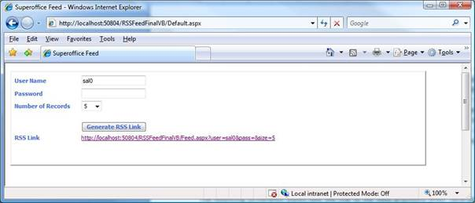

<properties date="2016-05-11"
SortOrder="10"
/>

 

How to generate an RSS Feed with NetServer using VB.net. In this example, we will create a feed that displays all activities created by other users on the current user’s contact. A feed displays information. Each item in the feed includes metadata about that item.

The example handles user authentication with forms authentication mode with a custom login page. Based on the user credentials provided, the link to the RSS feed is generated.

The second half of the article explains how to generate the XML contents with the relevant activity information. How the formatting of the Feed contents are handled will be addressed next, followed by an explanation of how  to configure the Feed in Outlook Express 2007 enabling Feed subscription through Outlook Express 2007.

The following screenshot shows how the link to the feed displayed when valid user credentials provided.

  

 

1. autolist

------------------------------------------------------------------------

**See Also:** [source code (zip)](RSSFeedFinalVB.zip)
 
