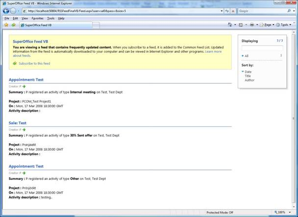
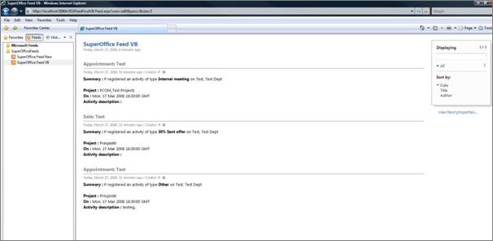
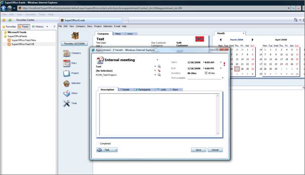

<properties date="2016-05-11"
SortOrder="14"
/>

The following screenshot depicts how the feed content is shown in a browser before subscribed.

  

 

Once subscribed to the feed it becomes available in the folder specified by the user.

  

By clicking on the link in the feed contents, the appropriate dialog in SuperOffice 6.Web is opened as shown below.

  

 
