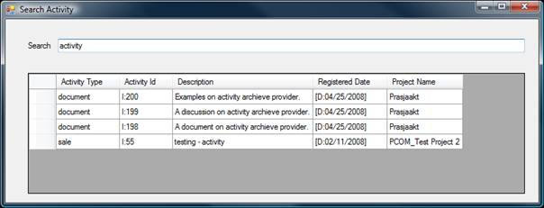

<properties date="2016-05-11"
SortOrder="6"
/>

A windows application that retrieves a list of activities for the past 6 months of the logged in user using the ActivityArchiveProvider. The client should also be able to filter the activites based on text provided by the user.

Following is a snapshot of the results when the application is run.

 

1. autolist
