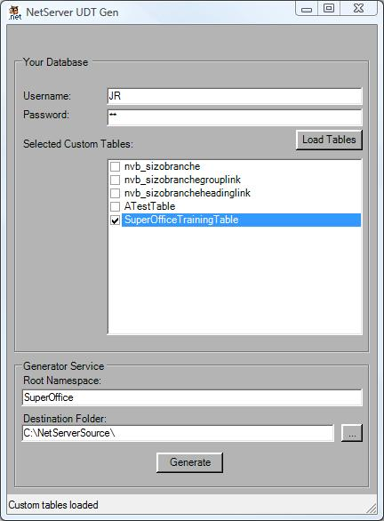

<properties date="2016-05-11"
SortOrder="14"
/>

 

To access the new User-Defined Table (UDT) using NetServer, we are required to generate NetServer OSQL and Row types that define the UDT. These types are easily generated using the on-line code generator hosted on DevNet.

 

 

  

 

When the code generation is complete a visual studio solution with one project is created in the location specified by the user. This project contains two folders.  One folder contains class files for supporting the data access layer and one for supporting Rows.  

This utility application is available for download from DevNet. See <http://devnet.superoffice.com/Library/Articles/NetServer-SDK/Archived-Articles/Generate-User-Defined-Table-Classes-For-Use-in-NetServer/> for more information.
