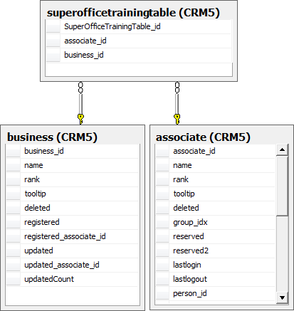

<properties date="2016-05-11"
SortOrder="10"
/>

In this article we will learn how to create a custom table that contains foreign keys to existing tables. We will also learn how to create a Sentry plug-in that enforces additional restrictions on the contact table. The objective is it to demonstrate how to control what the user is allowed to see. In this case, the user is only allowed to see contacts with a business type equal to that of the user’s company business type.

The following diagram shows the relationship between the three tables namely contact, associate and the custom table superofficetrainingtable.

 

1. autolist

[Sentry Plugin With External Table Source Code (zip)](SentryPluginWithExternalTable.zip)
