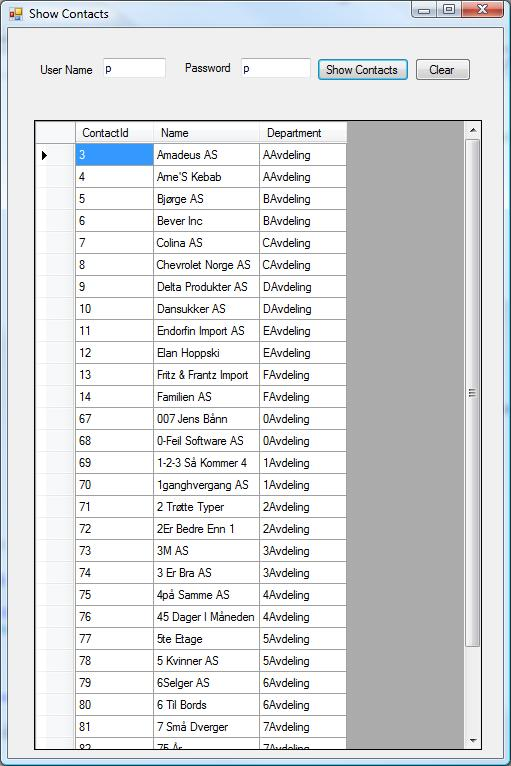
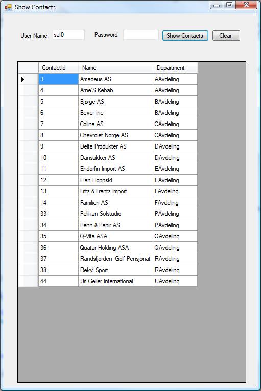

<properties date="2016-05-11"
SortOrder="17"
/>

In order for us to use the plugin, modifications are required in the ‘config’ file signaling NetServer that we have our own plugin and mentioning where the dll is located. Below is the section that we have to modify in the ‘app.config’ file.

```
<Factory>
      <DynamicLoad>
            <add key="SentryPlugin"
value="C:\\AllBackups\\SuperOffice_Working_Files\\SentryForCustomTableDll\\SentryForCustomTableDll\\bin\\Debug\\SentryForCustomTableDll.dll"
/>
      </DynamicLoad>
</Factory>
```

 

Following code snippet is an example that uses the plugin. Here we attempt to retrieve the Contact information logging on with different users and outputting the list of contacts that each user can see.

```
using System;
using System.Collections.Generic;
using System.ComponentModel;
using System.Drawing;
using System.Text;
using System.Windows.Forms;
 
using SuperOffice.CRM.Data;
using SuperOffice.Data;
using SuperOffice.Data.SQL;
using SuperOffice;
using System.Collections.Specialized;
using System.Collections;
 
private void btnShowContacts_Click(object sender, EventArgs e)
{
  try
  {
      using (SoSession session =
SoSession.Authenticate(this.txtUserName.Text.Trim(),
this.txtPWD.Text.Trim()))
      {          
          // Retriveing tableInfo for the ContactTable
          ContactTableInfo newConTable =
TablesInfo.GetContactTableInfo();
 
          // Retrieving data in to an instance of the Select Class
          Select newSelect = S.NewSelect();
 
          // Choosing the columns that should be retrieved
          newSelect.ReturnFields.Add(newConTable.ContactId,
newConTable.Department, newConTable.Name);
 
          // Ordering the retrieved Data
          newSelect.OrderBy.SortOrder.Add(newConTable.ContactId,
SuperOffice.Util.OrderBySortType.ASC);
 
          // Establishing a database connection
          SoConnection myConn = ConnectionFactory.GetConnection();
 
          // Creating SoCommand instance and assigning the Select
statement
          SoCommand myComm = myConn.CreateCommand();
          myComm.SqlCommand = newSelect;
          myConn.Open();
 
          // Loading the data into the DataReader
          SoDataReader myReader = myComm.ExecuteReader();
 
          ArrayList arrConData = new ArrayList();                  
 
 
          // Retrieving the Data from the Reader
          while (myReader.Read())
          {
              int conID = myReader.GetInt32(0);                    
 
              string conDept = myReader.GetString(1);
              string conName = myReader.GetString(2);
 
              // Creating a user defined contact object to be
stored
              // in the ArrayList
              ContactData contact = new ContactData(conID, conName,
conDept);
              arrConData.Add(contact);
          }
 
          // Setting the results to the data grid
          this.grdContactData.DataSource = arrConData;
 
          // Closing the reader
          myReader.Close();
      }
  }
  catch (Exception exception)
  {
      // Clear textboxes and the data grid
      this.clearAll();
      MessageBox.Show("Invalid user.");
  }
}
```

 

We have first retrieved the TableInfo object for the Contact table. Next a Select object is created in order to retrieve data. The columns to be included in the selection and the order in which the results to be sorted are specified next. The select command is executed against the Contact table to retrieve the Contact information. This is the point where our plugin come in to the picture i.e., when we attempt to run a query against the Contact table, the NetServer sentry mechanism calls our sentry plugin and the plugin logic gets executed. With the restriction specified in the ModifySelect method of the plugin, any user can retrieve only the contact information where the BusinessId of which is same as the currently logged in user’s BusinessId.

The next step is to convert the retrieved contact data into a format that can be displayed in a data grid. The approach taken in this example is to iterate over the retrieved DataReader and encapsulate those data into a custom object type called “ContactData”. These objects are stored in an ArrayList, which is set as the data source for the contact information data grid.

The following screenshots show the results of the same query run on the contact table for two users namely “SAL0” and “P”.





The sal0 user is restricted to a smaller subset of the contact table, due to the entries we put in the external table we have created.
