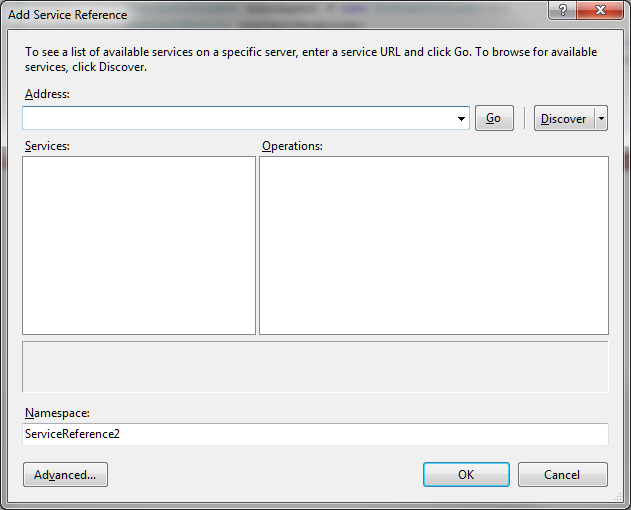
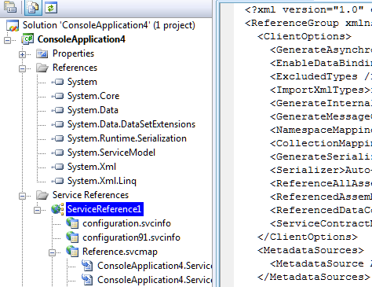

<properties date="2016-06-24"
SortOrder="7"
/>

To add a web reference to a project we can right click on the project on the visual studio solution explorer and then it pops up a panel and from that panel we can click on the “Add Web reference” which then displays the “Add Web Reference” window as shown below.


We can type a web service URL in the combo box on the top and when “Go” is clicked it checks the validity of the typed URL. Once the typed URL is validated, it activates the web reference text box where we can type the name that we plan to use in the project and click the “Add Reference” button.

Using more than one service
===========================

Since you first need to call the SoPrincipal service, then call the Contact service, you need several web-service references to get any useful work done.

The problem is that having multiple web-service references leads to multiple namespaces, each with the same classes defined separately.

In other words, you end up with three incompatible copies of the SoCredential data-carrier class. This is rather annoying, since you can't use the result from the authenticate call when you call a different web service.

To fix this, you need to convince Visual Studio to put all the service references in one namespace, so that they all share the same copy of the data-carrier classes.

Add a service reference
-----------------------



This will add a Service reference to the project. This service reference describes the URL and WSDL, and is used to generate the WCF SOAP proxies that your code will use to call the web services.

Turn on Show-all-files
----------------------



The web service reference node hides a lot of generated files.

Turn on **Show-all-files** by clicking the button in the Solution Explorer header.

We want to change the one hidden behind the `Reference.svcmap` file.

Add services to the MetadataSources
-----------------------------------

In the Reference.svcmap XML file you will find a &lt;MetadataSources&gt; node.
```
  <MetadataSources>
    <MetadataSource 
           Address="http://localhost/4003/SoPrincipal.svc" 
           Protocol="http" SourceId="1" />
  </MetadataSources>
```

Change this by adding the other services you want to use:
```
  <MetadataSources>
    <MetadataSource 
           Address="http://localhost/4003/SoPrincipal.svc" 
           Protocol="http" SourceId="1" />
    <MetadataSource 
           Address="http://localhost/4003/Contact.svc" 
           Protocol="http" SourceId="2" />
    <MetadataSource 
           Address="http://localhost/4003/Project.svc" 
           Protocol="http" SourceId="3" />
  </MetadataSources>
```

Save and close the file.
Update the service reference
----------------------------

Right click the Service reference and select the **Update Service Reference** menu item. This will cause Visual Studio to fetch all the services referenced in the MetadataSources list, and generate all the services into the same namespace.

You will see a lot more files generated inside the service reference folder.

You can turn off the Show-all-files now if they are distracting.
