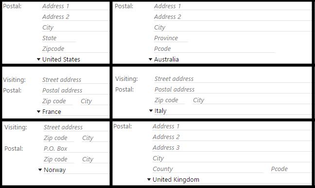
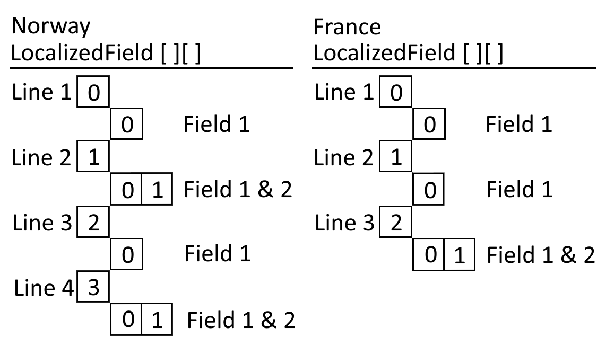

# Address Formats

Depending on where you live in the world, a company or person address can come in various shapes and sizes. SuperOffice CRM supports these various shapes and sizes with address format definitions for each country and region in the database.

## Introduction

Due to the dynamic nature of addresses, address fields in the SuperOffice CRM UI appear differently depending on the selected country for any particular company or person.

Below is an example of six different country formats and how they appear in SuperOffice CRM. It is interesting to note that while the top two are similar, the middle two are also similar but different from the first two. The bottom two are uniquely different from both each other and the other four.



To support multiple address variants, the SuperOffice web service API data structures must be generic. An address type must be flexible enough to support all of the different address formats of the world, and SuperOffice has accomplished by placing all address fields in a structure called LocalizedAddress.


A LocalizedAddress is a multidimentional array of LocalizedField – where the first dimension of LocalizedField contains each address line. The second dimension of a LocalizedField contains each field in that line.

Each LocalizedField contains, among others, three key properties: AddressType, Name and Value.

AddressType determines which type of address a field belongs to, of which there are three possibilities:

1. ContactPostalAddress
2. ContactStreetAddress
3. PersonStreetAddress

The first two types correspond to a company address, used to differentiate a company's postal address versus its' physical, or visiting, address. The third address type represents a contact person address.

The Name and Value properties are just what they sound like; the name is a unique field keyname, and the value is populated with the value from the database.

For example, the address format of Norway defines 4 lines total. The first and third lines contain just one element, while the second and fourth lines containing two elements.

France, however, has 3 lines total, with the first and second lines containing just one field element and the third line containing two field elements.



It is important to understand that some company addresses contain only a postal address while others contain both a postal and street address.

Because line elements are simply array containers, they do not know if they contain postal address information or street address information. As mentioned earlier, each field has an AddressType property that signals to which it belongs.

So how does one go about reading and writing address information using this generic construct?

Reading the LocalizedAddress data structure is very straightforward. Simply loop over the LocalizedField lines and print out each field on each line. The following code example demonstrates this using a ContactAgent to get a company and then looping over and printing out each address field.

```csharp
using(ContactAgent ca = new ContactAgent())
{
    ContactEntity ce = ca.GetContactEntity(2);

    foreach (LocalizedField[] addressLine in ce.Address.LocalizedAddress)
    {
        foreach (LocalizedField addressField in addressLine)
        {
            Console.WriteLine("Item: {0}, Value: {1}",
            addressField.Name, addressField.Value);
        }
    }
}
```

Writing address information back to this data structure is often complex when the consumer application does not share the same dynamic address structure as SuperOffice. In that case, the application must develop a strategy to format their address data structure into one SuperOffice understands.

Assuming the company or person from SuperOffice has the correctly formatted address, each line contains one or more field keynames that can be used to locate the same field in a different but corresponding address data structure.

There are two groups of pre-defined address field names, one for person and one contact.

| **Person Address Fields** | **Contact Address Fields** |
|---------------------------|----------------------------|
| Address1                  | PostalAddress1             |
| Address2                  | PostalAddress2             |
| Address3                  | PostalAddress3             |
| City                      | PostalCity                 |
| County                    | PostalCounty               |
| State                     | PostalState                |
| Zipcode                   | PostalZipcode              |
|                           | StreetAddress1             |
|                           | StreetAddress2             |
|                           | StreetAddress3             |
|                           | StreetCity                 |
|                           | StreetCounty               |
|                           | StreetState                |
|                           | StreetZipcode              |

Knowing what the field keynames are for each address type makes it easy to flatten the address data structure into a Dictionary, Map or Key/Value pairs. Then, it becomes easy to access each address field values and get or set the address information.

Ideally, consumers of SuperOffice CRM Web Service APIs could work with address information in a more intuitive way. One such possibility would be to work with key value pairs, where field keynames are the key part. Here is an example:

```csharp
using (PersonAgent pa = new PersonAgent())
{
  // get person
  var personEntity = pa.GetPersonEntity(215);

  // get person address as a Dictionary<string,string>.
  var addressDictionary = personEntity.GetAddress();

  // update a field
  addressDictionary["City"] = "TimbuckToo";

  // set the changed person address
  personEntity.SetAddress(addressDictionary);

  // save the person in the database
  pa.SavePersonEntity(personEntity);
}
```

Since web service entities are POCO objects, they do not contain methods. Below, however, I have created two extension methods to get and set the address based on a generic Dictionary<string, string>. With this structure, it becomes easy to both read and write address fields, and persist those changes back to SuperOffice CRM.

The first thing is to define a set of Constants that represent each AddressType, as well as each address field name:

```csharp
public class AddressConstants
{
  // Address Types
  public const string ContactPostalAddress = "ContactPostalAddress";
  public const string ContactStreetAddress = "ContactStreetAddress";
  public const string PersonPrivateAddress = "PersonStreetAddress";

  // Contact Address Fields
  public const string ContactPostalAddress1 = "PostalAddress1";
  public const string ContactPostalAddress2 = "PostalAddress2";
  public const string ContactPostalAddress3 = "PostalAddress3";
  public const string ContactPostalCity     = "PostalCity";
  public const string ContactPostalCounty   = "PostalCounty";
  public const string ContactPostalState    = "PostalState";
  public const string ContactPostalZip      = "PostalZipcode";
  public const string ContactStreetAddress1 = "StreetAddress1";
  public const string ContactStreetAddress2 = "StreetAddress2";
  public const string ContactStreetAddress3 = "StreetAddress3";
  public const string ContactStreetCity     = "StreetCity";
  public const string ContactStreetCounty   = "StreetCounty";
  public const string ContactStreetState    = "StreetState";
  public const string ContactStreetZip      = "StreetZipcode";

  // Person Address Fields
  public const string PersonAddress1 = "Address1";
  public const string PersonAddress2 = "Address2";
  public const string PersonAddress3 = "Address3";
  public const string PersonCity     = "City";
  public const string PersonCounty   = "County";
  public const string PersonState    = "State";
  public const string PersonZip      = "Zipcode";
}
```

Next are the extension methods that simplify how to get and set address information as key value pairs.

```csharp
public static class AddressFieldExtensions
{
  /// <summary>
  /// Get a PersonEntity.Address as a Dictionary&lt;string, string&gt;.
  /// </summary>
  /// <param name="personEntity">The person entity.</param>
  /// <returns>Key/Value pair of address fields.</returns>
  public static Dictionary<string, string> GetAddress(this PersonEntity personEntity)
  {
      return new AddressHelper().GetAddressAsDictionary(personEntity.Address);
  }

  /// <summary>
  /// Get a ContactEntity.Address as a Dictionary&lt;string, string&gt;.
  /// </summary>
  /// <param name="contactEntity">The contact entity.</param>
  /// <returns>Key/Value pair of address field name and values.</returns>
  public static Dictionary<string, string> GetAddress(this ContactEntity contactEntity)
  {
      return new AddressHelper().GetAddressAsDictionary(contactEntity.Address);
  }

  /// <summary>
  /// Populates the PersonEntity.Address property from a Dictionary&lt;string, string&gt; of key valuepairs.
  /// </summary>
  /// <param name="personEntity">The PersonEntity</param>
  /// <param name="addressInformation">Key/Value pairs that represent address field name andvalues.</param>
  public static void SetAddress(this PersonEntity personEntity, Dictionary<string, string>addressInformation)
  {
      var helper = new AddressHelper();
      helper.SetAddressFromDictionary(personEntity.Address, addressInformation);
  }

  /// <summary>
  /// Populates the ContactEntity.Address property from a Dictionary&lt;string, string&gt; of key valuepairs.
  /// </summary>
  /// <param name="contactEntity">The ContactEntity</param>
  /// <param name="addressInformation">Key/Value pairs that represent address field name andvalues.</param>
  public static void SetAddress(this ContactEntity contactEntity, Dictionary<string, string>addressInformation)
  {
      var helper = new AddressHelper();
      helper.SetAddressFromDictionary(contactEntity.Address, addressInformation);
  }
}
```

Each of the extension methods depend on a helper class called AddressHelper. The sole purpose of this class is to make it easy to get an Address as a Dictionary and transform a Dictionary into an Address.

```csharp
public class AddressHelper
{
    public Dictionary<string, string> GetAddressAsDictionary(Address address)
    {
        ValidateAddress(address);

        var result = new Dictionary<string, string>(14);

        foreach (var line in address.LocalizedAddress)
        {
            foreach (var field in line)
            {
                result.Add(field.Name, field.Value);
            }
        }

        return result;
    }

    public void SetAddressFromDictionary(Address address, Dictionary<string, string> addressInfo)
    {
        ValidateAddress(address);

        foreach (var line in address.LocalizedAddress)
        {
            foreach (var field in line)
            {
                if (addressInfo.ContainsKey(field.Name))
                    field.Value = addressInfo[field.Name];
            }
        }
    }

    private void ValidateAddress(Address address)
    {
        if (   address == null
            || address.LocalizedAddress == null
            || address.LocalizedAddress.Length == 0)
            throw new Exception("Must provide a formatted Address");
    }
}
```

Changing address formats are easy, and accomplished by changing the entity country id.

Before changing the countryId, make sure to first get the original address information to preserve the existing data, then change the country id of the entity and save it. Next, the returned entity will now contain the new address format and you can again get this as a Dictionary and merge it with the previous one. Finally, change any of the address information and persist the changes.

```csharp
using (ContactAgent ca = new ContactAgent())
{
  // get company
  var contactEntity = ca.GetContactEntity(144);

  // get company address as a Dictionary<string,string>.
  var oldAddressDictionary = contactEntity.GetAddress();

  // change the country id
  contactEntity.Country.CountryId = 36; //Australia

  // save the company in the database
  contactEntity = ca.SaveContactEntity(contactEntity);

  // get the new address as Dictionary<string,string>
  var newAddressDictionary = contactEntity.GetAddress();

  // merge the new and old fields into one dictionary
  var dictionary = newAddressDictionary.Union(oldAddressDictionary)
                      .ToDictionary(d=>d.Key, d=>d.Value);

  // update field(s)
  dictionary[AddressConstants.ContactPostalAddress2] = "TimbuckTwo";

  // set the changed address
  contactEntity.SetAddress(dictionary);

  // save the company in the database
  contactEntity = ca.SaveContactEntity(contactEntity);
}
```

### Conclusion

Working with address information in SuperOffice CRM web services had never been an easy task to deal with. It usually took a fair amount of struggling, blood, sweat and some hair pulling to figure out just how to access specific address fields. Hopefully now you understand the LocalizedAddress structure, its' madness, and know better how to deal with it in future projects.
