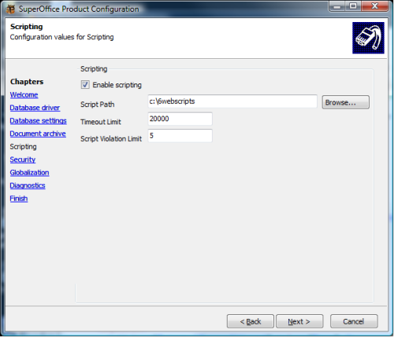

<properties date="2016-06-24"
SortOrder="2"
/>

How to Configure Scripting
--------------------------

When installing 6.web 6.3 a new scripting section is added to the SuperOffice Product Configuration application. If upgrading from a previous version, make sure to run the SoAppConfig.exe configuration utility.

Figure One: SoAppConfig.exe utility with the Scripting section displayed.


The configuration options are:

* Enabling scripting overall.
* The path to the folder where the scripts are stored. If no path is set the \[ArchivePath\]\\scripts is used.
* The timeout limit is how much time is allowed on synchronous scripts. Asynchronous scripts are not affected by the limit.
* The Script violation limit is the number of times a script can violate the time limit before being disabled.

The SoAppConfig.exe utility will the section as seen in Listing One in web.config.

SoAppConfig: Scripting section added to the application configuration file.

```
<Scripting>
    <!-- Turn on or off the use of scripts-->
    <add key="EnableScripting" value="False" />

    <!-- Path to the scripts. Default so_arc\script -->
    <add key="ScriptPath" value="" />

    <!-- Time in milliseconds allowed for the script to use. Default 20 sec.-->
    <add key="TimeoutLimit" value="20000" />

    <!-- The number of timeouts the script are allowed before it is disabled. Default 5.-->
    <add key="MaxTimeouts" value="5" />
</Scripting>
```
