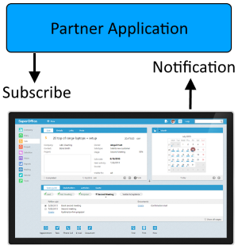

# SuperOffice Webhooks API

| Platform | Service Version |
|----------|---------|
|Online    | v8.5    |
|Onsite    | v8.5    |

---

Webhooks are a means to broadcast events that happen inside SuperOffice as they occur. A webhook payload includes information that describes what has changed, and is broadcast to all applications that have subscribed to a corresponding event.

The webhook workflow begins with applications subscribing to events that are interesting. The way an application does this is by adding one or more webhook definitions in SuperOffice.

For example: the Partner Application registers an interest in "contact.created" events with SuperOffice. From then on, whenever a contact record is created, SuperOffice will notify the Partner Application that the event has occurred. The Partner Application can then update its own state, get more information, or just log the information.

Lets start by looking at a webhook definition - what the Partner Application uses to register its interest in events with SuperOffice.



## Webhook Definition

A webhook subscription contains the follow properties:

| Property Name | Description                                                                              |
|---------------|------------------------------------------------------------------------------------------|
| Name          | A name to distinguish events from one another.                                           |
| Events        | An array of ```entity.event``` names.                                                          |
| TargetURL     | Defines a URL where webhook payloads are sent. Must be HTTPS and must respond to POST                                                   |
| Secret        | Optional shared secret. Used for creating a SHA256 HMAC if set.                           |
| State         | Unknown = 0, Active = 1, Stopped = 2, TooManyErrors = 3                                  |
| Type          | Name of webhook plugin that handles dispatching this webhook: "webhook", "crmscript" etc.|
| Headers       | Hook-specific custom headers to be added to the webhook payload.                         |
| Properties    | Hook-specific data properties to be added to the webhook payload.                        |

While a webhook name need not be unique, it should be unique enough to distinquish it from others and describe its purpose.

The Events property is an array of one or more event names the subscriber is subscribing to. The format of a single event name is ```<entity>.<event>```, where entity is one of the available entities (see below), and the event is one of _created_, _changed_ or _deleted_.

TargetURL defines where to send the POST request containing the webhook payload. The webhook payload contains all relevant information needed by subscribers to take action. The Target URL must be HTTPS, and it must respond to a POST request with a 200 OK response. The HTTPS certificate must be valid. If the certificate is not valid (i.e. self-signed, expired, not valid for host-name, revoked, etc), then the webhook will be rejected.

When security is important, which should be always, a webhook definition specifies a shared secret that both the sender and receiver use to validate a webhook payload. When an event notification is sent, the webhook payload is hashed and base64 encoded and the resulting value is added to a header in the POST request. The header key is ```X-SuperOffice-Signature```. It’s up to the subscriber to validate the header value. This is thoroughly explained in a later section.

The state of a webhook is by default Active but can be set to Stopped. If the sender does not receive a successful 200 response from the server after seven attempts, SuperOffice will set to state of the webhook to TooManyErrors.

A webhook Type must match the plugin responsible for dispatching notifications. As of this writing, the only supported value is “webhook”.

Webhook Headers are any additional header values SuperOffice appends to a request sent with each notification. Headers are a simple “string”:”string” value.

Webhook Properties are any additional values SuperOffice should append to each request sent with each notification. Properties are a “string”: {object} value.

## Event Details

Event name descriptors are a combination the webhook entity and event type, i.e. “contact.created” is one such descriptor.

Available event entities are: activity, associate, contact, person, project, projectmember, sale and salestakeholder. Each entity raises an event when created, changed or deleted. Therefore, all possible event names are:

| Create Events           | Changed Events          | Deleted Events          |
|-------------------------|-------------------------|-------------------------|
| activity.create         | activity.changed        | activity.deleted        |
| associate.created       | associate.changed       | associate.deleted       |
| contact.created         | contact.changed         | contact.deleted         |
| person.created          | person.changed          | person.deleted          |
| project.created         | project.changed         | projectmember.deleted   |
| projectmember.created   | projectmember.changed   | projectmember.deleted   |
| sale.created            | sale.changed            | sale.deleted            |
| salestakeholder.created | salestakeholder.changed | salestakeholder.deleted |

## Webhook Subscription

Webhook subscriptions are created using SuperOffice NetServer core and NetServer web services; both SOAP and REST API’s.

Below I will demonstrate how to create webhook using both NetServer core and web services.

### NetServer Core

There are two distinct ways to create webhooks using NetServer core, and there is a difference in behavior between them.

There is the traditional Row classes SuperOffice.CRM.Rows.WebhookRow, and then there is the SuperOffice.CRM.Webhooks.WebhookManager.

The key difference is when using WebhookManager, the TargetURL is pre-checked prior to saving, by sending out a test webhook payload, and is expected to send a 200 OK response. If the TargetURL fails to respond, the save operation will fail.

Creating webhooks via the SOAP or REST API’s, NetServer uses the WebhookManager, therefore the TargetURL must already exist and respond accordingly.

``` CSharp
// SuperOffice.CRM.Rows: no verification check for TargetUrl

var name      = "Tonys Contact Handler";
var events    = "contact.created,contact.changed,contact.deleted";
var targetUrl = "https://www.myserver.com/superoffice/webhookhandler";
var secret    = "Something Super Secret";
var type      = "webhook";
var state     = SuperOffice.Data.WebhookState.Active;

var webHookRow = WebhookRow.CreateNew();

webHookRow.SetDefaults();
webHookRow.Name      = name;
webHookRow.Events    = events;
webHookRow.TargetUrl = targetUrl;
webHookRow.Secret    = secret;
webHookRow.State     = state;
webHookRow.Type      = type;

webHookRow.Save();


// SuperOffice.CRM.Webhooks.WebhookManager: verifies the existence of the TargetUrl

var webhookManager = WebhookManager.GetCurrent();
var webhook        = new Webhook(0, name, targetUrl, events, secret);
webhookManager.SaveWebhook(webhook);
```

### NetServer SOAP Web Services

```SuperOffice.CRM.Services.WebhookAgent``` is used to manage webhooks. Using ```WebhookAgent.CreateDefaultWebhook``` will automatically set the ```Type``` and ```State``` to _webhook_ and _Active_, respectively. The webhook will also contain two default Events, _contact.created_ and _contact.deleted_. These are easy to replace, but nice to have for testing purposes.

Use the ```WebhookAgent.SaveWebhook``` method to save or update a webhook.

``` CSharp

using (var wa = new WebhookAgent())
{
    var wh = wa.CreateDefaultWebhook(); // defines two default events
                                        // contact.created & contact.deleted

    wh.Name      = "Tonys Contact Handler";
    wh.Events    = new [] { "contact.created", "contact.changed", "contact.deleted" };
    wh.TargetUrl = "https://www.myserver.com/superoffice/webhookhandler";
    wh.Secret    = "Something Super Secret";

    wh = wa.SaveWebhook(wh);
}

```

The WebhookAgent has methods to get an existing webhook by id ```GetWebhook(int id)```, and a delete method to permanently remove a webhook, ```DeleteWebhook(int id)```. The table below lists all available WebhookAgent Methods.

| Method Name                                               | Description                                                                                                          |
|----------------------------------------------------|----------------------------------------------------------------------------------------------------------------------|
| CreateDefaultWebhook()                             | Returns new Webhook with default values.                                                                             |
| DeleteWebhook(id)                                  | Deletes the webhook.                                                                                                 |
| GetLastError(id)                                   | Return the most recent error message received when calling this webhook.                                             |
| GetAllWebhooks(string, string webhookState)        | Returns all webhooks, according to filter criteria.                                                                  |
| GetWebhook(id)                                     | Gets a Webhook by Id.                                                                                                |
| SignalWebhook(string, int, StringObjectDictionary) | Signal webhooks that an event has occurred. All webhooks listening for the event will be notified.                   |
| TestWebhook(webhook)                               | Pings a webhook with a 'test' event, returns SUCCESS(true) or FAILURE(false) + the response from the webhook target. |

---

### NetServer REST Web Services

NetServer REST API's are an abstraction over the NetServer SOAP API, and therefore has the same behavior.

To create a new webhook, you can either build the JSON structure yourself, or issue a GET request the ```api/v1/Webhook/default``` url and get the structure prepopulated with the defaults.

``` json

{
"WebhookId": 0,
"Name": null,
"Events": [
  "contact.created",
  "contact.deleted"
],
"TargetUrl": null,
"Secret": null,
"State": "Active",
"Type": "webhook",
"Headers": null,
"Properties": null,
"Registered": "0001-01-01T00:00:00",
"RegisteredAssociate": null,
"Updated": "0001-01-01T00:00:00",
"UpdatedAssociate": null
}

```

To save a webhook: **POST api/v1/Webhook**

``` json

{
  "Name": "Tonys Contact Handler",
  "Events": [
        "contact.created",
        "contact.changed",
        "contact.deleted"
    ],
  "TargetUrl": "https://www.myserver.com/superoffice/webhookhandler",
  "Secret": "Something Super Secret",
  "State": "Active",
  "Type": "webhook"
}

```

Available REST URL's

| Verb   | URL                                                                                          |
|--------|----------------------------------------------------------------------------------------------|
| GET    | api/v1/Webhook/default                                                                       |
| GET    | api/v1/Webhook/{id}                                                                          |
| GET    | api/v1/Webhook/{webhookId}/LastError                                                         |
| GET    | api/v1/Webhook?nameFilter={nameFilter}&eventFilter={eventFilter}&statusFilter={statusFilter} |
| POST   | api/v1/Webhook                                                                               |
| POST   | api/v1/Webhook/Test                                                                          |
| POST   | api/v1/Webhook/{eventName}/{primaryKey}                                                      |
| PUT    | api/v1/Webhook/{id}                                                                          |
| DELETE | api/v1/Webhook/{id}                                                                          |

__POST api/v1/Webhook__ will register a new webhook definition.

__POST api/v1/Webhook/Test__ will check that the webhook definition is OK, and verify that the target URL responds to a test POST with 200 OK.

__POST api/v1/Webhook/foo.bar/123__ will signal that the event 'foo.bar' has happened to id 123. Any webhooks registered for the event 'foo.bar' will be notified. You can add additional details (like field changes) in the body of the POST.

---

## Webhook Notification

Now that webhooks have been created and saved in SuperOffice, notifications can be sent out when an event occurs. A webhook notification is referred to as a WebhookPayload, and contains the following properties:

| Property Name | Description                                                                              |
|---------------|------------------------------------------------------------------------------------------|
| EventId          | A GUID that uniquely identifies this event.                                           |
| Timestamp        | The datetime when the event occured.                                                           |
| Changes     | An array of fields that are connected to the change.                                                   |
| Event        | The name of the event.                           |
| PrimaryKey         | The entity identity that was affected                                  |
| Entity          | The type of entity that was affected, i.e. activity, associate, contact, person etc. |
| ContectIdentifier       | Customer id for Online users: "Cust1234". Not used for On-site installations.                         |
| ChangedByAssociateId    | Associate id of the user that triggered the event.                        |
| WebhookName   | The given name of the webhook. |

A webhook payload for the event _contact.changed_ is send as the following JSON message:

``` json

{
    "EventId":"88f91933-edce-4c1a-8ded-ade8e2f72434",
    "Timestamp":"2018-04-05T08:28:01.5732501Z",
    "Changes":["contact_id","updated_associate_id","soundEx","updated","name"],
    "Event":"contact.changed",
    "PrimaryKey":18,
    "Entity":"contact",
    "ContextIdentifier":"Cust54321",
    "ChangedByAssociateId":5,
    "WebhookName":"Tonys Contact Handler"
}

```

Notifications are sent out in a fire-and-forget fashion and do not expect a response to these POST requests. There is no way to prevent changes or interrupt the normal workflow of SuperOffice.

Note that the event name, event id and signature are sent as HTTP headers, to help the recipient route and filter the notification without having to parse the body.

### WebhookPayload Headers

| Header Name | Description                                                                              |
|-------------|------------------------------------------------------------------------------------------|
| X-SuperOffice-Event   | The event name, i.e. contact.created, project.changed.                         |
| X-SuperOffice-EventId | A GUID that uniquely identifies this event.                                    |
| X-SuperOffice-Retry   | The number of retries this webhook has been tried to be sent.                  |
| X-SuperOffice-Signature | The hash/base64 encoded secret.                                              |

---

## Webhook Secrets

A webhook secret is used as an additional layer of security in order to verify that the webhook sent to the receiver has not been tampered with. How do you know that the notification was sent from SuperOffice, and not from some random hacker.

Only when a webhook definition contains a secret value will SuperOffice will append an X-SuperOffice-Signature header to each event notification. It is then up to the receiver to verifying signature of the payload prior to processing the message.

So how does a receiver validate the X-SuperOffice-Signature header value? Let’s first review how the signature is generated.

SuperOffice uses the shared secret as a key in the HMAC SHA256 algorithm, which in turn is used to hash the body of the webhook JSON value. The result of the hash is then base64 encoded and used to populate the X-SuperOffice-Signature header value.

The responsiblity of the receiver is to use the shared secret in the same manner, and essensially do exactly the same thing. The receiver takes the body of the request; essentially the webhook payload, hash and base64 encode it, and then compare the results with the value from the X-SuperOffice-Signature header.

If the values match then you can be confident the webhook is a valid message that has not been tampered with. If not, the webhook has likely been tampered with mid-stream and should be ignored.

Here is a validation example using C#.

``` CSharp

/// <summary>
/// Validates the X-SuperOffice-Signature webhook header value.
/// </summary>
/// <param name="storedSecret">The shared secret stored on the application side.</param>
/// <param name="headerValue">The value from X-SuperOffice-Signature header</param>
/// <param name="body">JSON representation of the webhook</param>
/// <returns></returns>
private bool IsValidWebHook(
    string storedSecret,
    string headerValue,
    System.IO.Stream body)
{
    var validationResult = false;

    // ensure it is the correct encoding
    var secret = System.Text.Encoding.UTF8.GetBytes(storedSecret);

    // hash and base64 encode the stored shared secret
    using (var hasher = new System.Security.Cryptography.HMACSHA256(secret))
    {
        var sha256 = hasher.ComputeHash(body);
        var base64 = Convert.ToBase64String(sha256);

        // verify the values match!

        if (base64 == headerValue)
        {
            validationResult = true;
        }
    }

    return validationResult;
}

```

Here is a validation routine using Node/Javascript:

You need to be careful to compute the hash based on the request string, and not a parsed and converted representation, since whitespace and line delimiters are significant. See this [article](https://sensecommerce.io/blog/validating-shopify-webhooks-node-js/) for an in-depth example using Express and Node.

``` javascript

/**
@signature is X-SuperOffice-Signature header value
@secret is the stored shared secret
@ req is the HTTP request
@ buf is the body of the HTTP request
**/
function isValidWebHook(signature, secret, req, buf) {

    // generate the signature locally
    const computedSignature = crypto
      .createHmac("sha256", secret)
      .update(buf.toString())
      .digest("base64");

    // compare generated vs. header value
    if (computedSignature === signature) {
      return true;
    } else {
      return false;
    }

}

```

## Conclusion

No longer must integrations poll SuperOffice and ask for the latest changes. SuperOffice Webhooks actively send messages to subscribers when events occur in a SuperOffice, and provide an opportunity for applications to react accordingly.
