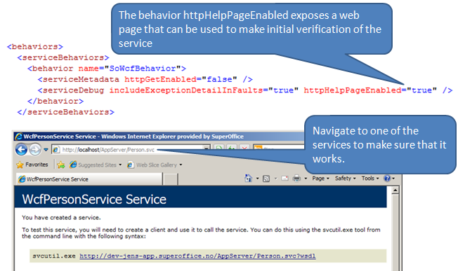

<properties date="2016-06-24"
SortOrder="28"
/>

In the web.config for the application server you can turn on help pages to verify that the services are working. They also describe the API - so you should probably turn these off when exposing services on the open internet.
