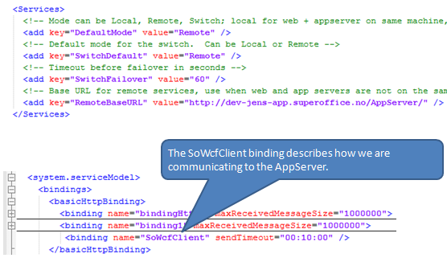

<properties date="2016-06-24"
SortOrder="29"
/>

In order for the web server to talk to the back end you must cahnge the `DefaultMode` to "Remote".

With ASMX services that was enough.

With WCF you must also set up the WCF binding to connect the web server to the app server.
