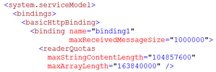
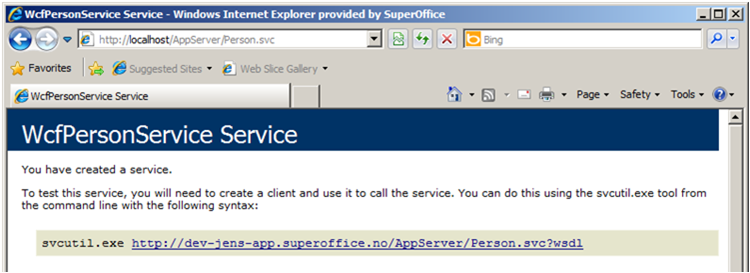

<properties date="2016-06-24"
SortOrder="59"
/>

If something goes wrong?
========================

Configuration
-------------

The most common issue by far is to low default values on the bindings.

Remember to Increase both server and client sides when there are problems.

Use a browser
-------------

Use the web browser to navigate to the web-service end-point and see what you get back.

Fiddler
-------

Use Fiddler to look at the HTTP traffic between the client and the web service to see what is really going on.

Fiddler is a HTTP Proxy that allows you to look at HTTP traffic between local clients and a server (possibly running on your local machine).

Use SoWcfHost
-------------

This is a stand-alone EXE that you can use to host web-services locally without relying on IIS or the development web-server. This makes it a little easier to attach a debugger to, and you have more control over what services are running.
