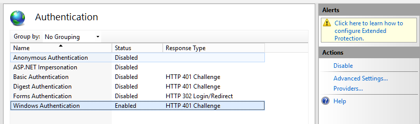
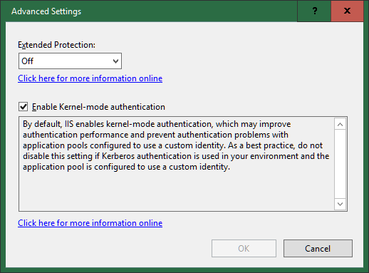
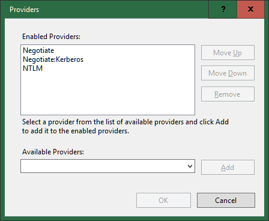

# SuperOffice Users

In order to do this, you need to set up your SuperOffice users as Active Directory users.

**web.config** must define and configure the `ActiveDirectoryCredentialPlugin` section.

Your SuperOffice users need to be linked to Active Directory users.


## SuperOffice Web.Config

You must explicitly enable the authentication methods you want to use in the `web.config` file.

```xml
<WebApi>
      <add key="AuthorizeWithImplicit" value="true" />
</WebApi>
```

**AuthorizeWithImplicit** must be `true` otherwise the Active Directory authentication method will not work.

It adds the `WWW-Authenticate: Negotiate` header that kicks off windows authentication.


# IIS Configuration

Open the IIS Configuration tool and select the SuperOffice application.


## Configure Authentication

In IIS, navigate to the application hosting SuperOffice web client. 

Enable Windows Authentication, and disable the others.




Click **Advanced Settings** to enable Kernel-mode authentication.



Click **Providers** to ensure that **Negotiate** is the first enabled provider.




Your CRM.web and WebAPI should now be accessible without logging in.

The HTTP.sys kernel driver will stop unauthenticated requests before they reach ASP.net and send back an ActiveDirectory response that the browser can use to log in using its windows identity. When the 

Accessing `/api/v1/user/currentPrincipal` via Chrome or Edge should automatically log you in, and return the current user's info.

