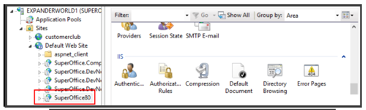
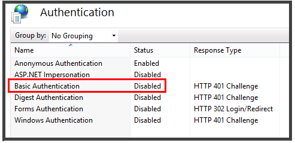
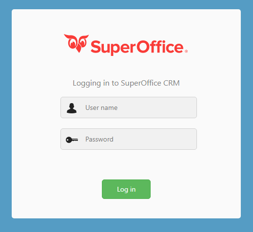
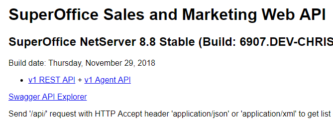
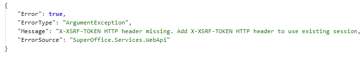
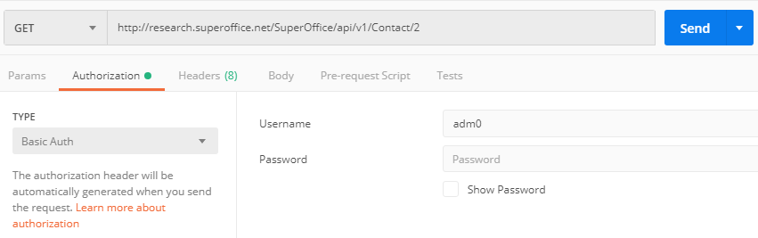

## IIS Configuration

Configure the SuperOffice IIS website for Anonymous access.



Open the IIS Authentication dialog. 

Disable all except **Anonymous** authentication.



This sets up the site so that anyone can access the application and the WebApi, but they will still need a valid SuperOffice username and password to access the site.

If you enable **Basic authentication** on the IIS site, then IIS will try to use any username+password passed in, and fail the call if the username and password are not valid Active Directory accounts (because that's where IIS checks its usernames and passwords).

The SuperOffice WebAPI can check usernames and passwords against the SuperOffice users without Basic authentication being enabled on IIS. We need to enable it for SuperOffice in web.config.


## SuperOffice Web.Config

You must explicitly enable the authentication methods you want to use in the `web.config` file.

```xml
<WebApi>
      <add key="AuthorizeWithUsername" value="true" />
</WebApi>
```

**AuthorizeWithUsername** must be `true` otherwise the **Basic** authentication method will not work.


## Testing Login

Accessing the SuperOffice webpage, you should see the login page, asking for a username and password.




## Testing WebApi

If we access the `/api/`endpoint, we should get a page describing the WebAPI



This page should require any login to access.


## Testing Authentication

If we try to get some information out of the API, we should be asked to login.

`GET /SuperOffice/api/v1/contact/2` should prompt for a username and password.

If we try to use the browser, we will get an error message: **401 Unauthorized**



If we use [Postman](https://www.getpostman.com/), we can add the Authorization HTTP header to the request.



This adds the `Authorization` header to the request, with the username:password base64 encoded:


```http
GET /SuperOffice/api/v1/Contact/2
Authorization: Basic YWRtMDo=
Accept: application/json
```


This returns the contact info

```json
{
    "TableRight": {
        "Mask": "RI, RestrictedUpdate",
        "Reason": "[SR_ACCESS_ASSOCCONT_DELETE]"
    },
    "FieldProperties": { ... },
    "ContactId": 2,
    "Name": "statezerodatabase",
    "Department": "",
    "OrgNr": "",
    "Number1": "",
    "Number2": "",
    "UpdatedDate": "2016-01-04T13:27:28",
    "CreatedDate": "2002-07-23T15:14:29",
    "Emails": [],
```


