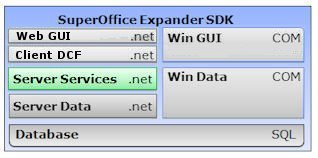

<properties date="2016-06-24"
SortOrder="1"
/>

 
Expander SDK: Server Services .net API
======================================

The web-services API gives you platform-independent access to SuperOffice data and functionality.
The [corresponding **SuperOffice.NetServer.Services** Nuget package](https://www.nuget.org/packages/SuperOffice.NetServer.Services/) contains the assemblies needed to use these APIs. The internal core APIs are documented separately. If you want to work with SuperOffice Online, you will also need to add [the Online Nuget package](https://www.nuget.org/packages/SuperOffice.Crm.Online.Core/) to your solution.

Web-services are simple to use:

         ContactAgent ca = new ContactAgent();
         ContactEntity c = ca.GetContactById( 123 );
         System.out.WriteLine("Contact 123 has name {0}", c.Name );

Take a look at:

* [**What's new in NetServer's Services API**](What's%20New/What's%20New.md)
* [**Introduction to services: concepts**](Introduction/Introduction.md)
* [**Guide to programming with the services API**](Developer's%20Guide/Developer's%20Guide.md)
* [**Programming Examples**](Examples/Examples.md)
* The re-usable Dynamic Client Foundation (DCF) components. These are generic and can be used outside ASP.net to build any sort of client. For example: Internationalization/translation support
