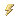

<properties date="2016-06-24"
/>

NetServer Services API Changes from 3.2.3400.1300 to 7.0.4003.1200
 SuperOffice.Services DLL
SuperOffice.License.BuildInfoAttribute

System.Diagnostics.DebuggableAttribute

System.Runtime.CompilerServices.ExtensionAttribute

SuperOffice.CRM.Services
ActivityFilter
System.CodeDom.Compiler.GeneratedCodeAttribute

System.Runtime.Serialization.DataContractAttribute

System.Xml.Serialization.XmlRootAttribute

ToString(System.String)

ActivityInformationListItem
System.CodeDom.Compiler.GeneratedCodeAttribute

System.Runtime.Serialization.DataContractAttribute

System.Xml.Serialization.XmlRootAttribute

ToString(System.String)

ActivitySummary
System.CodeDom.Compiler.GeneratedCodeAttribute

System.Runtime.Serialization.DataContractAttribute

System.Xml.Serialization.XmlRootAttribute

ToString(System.String)

Address
System.CodeDom.Compiler.GeneratedCodeAttribute

System.Runtime.Serialization.DataContractAttribute

System.Xml.Serialization.XmlRootAttribute

Address1

Address2

Address3

City

County

LocalizedAddress

State

Wgs84Latitude

Wgs84Longitude

Zipcode

ToString(System.String)

AgentBase\`1

AgentFactory
System.CodeDom.Compiler.GeneratedCodeAttribute

.ctor()

GetAppointmentAgent()

GetArchiveAgent()

GetAssociateAgent()

GetAudienceAgent()

GetBatchAgent()

GetBLOBAgent()

GetConfigurationAgent()

GetContactAgent()

GetDiagnosticsAgent()

GetDocumentAgent()

GetEMailAgent()

GetFindAgent()

GetForeignSystemAgent()

GetListAgent()

GetMDOAgent()

GetNavigatorAgent()

GetPersonAgent()

GetPhoneListAgent()

GetProjectAgent()

GetRelationAgent()

GetReportAgent()

GetSaintAgent()

GetSaleAgent()

GetSelectionAgent()

GetSentryAgent()

GetTooltipsAgent()

GetTrayAppAgent()

GetUserDefinedFieldInfoAgent()

GetViewStateAgent()

AlarmData

Appointment
System.CodeDom.Compiler.GeneratedCodeAttribute

System.Runtime.Serialization.DataContractAttribute

System.Xml.Serialization.XmlRootAttribute

AlarmLeadTime

AssociateName

HasAlarm

HasAlarm

Location

SaleId

SaleName

ToString(System.String)

AppointmentAgent

AppointmentEntity
System.CodeDom.Compiler.GeneratedCodeAttribute

System.Runtime.Serialization.DataContractAttribute

System.Xml.Serialization.XmlRootAttribute

SuperOffice.CRM.Services.IContactPersonRelationEntityCarrier

SuperOffice.CRM.Services.IRelationEntityCarrier

SuperOffice.CRM.Services.ILinksContainerEntityCarrier

SuperOffice.CRM.Services.IProjectRelationEntityCarrier

AlarmLeadTimeAsInt

LagTimeAsInt

LeadTimeAsInt

Sale

SuggestedAppointmentId

ToString(System.String)

ArchiveAgent

ArchiveConfiguration
System.CodeDom.Compiler.GeneratedCodeAttribute

System.Runtime.Serialization.DataContractAttribute

System.Xml.Serialization.XmlRootAttribute

ToString(System.String)

ArchiveListItem
System.CodeDom.Compiler.GeneratedCodeAttribute

System.Runtime.Serialization.DataContractAttribute

System.Xml.Serialization.XmlRootAttribute

ToString(System.String)

ArchiveListResult

Area

Associate
System.CodeDom.Compiler.GeneratedCodeAttribute

System.Runtime.Serialization.DataContractAttribute

System.Xml.Serialization.XmlRootAttribute

EjUserId

HasPassword

Type

Type

ToString(System.String)

AssociateAgent

AudienceConfigParameter
System.CodeDom.Compiler.GeneratedCodeAttribute

System.SerializableAttribute

System.Xml.Serialization.XmlRootAttribute

.ctor()

AudienceLayoutId

CreatedBy

CreatedDate

Name

UpdatedBy

UpdatedDate

Value

ToString()

AudienceLayoutEntity
System.CodeDom.Compiler.GeneratedCodeAttribute

System.SerializableAttribute

System.Xml.Serialization.XmlRootAttribute

System.Xml.Serialization.XmlSchemaProviderAttribute

System.Xml.Serialization.IXmlSerializable

.ctor()

AudienceLayoutId

CreatedBy

CreatedDate

InstanceLayout

InstanceName

UpdatedBy

UpdatedDate

CarrierSchema(System.Xml.Schema.XmlSchemaSet)

GetSchema()

ReadXml(System.Xml.XmlReader)

ToString()

WriteComplexType(System.IO.StringWriter)

WriteXml(System.Xml.XmlWriter)

BatchTaskInfo
System.CodeDom.Compiler.GeneratedCodeAttribute

System.SerializableAttribute

System.Xml.Serialization.XmlRootAttribute

.ctor()

AssociateId

Context

Created

DatabaseSerialNumber

Description

DetailsRecord

DetailsTable

Id

IsInternalTask

IsSystemTask

LastStarted

Name

ParameterObject

Request

Response

Result

StartCount

State

ToString()

BLOBAgent

BlobEntity
System.CodeDom.Compiler.GeneratedCodeAttribute

System.Runtime.Serialization.DataContractAttribute

System.Xml.Serialization.XmlRootAttribute

ToString(System.String)

Business
System.CodeDom.Compiler.GeneratedCodeAttribute

System.Runtime.Serialization.DataContractAttribute

System.Xml.Serialization.XmlRootAttribute

ToString(System.String)

Cache

Category
System.CodeDom.Compiler.GeneratedCodeAttribute

System.Runtime.Serialization.DataContractAttribute

System.Xml.Serialization.XmlRootAttribute

ToString(System.String)

ColumnDataDictionary
System.Runtime.Serialization.CollectionDataContractAttribute

System.Xml.Serialization.XmlRootAttribute

System.Xml.Serialization.XmlSchemaProviderAttribute

System.Xml.Serialization.IXmlSerializable

CarrierSchema(System.Xml.Schema.XmlSchemaSet)

GetSchema()

ReadXml(System.Xml.XmlReader)

WriteXml(System.Xml.XmlWriter)

ColumnDataKeyValuePair
System.SerializableAttribute

System.Xml.Serialization.XmlRootAttribute

System.Xml.Serialization.XmlSchemaProviderAttribute

System.Xml.Serialization.IXmlSerializable

.ctor()

Key

Value

CarrierSchema(System.Xml.Schema.XmlSchemaSet)

GetSchema()

ReadXml(System.Xml.XmlReader)

WriteXml(System.Xml.XmlWriter)

Competitor
System.CodeDom.Compiler.GeneratedCodeAttribute

System.Runtime.Serialization.DataContractAttribute

System.Xml.Serialization.XmlRootAttribute

ToString(System.String)

Contact
System.CodeDom.Compiler.GeneratedCodeAttribute

System.Runtime.Serialization.DataContractAttribute

System.Xml.Serialization.XmlRootAttribute

Address

Address

FullName

IsOwnerContact

ToString(System.String)

ContactActivity
System.CodeDom.Compiler.GeneratedCodeAttribute

System.Runtime.Serialization.DataContractAttribute

System.Xml.Serialization.XmlRootAttribute

ToString(System.String)

ContactAgent

ContactEntity
System.CodeDom.Compiler.GeneratedCodeAttribute

System.Runtime.Serialization.DataContractAttribute

System.Xml.Serialization.XmlRootAttribute

Address

Address

CustomerLanguage

DbiAgentId

DbiKey

DbiLastModified

DbiLastSyncronized

Deleted

Source

SupportAssociate

SupportPerson

TicketPriority

ToString(System.String)

ContactPersonId
System.CodeDom.Compiler.GeneratedCodeAttribute

System.Runtime.Serialization.DataContractAttribute

System.Xml.Serialization.XmlRootAttribute

ToString(System.String)

ContactRelationEntity
System.CodeDom.Compiler.GeneratedCodeAttribute

System.Runtime.Serialization.DataContractAttribute

System.Xml.Serialization.XmlRootAttribute

ToString(System.String)

Country
System.CodeDom.Compiler.GeneratedCodeAttribute

System.Runtime.Serialization.DataContractAttribute

System.Xml.Serialization.XmlRootAttribute

ToString(System.String)

Credential

CredentialsGroup

CredentialsGroupUsers

CredentialType

CredentialUser

Credited
System.CodeDom.Compiler.GeneratedCodeAttribute

System.Runtime.Serialization.DataContractAttribute

System.Xml.Serialization.XmlRootAttribute

ToString(System.String)

CriteriaInformation
System.CodeDom.Compiler.GeneratedCodeAttribute

System.Runtime.Serialization.DataContractAttribute

System.Xml.Serialization.XmlRootAttribute

ToString(System.String)

Currency
System.CodeDom.Compiler.GeneratedCodeAttribute

System.Runtime.Serialization.DataContractAttribute

System.Xml.Serialization.XmlRootAttribute

ToString(System.String)

CustomerLanguage

DayInformationListItem
System.CodeDom.Compiler.GeneratedCodeAttribute

System.Runtime.Serialization.DataContractAttribute

System.Xml.Serialization.XmlRootAttribute

ToString(System.String)

Department
System.CodeDom.Compiler.GeneratedCodeAttribute

System.Runtime.Serialization.DataContractAttribute

System.Xml.Serialization.XmlRootAttribute

ToString(System.String)

DiagnosticsAgent

DiaryViewEntity
System.CodeDom.Compiler.GeneratedCodeAttribute

System.SerializableAttribute

System.Xml.Serialization.XmlRootAttribute

.ctor()

AssociateList

AssocId

DiaryViewId

Name

Rank

TimeZoneId

Tooltip

VisibleColumns

ToString()

DictionaryCarrier\`2
System.SerializableAttribute

System.Xml.Serialization.XmlRootAttribute

System.Xml.Serialization.XmlSchemaProviderAttribute

System.Collections.IEnumerable

System.Runtime.Serialization.IDeserializationCallback

System.Collections.Generic.ICollection\`1\[System.Collections.Generic.KeyValuePair\`2\[KeyType,ValueType\]\]

System.Collections.Generic.IEnumerable\`1\[System.Collections.Generic.KeyValuePair\`2\[KeyType,ValueType\]\]

System.Collections.IDictionary

System.Collections.Generic.IDictionary\`2\[KeyType,ValueType\]

System.Xml.Serialization.IXmlSerializable

System.Runtime.Serialization.ISerializable

System.Collections.ICollection

.ctor()

CarrierSchema(System.Xml.Schema.XmlSchemaSet)

GetSchema()

ReadXml(System.Xml.XmlReader)

WriteXml(System.Xml.XmlWriter)

Document
System.CodeDom.Compiler.GeneratedCodeAttribute

System.Runtime.Serialization.DataContractAttribute

System.Xml.Serialization.XmlRootAttribute

ToString(System.String)

DocumentEntity
System.CodeDom.Compiler.GeneratedCodeAttribute

System.SerializableAttribute

System.Xml.Serialization.XmlRootAttribute

SuperOffice.CRM.Services.IExtraFieldCarrier

SuperOffice.CRM.Services.IUdefFieldCarrier

SuperOffice.CRM.Services.IEntityCarrier

SuperOffice.CRM.Services.IPublishedCarrier

SuperOffice.CRM.Services.IActivityEntityCarrier

SuperOffice.CRM.Services.IVisibleForCarrier

.ctor()

ActiveLinks

Associate

Attention

Completed

Contact

CreatedBy

CreatedDate

Date

Description

DocumentId

DocumentTemplate

ExternalRef

ExtraFields

Header

IsPublished

Links

LockSemantics

Name

OurRef

Person

Project

PublishEventDate

PublishFrom

PublishTo

Type

UpdatedBy

UpdatedDate

UserDefinedFields

VisibleFor

YourRef

SuperOffice.CRM.Services.IVisibleForCarrier.get\_FieldProperties()

SuperOffice.CRM.Services.IVisibleForCarrier.set\_FieldProperties(SuperOffice.CRM.Security.FieldPropertyDictionary)

ToString()

DocumentTemplate
System.CodeDom.Compiler.GeneratedCodeAttribute

System.Runtime.Serialization.DataContractAttribute

System.Xml.Serialization.XmlRootAttribute

ToString(System.String)

DuplicateEntry
System.CodeDom.Compiler.GeneratedCodeAttribute

System.Runtime.Serialization.DataContractAttribute

System.Xml.Serialization.XmlRootAttribute

ToString(System.String)

DuplicateRule
System.CodeDom.Compiler.GeneratedCodeAttribute

System.Runtime.Serialization.DataContractAttribute

System.Xml.Serialization.XmlRootAttribute

ToString(System.String)

EMailAddress
System.CodeDom.Compiler.GeneratedCodeAttribute

System.SerializableAttribute

System.Xml.Serialization.XmlRootAttribute

.ctor()

Address

AssociateId

ContactId

ContactName

EmailId

PersonId

PersonName

ToString()

EMailAttachment
System.CodeDom.Compiler.GeneratedCodeAttribute

System.SerializableAttribute

System.Xml.Serialization.XmlRootAttribute

System.Xml.Serialization.XmlSchemaProviderAttribute

System.Xml.Serialization.IXmlSerializable

.ctor()

Description

Disposition

Encoding

Filename

Id

Size

Stream

Type

CarrierSchema(System.Xml.Schema.XmlSchemaSet)

GetSchema()

ReadXml(System.Xml.XmlReader)

ToString()

WriteComplexType(System.IO.StringWriter)

WriteXml(System.Xml.XmlWriter)

EMailConnectionInfo
System.CodeDom.Compiler.GeneratedCodeAttribute

System.Runtime.Serialization.DataContractAttribute

System.Xml.Serialization.XmlRootAttribute

ToString(System.String)

EMailCustomHeader
System.CodeDom.Compiler.GeneratedCodeAttribute

System.SerializableAttribute

System.Xml.Serialization.XmlRootAttribute

.ctor()

Name

Values

ToString()

EMailEntity
System.CodeDom.Compiler.GeneratedCodeAttribute

System.SerializableAttribute

System.Xml.Serialization.XmlRootAttribute

.ctor()

Attachments

Bcc

Cc

CustomHeaderList

EMailSOInfo

Flags

FolderName

From

HTMLBody

IsSent

MessageID

PlainBody

Priority

Sent

ServerId

Size

Subject

To

ToString()

EMailEnvelope
System.CodeDom.Compiler.GeneratedCodeAttribute

System.SerializableAttribute

System.Xml.Serialization.XmlRootAttribute

.ctor()

EMailSOInfo

Flags

From

MessageId

Priority

Sent

ServerId

Size

Subject

To

ToString()

EMailFolder
System.CodeDom.Compiler.GeneratedCodeAttribute

System.SerializableAttribute

System.Xml.Serialization.XmlRootAttribute

.ctor()

Delimiter

Flags

Name

Subscribed

TotalItems

UnreadItems

ToString()

EMailSOInfo
System.CodeDom.Compiler.GeneratedCodeAttribute

System.SerializableAttribute

System.Xml.Serialization.XmlRootAttribute

.ctor()

AppointmentId

Archived

DocumentId

ProjectId

SaleId

ToString()

EntityElement
ToString(System.String)

Find
System.CodeDom.Compiler.GeneratedCodeAttribute

System.SerializableAttribute

System.Xml.Serialization.XmlRootAttribute

.ctor()

CriteriaInformation

FindResults

ToString()

FindAgent

FindResults
System.CodeDom.Compiler.GeneratedCodeAttribute

System.Runtime.Serialization.DataContractAttribute

System.Xml.Serialization.XmlRootAttribute

RowCount

ToString(System.String)

ForeignAppEntity
System.CodeDom.Compiler.GeneratedCodeAttribute

System.Runtime.Serialization.DataContractAttribute

System.Xml.Serialization.XmlRootAttribute

ToString(System.String)

ForeignDevice
System.CodeDom.Compiler.GeneratedCodeAttribute

System.Runtime.Serialization.DataContractAttribute

System.Xml.Serialization.XmlRootAttribute

ToString(System.String)

ForeignKey
System.CodeDom.Compiler.GeneratedCodeAttribute

System.Runtime.Serialization.DataContractAttribute

System.Xml.Serialization.XmlRootAttribute

ToString(System.String)

ForeignSystemAgent

History
System.CodeDom.Compiler.GeneratedCodeAttribute

System.Runtime.Serialization.DataContractAttribute

System.Xml.Serialization.XmlRootAttribute

ToString(System.String)

HistoryRequest
System.CodeDom.Compiler.GeneratedCodeAttribute

System.Runtime.Serialization.DataContractAttribute

System.Xml.Serialization.XmlRootAttribute

ToString(System.String)

IContactPersonRelationEntityCarrier

ILicenseAgent

ILinksContainerEntityCarrier

IPreferenceAgent

IProjectRelationEntityCarrier

IRelationEntityCarrier

IReplicationAgent

ITimeZoneAgent

IUserAgent

KeyValuePairCarrier\`2
System.SerializableAttribute

System.Xml.Serialization.XmlRootAttribute

System.Xml.Serialization.XmlSchemaProviderAttribute

System.Xml.Serialization.IXmlSerializable

.ctor()

Key

Value

CarrierSchema(System.Xml.Schema.XmlSchemaSet)

GetSchema()

ReadXml(System.Xml.XmlReader)

WriteXml(System.Xml.XmlWriter)

LanguageInfo
System.CodeDom.Compiler.GeneratedCodeAttribute

System.Runtime.Serialization.DataContractAttribute

System.Xml.Serialization.XmlRootAttribute

ToString(System.String)

LicenseAgent

LicenseOwner

LicenseResult

Link
System.CodeDom.Compiler.GeneratedCodeAttribute

System.Runtime.Serialization.DataContractAttribute

System.Runtime.Serialization.KnownTypeAttribute

System.Xml.Serialization.XmlRootAttribute

ExtraInfo

LinkId

ToString(System.String)

LinkExtended

ListAgent

LocalizedField
System.CodeDom.Compiler.GeneratedCodeAttribute

System.Runtime.Serialization.DataContractAttribute

System.Xml.Serialization.XmlRootAttribute

AddressType

ToString(System.String)

LocalizedText
System.CodeDom.Compiler.GeneratedCodeAttribute

System.Runtime.Serialization.DataContractAttribute

System.Xml.Serialization.XmlRootAttribute

ToString(System.String)

Logging

MailMergeSettings
System.CodeDom.Compiler.GeneratedCodeAttribute

System.SerializableAttribute

System.Xml.Serialization.XmlRootAttribute

.ctor()

AddCompanyInterest

AddPersonInterest

AlwaysUseCustomAttention

CustomAttention

CustomMailBody

CustomMailSubject

DocumentId

ExtraInfo

IncludeNoMailingsRecipient

IncludeRetiredRecipients

IncludeStoppedRecipients

MailMergeDeliveryType

ProjectId

RemoveCompanyInterest

RemovePersonInterest

SaveDocument

SelectionId

Synchronous

TaskEntity

TestOnly

ToString()

MailMergeTask
System.CodeDom.Compiler.GeneratedCodeAttribute

System.SerializableAttribute

System.Xml.Serialization.XmlRootAttribute

.ctor()

Completed

Description

Duration

OwnerAssociateId

PriorityId

ProjectId

SingleEntryOnEachCompany

StartDate

TypeId

VisibleFor

ToString()

MDOAgent

MDOListItem
System.CodeDom.Compiler.GeneratedCodeAttribute

System.Runtime.Serialization.DataContractAttribute

System.Xml.Serialization.XmlRootAttribute

ToString(System.String)

ModuleLicenseLink

MrMrs
System.CodeDom.Compiler.GeneratedCodeAttribute

System.Runtime.Serialization.DataContractAttribute

System.Xml.Serialization.XmlRootAttribute

ToString(System.String)

MultiAlarmData

NavigatorCompany
System.CodeDom.Compiler.GeneratedCodeAttribute

System.SerializableAttribute

System.Xml.Serialization.XmlRootAttribute

.ctor()

Id

Tooltip

Value

ToString()

Person
System.CodeDom.Compiler.GeneratedCodeAttribute

System.Runtime.Serialization.DataContractAttribute

System.Xml.Serialization.XmlRootAttribute

ContactFullName

ToString(System.String)

PersonAgent

PersonEntity
System.CodeDom.Compiler.GeneratedCodeAttribute

System.Runtime.Serialization.DataContractAttribute

System.Xml.Serialization.XmlRootAttribute

Address

Address

BlockEmarketing

ChatEmails

CustomerLanguage

DbiAgentId

DbiKey

DbiLastModified

DbiLastSyncronized

InternetPhones

OtherPhones

Pagers

SentInfo

ShowContactTickets

Source

SupportAssociate

TicketPriority

UserInfo

ToString(System.String)

PhoneListAgent

PhoneListItem
System.CodeDom.Compiler.GeneratedCodeAttribute

System.Runtime.Serialization.DataContractAttribute

System.Xml.Serialization.XmlRootAttribute

ToString(System.String)

PhoneListPreferences
System.CodeDom.Compiler.GeneratedCodeAttribute

System.Runtime.Serialization.DataContractAttribute

System.Xml.Serialization.XmlRootAttribute

ToString(System.String)

Position
System.CodeDom.Compiler.GeneratedCodeAttribute

System.Runtime.Serialization.DataContractAttribute

System.Xml.Serialization.XmlRootAttribute

ToString(System.String)

Preference
System.CodeDom.Compiler.GeneratedCodeAttribute

System.Runtime.Serialization.DataContractAttribute

System.Xml.Serialization.XmlRootAttribute

TabOrder

ToString(System.String)

PreferenceAgent

PreferenceSpec
System.CodeDom.Compiler.GeneratedCodeAttribute

System.Runtime.Serialization.DataContractAttribute

System.Xml.Serialization.XmlRootAttribute

ToString(System.String)

Priority
System.CodeDom.Compiler.GeneratedCodeAttribute

System.Runtime.Serialization.DataContractAttribute

System.Xml.Serialization.XmlRootAttribute

ToString(System.String)

PrivateAudienceAgentFactory
SuperOffice.Factory.ClassFactoryAttribute

System.CodeDom.Compiler.GeneratedCodeAttribute

SuperOffice.Factory.IPrivateFactory

.ctor()

SuperOffice.Factory.IPrivateFactory.Create(System.Type, System.Type\[\], System.Object\[\])

PrivateBatchAgentFactory
SuperOffice.Factory.ClassFactoryAttribute

System.CodeDom.Compiler.GeneratedCodeAttribute

SuperOffice.Factory.IPrivateFactory

.ctor()

SuperOffice.Factory.IPrivateFactory.Create(System.Type, System.Type\[\], System.Object\[\])

PrivateConfigurationAgentFactory
SuperOffice.Factory.ClassFactoryAttribute

System.CodeDom.Compiler.GeneratedCodeAttribute

SuperOffice.Factory.IPrivateFactory

.ctor()

SuperOffice.Factory.IPrivateFactory.Create(System.Type, System.Type\[\], System.Object\[\])

PrivateDocumentAgentFactory
SuperOffice.Factory.ClassFactoryAttribute

System.CodeDom.Compiler.GeneratedCodeAttribute

SuperOffice.Factory.IPrivateFactory

.ctor()

SuperOffice.Factory.IPrivateFactory.Create(System.Type, System.Type\[\], System.Object\[\])

PrivateEMailAgentFactory
SuperOffice.Factory.ClassFactoryAttribute

System.CodeDom.Compiler.GeneratedCodeAttribute

SuperOffice.Factory.IPrivateFactory

.ctor()

SuperOffice.Factory.IPrivateFactory.Create(System.Type, System.Type\[\], System.Object\[\])

PrivateLicenseAgentFactory

PrivateNavigatorAgentFactory
SuperOffice.Factory.ClassFactoryAttribute

System.CodeDom.Compiler.GeneratedCodeAttribute

SuperOffice.Factory.IPrivateFactory

.ctor()

SuperOffice.Factory.IPrivateFactory.Create(System.Type, System.Type\[\], System.Object\[\])

PrivatePreferenceAgentFactory

PrivateProjectAgentFactory
SuperOffice.Factory.ClassFactoryAttribute

System.CodeDom.Compiler.GeneratedCodeAttribute

SuperOffice.Factory.IPrivateFactory

.ctor()

SuperOffice.Factory.IPrivateFactory.Create(System.Type, System.Type\[\], System.Object\[\])

PrivateReplicationAgentFactory

PrivateReportAgentFactory
SuperOffice.Factory.ClassFactoryAttribute

System.CodeDom.Compiler.GeneratedCodeAttribute

SuperOffice.Factory.IPrivateFactory

.ctor()

SuperOffice.Factory.IPrivateFactory.Create(System.Type, System.Type\[\], System.Object\[\])

PrivateSaintAgentFactory
SuperOffice.Factory.ClassFactoryAttribute

System.CodeDom.Compiler.GeneratedCodeAttribute

SuperOffice.Factory.IPrivateFactory

.ctor()

SuperOffice.Factory.IPrivateFactory.Create(System.Type, System.Type\[\], System.Object\[\])

PrivateSaleAgentFactory
SuperOffice.Factory.ClassFactoryAttribute

System.CodeDom.Compiler.GeneratedCodeAttribute

SuperOffice.Factory.IPrivateFactory

.ctor()

SuperOffice.Factory.IPrivateFactory.Create(System.Type, System.Type\[\], System.Object\[\])

PrivateSelectionAgentFactory
SuperOffice.Factory.ClassFactoryAttribute

System.CodeDom.Compiler.GeneratedCodeAttribute

SuperOffice.Factory.IPrivateFactory

.ctor()

SuperOffice.Factory.IPrivateFactory.Create(System.Type, System.Type\[\], System.Object\[\])

PrivateTimeZoneAgentFactory

PrivateTooltipsAgentFactory
SuperOffice.Factory.ClassFactoryAttribute

System.CodeDom.Compiler.GeneratedCodeAttribute

SuperOffice.Factory.IPrivateFactory

.ctor()

SuperOffice.Factory.IPrivateFactory.Create(System.Type, System.Type\[\], System.Object\[\])

PrivateTrayAppAgentFactory
SuperOffice.Factory.ClassFactoryAttribute

System.CodeDom.Compiler.GeneratedCodeAttribute

SuperOffice.Factory.IPrivateFactory

.ctor()

SuperOffice.Factory.IPrivateFactory.Create(System.Type, System.Type\[\], System.Object\[\])

PrivateUserAgentFactory

PrivateViewStateAgentFactory
SuperOffice.Factory.ClassFactoryAttribute

System.CodeDom.Compiler.GeneratedCodeAttribute

SuperOffice.Factory.IPrivateFactory

.ctor()

SuperOffice.Factory.IPrivateFactory.Create(System.Type, System.Type\[\], System.Object\[\])

Project
System.CodeDom.Compiler.GeneratedCodeAttribute

System.Runtime.Serialization.DataContractAttribute

System.Xml.Serialization.XmlRootAttribute

ToString(System.String)

ProjectEntity
System.CodeDom.Compiler.GeneratedCodeAttribute

System.SerializableAttribute

System.Xml.Serialization.XmlRootAttribute

SuperOffice.CRM.Services.IExtraFieldCarrier

SuperOffice.CRM.Services.IUdefFieldCarrier

SuperOffice.CRM.Services.IEntityCarrier

SuperOffice.CRM.Services.IPublishedCarrier

.ctor()

ActiveStatusMonitorId

Associate

CreatedBy

CreatedDate

Description

ExtraFields

HasImage

ImageDescription

IsPublished

Name

Postit

ProjectId

ProjectMembers

ProjectNumber

ProjectStatus

ProjectType

PublishEventDate

PublishFrom

PublishTo

UpdatedBy

UpdatedDate

Urls

UserDefinedFields

ToString()

ProjectEvent
System.CodeDom.Compiler.GeneratedCodeAttribute

System.SerializableAttribute

System.Xml.Serialization.XmlRootAttribute

.ctor()

AssociateFullName

AssociateId

Description

Enabled

EventDate

EventName

IsSignedOn

ProjectId

SignOff

SignOffConfirmationText

SignOffPersonId

SignOffTaskEnable

SignOffTaskId

SignOffText

SignOffTriggersAssign

SignOn

SignOnConfirmationText

SignOnPersonId

SignOnTaskEnable

SignOnTaskId

SignOnText

SignOnTriggersAssign

ToString()

ProjectEventEntity
System.CodeDom.Compiler.GeneratedCodeAttribute

System.SerializableAttribute

System.Xml.Serialization.XmlRootAttribute

.ctor()

CreatedBy

CreatedDate

Enabled

EventDate

Id

IsPublished

IsVisibleForCategories

IsVisibleForMembers

IsVisibleForPersonInterests

ProjectEventId

ProjectId

PublishFrom

PublishTo

PublishType

SignOff

SignOffConfirmationText

SignOffTaskEnable

SignOffTaskId

SignOffText

SignOffTriggersAssign

SignOn

SignOnConfirmationText

SignOnTaskEnable

SignOnTaskId

SignOnText

SignOnTriggersAssign

UpdatedBy

UpdatedDate

VisibleForCategories

VisibleForPersonInterests

ToString()

ProjectMember
System.CodeDom.Compiler.GeneratedCodeAttribute

System.SerializableAttribute

System.Xml.Serialization.XmlRootAttribute

.ctor()

Comment

ContactId

ContactName

CountryId

EmailAddress

EmailAddressName

EmailId

Firstname

FullName

Lastname

MiddleName

Mrmrs

PersonId

Phone

PhoneId

ProjectId

ProjectmemberId

ProjectMemberTypeId

ProjectMemberTypeName

ToString()

ProjectStatus
System.CodeDom.Compiler.GeneratedCodeAttribute

System.Runtime.Serialization.DataContractAttribute

System.Xml.Serialization.XmlRootAttribute

ToString(System.String)

ProjectType
System.CodeDom.Compiler.GeneratedCodeAttribute

System.Runtime.Serialization.DataContractAttribute

System.Xml.Serialization.XmlRootAttribute

ToString(System.String)

Rating
System.CodeDom.Compiler.GeneratedCodeAttribute

System.Runtime.Serialization.DataContractAttribute

System.Xml.Serialization.XmlRootAttribute

ToString(System.String)

Reason
System.CodeDom.Compiler.GeneratedCodeAttribute

System.Runtime.Serialization.DataContractAttribute

System.Xml.Serialization.XmlRootAttribute

ToString(System.String)

ReasonSold

ReasonStalled

RecipientStatistics
System.CodeDom.Compiler.GeneratedCodeAttribute

System.Runtime.Serialization.DataContractAttribute

System.Xml.Serialization.XmlRootAttribute

ToString(System.String)

RedLetterDetails
System.CodeDom.Compiler.GeneratedCodeAttribute

System.Runtime.Serialization.DataContractAttribute

System.Xml.Serialization.XmlRootAttribute

ToString(System.String)

RedLetterInformationListItem
System.CodeDom.Compiler.GeneratedCodeAttribute

System.Runtime.Serialization.DataContractAttribute

System.Xml.Serialization.XmlRootAttribute

ToString(System.String)

RedLetterSummary
System.CodeDom.Compiler.GeneratedCodeAttribute

System.Runtime.Serialization.DataContractAttribute

System.Xml.Serialization.XmlRootAttribute

ToString(System.String)

RelationAgent

ReplicationAgent

ReportEntity
System.CodeDom.Compiler.GeneratedCodeAttribute

System.SerializableAttribute

System.Xml.Serialization.XmlRootAttribute

.ctor()

AssociateId

Description

Name

ReportCategory

ReportId

ReportLayout

TemplateId

ToString()

ReportLabelLayoutEntity
System.CodeDom.Compiler.GeneratedCodeAttribute

System.SerializableAttribute

System.Xml.Serialization.XmlRootAttribute

.ctor()

BottomMargin

CountColumns

CountRows

Description

LeftMargin

Name

Orientation

PaperHeight

PaperWidth

ReportLabelLayoutId

RightMargin

TopMargin

ToString()

Role

Sale
System.CodeDom.Compiler.GeneratedCodeAttribute

System.Runtime.Serialization.DataContractAttribute

System.Xml.Serialization.XmlRootAttribute

ToString(System.String)

SaleEntity
System.CodeDom.Compiler.GeneratedCodeAttribute

System.SerializableAttribute

System.Xml.Serialization.XmlRootAttribute

SuperOffice.CRM.Services.IExtraFieldCarrier

SuperOffice.CRM.Services.IUdefFieldCarrier

SuperOffice.CRM.Services.IEntityCarrier

SuperOffice.CRM.Services.IPublishedCarrier

SuperOffice.CRM.Services.IActivityEntityCarrier

SuperOffice.CRM.Services.IVisibleForCarrier

.ctor()

ActiveLinks

Amount

Appointment

Associate

Competitor

Completed

Contact

CreatedBy

CreatedDate

Credited

Currency

Earning

EarningPercent

ExtraFields

Heading

IsPublished

Links

Number

Person

Probability

Project

PublishEventDate

PublishFrom

PublishTo

Rating

Reason

Saledate

SaleId

SaleText

Source

Status

UpdatedBy

UpdatedDate

UserDefinedFields

VisibleFor

SuperOffice.CRM.Services.IVisibleForCarrier.get\_FieldProperties()

SuperOffice.CRM.Services.IVisibleForCarrier.set\_FieldProperties(SuperOffice.CRM.Security.FieldPropertyDictionary)

ToString()

SalesActivity
System.CodeDom.Compiler.GeneratedCodeAttribute

System.Runtime.Serialization.DataContractAttribute

System.Xml.Serialization.XmlRootAttribute

ToString(System.String)

SaleSummary
System.CodeDom.Compiler.GeneratedCodeAttribute

System.SerializableAttribute

System.Xml.Serialization.XmlRootAttribute

.ctor()

BaseCurrency

CurrentOverdue

CurrentOverdueTotalBaseCurrency

CurrentOverdueTotalOwnCurrency

CurrentOverdueWeightedBaseCurrency

CurrentOverdueWeightedOwnCurrency

FutureOpen

FutureOpenTotalBaseCurrency

FutureOpenTotalOwnCurrency

FutureOpenWeightedBaseCurrency

FutureOpenWeightedOwnCurrency

Lost

LostTotalBaseCurrency

LostTotalOwnCurrency

Open

OpenTotalBaseCurrency

OpenTotalOwnCurrency

OpenWeightedBaseCurrency

OpenWeightedOwnCurrency

OwnCurrency

PreviousOverdue

PreviousOverdueTotalBaseCurrency

PreviousOverdueTotalOwnCurrency

PreviousOverdueWeightedBaseCurrency

PreviousOverdueWeightedOwnCurrency

Sold

SoldTotalBaseCurrency

SoldTotalOwnCurrency

ToString()

SaleType

Satellite

SelectableMDOListItem
System.CodeDom.Compiler.GeneratedCodeAttribute

System.Runtime.Serialization.DataContractAttribute

System.Xml.Serialization.XmlRootAttribute

GetFlattenedList(SuperOffice.CRM.Services.SelectableMDOListItem\[\], System.Boolean)

ToString(System.String)

SelectionCategory
System.CodeDom.Compiler.GeneratedCodeAttribute

System.Runtime.Serialization.DataContractAttribute

System.Xml.Serialization.XmlRootAttribute

ToString(System.String)

SelectionEntity
System.CodeDom.Compiler.GeneratedCodeAttribute

System.SerializableAttribute

System.Xml.Serialization.XmlRootAttribute

SuperOffice.CRM.Services.IVisibleForCarrier

SuperOffice.CRM.Services.IEntityCarrier

.ctor()

Associate

CompanyUnique

CreatedBy

CreatedDate

Description

GroupIdx

IncludePerson

MemberCount

Name

Postit

PostitTextId

SelectionCategory

SelectionId

SelectionType

SoundEx

Source

TextId

UpdatedBy

UpdatedCount

UpdatedDate

Visibility

VisibleFor

SuperOffice.CRM.Services.IVisibleForCarrier.get\_FieldProperties()

SuperOffice.CRM.Services.IVisibleForCarrier.set\_FieldProperties(SuperOffice.CRM.Security.FieldPropertyDictionary)

ToString()

SelectionMemberEditValues
System.CodeDom.Compiler.GeneratedCodeAttribute

System.Runtime.Serialization.DataContractAttribute

System.Xml.Serialization.XmlRootAttribute

ToString(System.String)

Sentry
System.CodeDom.Compiler.GeneratedCodeAttribute

System.Runtime.Serialization.DataContractAttribute

System.Xml.Serialization.XmlRootAttribute

ToString(System.String)

SentryAgent

Source
System.CodeDom.Compiler.GeneratedCodeAttribute

System.Runtime.Serialization.DataContractAttribute

System.Xml.Serialization.XmlRootAttribute

ToString(System.String)

StatusMonitor
System.CodeDom.Compiler.GeneratedCodeAttribute

System.Runtime.Serialization.DataContractAttribute

System.Xml.Serialization.XmlRootAttribute

ToString(System.String)

SuggestedAppointment

TabOrder

Task
System.CodeDom.Compiler.GeneratedCodeAttribute

System.Runtime.Serialization.DataContractAttribute

System.Xml.Serialization.XmlRootAttribute

ToString(System.String)

TaskListItem
System.CodeDom.Compiler.GeneratedCodeAttribute

System.Runtime.Serialization.DataContractAttribute

System.Xml.Serialization.XmlRootAttribute

ToString(System.String)

TemplateVariablesParameters
System.CodeDom.Compiler.GeneratedCodeAttribute

System.SerializableAttribute

System.Xml.Serialization.XmlRootAttribute

.ctor()

AppointmentId

ContactId

CultureName

CustomTags

DocumentEntity

DocumentId

Encoding

PersonId

ProjectId

SaleId

SelectionId

SourceInput

ToString()

TicketPriority

TimeZoneAgent

Tooltips
System.CodeDom.Compiler.GeneratedCodeAttribute

System.SerializableAttribute

System.Xml.Serialization.XmlRootAttribute

.ctor()

ToString()

TrayApp
System.CodeDom.Compiler.GeneratedCodeAttribute

System.SerializableAttribute

System.Xml.Serialization.XmlRootAttribute

.ctor()

ToString()

UntrustedCredentials
System.CodeDom.Compiler.GeneratedCodeAttribute

System.Runtime.Serialization.DataContractAttribute

System.Xml.Serialization.XmlRootAttribute

ToString(System.String)

User

UserAgent

UserDefinedFieldInfo
System.CodeDom.Compiler.GeneratedCodeAttribute

System.Runtime.Serialization.DataContractAttribute

System.Xml.Serialization.XmlRootAttribute

ToString(System.String)

UserDefinedFieldInfoAgent

UserGroup

UserHelper

UserInfo

UserValidationResult

VisibleFor
System.Runtime.Serialization.DataContractAttribute

System.Xml.Serialization.XmlRootAttribute

ToString()

ToString(System.String)

WindowPosSize
System.CodeDom.Compiler.GeneratedCodeAttribute

System.SerializableAttribute

System.Xml.Serialization.XmlRootAttribute

.ctor()

AssociateId

ExtraId

ExtraInfo

Height

LeftX

OwnerWindow

PersonId

State

UpperY

Width

WindowPosSizeId

ToString()

SuperOffice.CRM.Services.Reflection
FactoryHelper

SuperOffice.CRM.Services.SOAP
SoCredentialsHeader
System.Xml.Serialization.XmlRootAttribute

.ctor()

.ctor(SuperOffice.Security.Principal.SoCredentials)

.ctor(System.String, System.String, System.String)

AuthenticationType

Secret

UserId

TimeZoneHeader
System.Xml.Serialization.XmlRootAttribute

.ctor()

SoTimeZoneId

SoTimeZoneLocationCode

SuperOffice.CRM.Services.Util
TypeConversion
ConvertToImage(System.Byte\[\])

ConvertToImage(System.String)

ConvertToStream(System.Byte\[\])

ConvertToStream(System.String)

------------------------------------------------------------------------

 SOCore DLL
System.Runtime.CompilerServices.ExtensionAttribute

SuperOffice
SoContext
CurrentIdentity

CurrentIdentity

SoSession
Authenticate(SuperOffice.Security.Principal.SoCredentials, System.Security.Principal.WindowsIdentity)

Authenticate(System.IdentityModel.Tokens.SecurityToken\[\])

SoSystemInfo

SuperOffice.Configuration
ConfigFile
AddOverride(System.String, System.String, System.String)

AddOverrides(System.String\[,\])

GetAllOverrides()

GetConfig(System.String, System.Boolean)

RemoveAllOverrides()

RemoveOverride(System.String, System.String)

SetConfigFile(System.String)

BatchService
ImpersonateReporterPlugin

ReporterPath

RunTasksInProcess

TaskTimeout

Data
Explicit
ParentDBPassword

ParentDBUser

Documents
AllArchivePaths

Globalization
AllwaysUseGsmPhoneStyle

Security
Authentication

Services
WrapExceptions

ProtectUserNameAndPasswordHelper

SuperOffice.CRM
FunctionRightStrings
AdminPreferences

AdminReplication

AdminRole

AdminSale

AdminScript

ManageEntities

INextDueDatePlugin

NextDueDatePluginAttribute

ProgressEstimateCallback

ProgressStepCallback

TimeZoneData
System.Runtime.Serialization.DataContractAttribute

System.Xml.Serialization.XmlRootAttribute

System.Xml.Serialization.XmlSchemaProviderAttribute

MachineTimeZone

CarrierSchema(System.Xml.Schema.XmlSchemaSet)

TimeZoneRule
System.Runtime.Serialization.DataContractAttribute

System.Xml.Serialization.XmlRootAttribute

System.Xml.Serialization.XmlSchemaProviderAttribute

CarrierSchema(System.Xml.Schema.XmlSchemaSet)

UserPreferenceStrings
Defaults
DefaultSaleType

DocPluginNames

DocTemplateTypeMap

Functions
AcademicTitle

ActiveSound

MiniPanel

QuickLaunchBar

Sale

SaleFilterDialog

Selection
LastUsedSelectionTargetTableId

LastUsedSelectionUnionType

SkipCompletedSelections

System
NoDbUsers

PreferDocLanguage

Visual
AcademicTitle

ActiveSound

SuperOffice.CRM.ArchiveLists
ArchiveActivityRow
ColumnSaleId

SaleId

ArchiveColumnData
System.Runtime.Serialization.DataContractAttribute

System.Xml.Serialization.XmlRootAttribute

System.Xml.Serialization.XmlSchemaProviderAttribute

System.Xml.Serialization.IXmlSerializable

.ctor(System.String, System.String, System.String, System.Object)

\_\_dbFieldId

\_\_dbFieldPrimaryKey

\_\_dbParentPrimaryKey

\_\_dbParentTableNumber

RawValue

CarrierSchema(System.Xml.Schema.XmlSchemaSet)

GetSchema()

ReadXml(System.Xml.XmlReader)

SetAlgorithmInfo(System.Int32)

SetRawValue(System.Object)

TransferDbInfo(SuperOffice.CRM.ArchiveLists.ArchiveColumnData)

WriteComplexType(System.IO.StringWriter)

WriteXml(System.Xml.XmlWriter)

ArchiveColumnInfo
\_\_sourceCode

ExtractCompletePrefix(System.String)

IsDotSyntax()

IsDotSyntax(System.String\[\])

ArchiveEntityInfo
System.SerializableAttribute

System.ICloneable

.ctor()

.ctor(System.String, System.String, System.Boolean)

.ctor(System.String, System.String, System.Boolean, System.Boolean)

HideAsDefault

Mandatory

Optional

SetMandatory

SetOptional

ShowAsDefault

DefaultShow

DisplayName

DisplayTooltip

IsOptional

Name

Clone()

ToNameArray(SuperOffice.CRM.ArchiveLists.ArchiveEntityInfo\[\])

ToNameArray(System.Collections.Generic.List\`1\[SuperOffice.CRM.ArchiveLists.ArchiveEntityInfo\])

ToNameArray(System.Predicate\`1\[SuperOffice.CRM.ArchiveLists.ArchiveEntityInfo\], SuperOffice.CRM.ArchiveLists.ArchiveEntityInfo\[\])

ToNameArray(System.Predicate\`1\[SuperOffice.CRM.ArchiveLists.ArchiveEntityInfo\], System.Collections.Generic.List\`1\[SuperOffice.CRM.ArchiveLists.ArchiveEntityInfo\])

ToNameDictionary(SuperOffice.CRM.ArchiveLists.ArchiveEntityInfo\[\])

ToNameDictionary(System.Collections.Generic.List\`1\[SuperOffice.CRM.ArchiveLists.ArchiveEntityInfo\])

ToNameDictionary(System.Predicate\`1\[SuperOffice.CRM.ArchiveLists.ArchiveEntityInfo\], SuperOffice.CRM.ArchiveLists.ArchiveEntityInfo\[\])

ToNameDictionary(System.Predicate\`1\[SuperOffice.CRM.ArchiveLists.ArchiveEntityInfo\], System.Collections.Generic.List\`1\[SuperOffice.CRM.ArchiveLists.ArchiveEntityInfo\])

ToString()

ArchiveOrderByInfo
ToNameArray(SuperOffice.CRM.ArchiveLists.ArchiveOrderByInfo\[\])

ArchiveProjectRow
ColumnText

Text

ArchiveRestrictionInfo
InterOperator

InterParenthesis

UniqueHash

GetBaseNameFromComplexName(System.String)

GetBaseNameFromUniqueRestrictionKey(System.String)

GetComplexName()

ToKeyArray(SuperOffice.CRM.ArchiveLists.ArchiveRestrictionInfo\[\])

ToKeyArray(System.Collections.Generic.List\`1\[SuperOffice.CRM.ArchiveLists.ArchiveRestrictionInfo\])

ToKeyArray(System.Predicate\`1\[SuperOffice.CRM.ArchiveLists.ArchiveRestrictionInfo\], SuperOffice.CRM.ArchiveLists.ArchiveRestrictionInfo\[\])

ToKeyArray(System.Predicate\`1\[SuperOffice.CRM.ArchiveLists.ArchiveRestrictionInfo\], System.Collections.Generic.List\`1\[SuperOffice.CRM.ArchiveLists.ArchiveRestrictionInfo\])

ToKeyDictionary(SuperOffice.CRM.ArchiveLists.ArchiveRestrictionInfo\[\])

ToKeyDictionary(System.Collections.Generic.ICollection\`1\[SuperOffice.CRM.ArchiveLists.ArchiveRestrictionInfo\])

ToKeyDictionary(System.Predicate\`1\[SuperOffice.CRM.ArchiveLists.ArchiveRestrictionInfo\], SuperOffice.CRM.ArchiveLists.ArchiveRestrictionInfo\[\])

ToKeyDictionary(System.Predicate\`1\[SuperOffice.CRM.ArchiveLists.ArchiveRestrictionInfo\], System.Collections.Generic.ICollection\`1\[SuperOffice.CRM.ArchiveLists.ArchiveRestrictionInfo\])

InterRestrictionOperator

ArchiveResultInformation

ArchiveRow
EntityName

Parents

PrimaryKey

RowKey

RowType

AddOverlappingBoolColumn(System.String, System.Boolean)

AddOverlappingBoolColumn(System.String, System.Boolean, System.String)

AddOverlappingBoolColumn(System.String, System.Boolean, System.String, System.String)

AddOverlappingDateTimeColumn(System.String, System.DateTime)

AddOverlappingDateTimeColumn(System.String, System.DateTime, System.String)

AddOverlappingDateTimeColumn(System.String, System.DateTime, System.String, System.String)

AddOverlappingIntColumn(System.String, System.Int32)

AddOverlappingIntColumn(System.String, System.Int32, System.String)

AddOverlappingIntColumn(System.String, System.Int32, System.String, System.String)

AddParent(System.String, System.Int32)

RemoveLinkHint(System.String)

ArchiveRowParent

ArchiveRowTypeInfo

ArchiveSelectionRow
ColumnCompleted

ColumnSelectionMemberType

Completed

SelectionMemberType

Constants
ColumnAlgorithms

DisplayTypes
Bool

IconHints
AlarmBell

AnonymousUser

Appointment\_Alarm

AppointmentActivity

AppointmentUdef

Arrow\_Left

Arrow\_Right

Assignment\_Declined

Assignment\_Seen

AssignmentDeclined

AssignmentSeen

Associate\_Current

Audience\_Associate

Audience\_Associate\_Heading

Audience\_Associate\_NoLogin

Booking\_Accepted

Booking\_Cancelled

Booking\_Child

Booking\_Moved

Booking\_Moved\_Seen

Booking\_Not\_Seen

Booking\_Rejected

Booking\_Seen

BookingAccepted

BookingCancelled

BookingDeclined

BookingMoved

BookingMovedSeen

BookingNew

BookingSeen

ChildBooking

Conflict

ContactSaint

ContactUdef

CurrentAssociate

Document\_MailMerge

DocumentActivity

DocumentMergeActivity

DocumentReportActivity

DocumentUdef

Email

Email\_Archive\_Heading

Email\_Archived

Email\_Deleted

Email\_Forwarded

Email\_Importance\_High

Email\_Importance\_Low

Email\_NotRead

Email\_Read

Email\_Replied

Email\_Status\_Heading

EmailActivity

ExternalPerson

Leftarrow

LostSaleActivity

MailArchived

MailArchivedHeading

MailDeleted

MailForwarded

Mailings\_Heading

Mailings\_No

MailNew

MailRead

MailReplied

MailStatus

NoMail

NoMailings

OpenSaleActivity

Other\_Criteria

Person\_Heading

Person\_Undefined

PersonTypeActiveAssociate

PersonTypeActiveExternal

PersonTypeInactiveAssociate

PersonTypeInactiveExternal

PersonTypeUndefined

PersonUdef

Phone

PhoneActivity

PriorityHigh

PriorityLow

ProjectSaint

ProjectUdef

Published

Relation\_DestinationTarget

Relation\_SourceTarget

RelationDest

RelationSource

Report

Rightarrow

Saint\_Counter\_Contact

Saint\_Counter\_Project

Saint\_Counter\_Saint

Saint\_StatusMonitor

Saint\_StatusMonitor\_Passive

SaintMonitorPassive

Sale\_Lost

Sale\_Open

Sale\_Sold

Sale\_Stalled

SaleUdef

SoldSaleActivity

StatusMonitor

SystemUser

Task

TaskActivity

Ticket

URL

User\_Anonymous

User\_External

User\_System

UserLicense

Yes

Options

StyleHints
Active

InActive

LoggedOnWin

TicketUnread

ResourceIconHintMapping

ResourceIconHintMappingHelper

SuperOffice.CRM.Globalization
CultureDataFormatter
EncodeDate(System.DateTime, System.Boolean)

EncodeDateTime(System.DateTime, System.Boolean)

EncodeDouble(System.Double, System.Boolean)

EncodeDouble(System.Double, System.Int32, System.Boolean)

EncodeInt(System.Int32, System.Boolean)

EncodeMoney(System.Double, System.Boolean)

EncodeTime(System.DateTime, System.Boolean)

DummyField
AddressType

FormattedFieldLocal
.ctor(System.String, System.Reflection.PropertyInfo, System.Object, System.String, System.String, System.Int32, SuperOffice.CRM.Globalization.FormattedFieldFlags, System.String)

.ctor(System.String, System.Reflection.PropertyInfo, System.Object, System.String, System.String, System.Int32, SuperOffice.CRM.Globalization.FormattedFieldFlags, System.String, SuperOffice.Data.AddressType)

AddressType

SuperOffice.CRM.Rows
ContactCode

SuperOffice.CRM.Security
FieldProperty
System.Runtime.Serialization.DataContractAttribute

System.SerializableAttribute

System.Xml.Serialization.XmlRootAttribute

System.Xml.Serialization.XmlSchemaProviderAttribute

System.Xml.Serialization.IXmlSerializable

CarrierSchema(System.Xml.Schema.XmlSchemaSet)

GetSchema()

ReadXml(System.Xml.XmlReader)

WriteXml(System.Xml.XmlWriter)

FieldPropertyDictionary
System.Runtime.Serialization.CollectionDataContractAttribute

System.Xml.Serialization.XmlRootAttribute

System.Xml.Serialization.XmlSchemaProviderAttribute

System.Xml.Serialization.IXmlSerializable

CarrierSchema(System.Xml.Schema.XmlSchemaSet)

GetSchema()

ReadXml(System.Xml.XmlReader)

System.Runtime.Serialization.ISerializable.GetObjectData(System.Runtime.Serialization.SerializationInfo, System.Runtime.Serialization.StreamingContext)

WriteXml(System.Xml.XmlWriter)

FieldPropertyDictionaryKeyValuePair
System.SerializableAttribute

System.Xml.Serialization.XmlRootAttribute

System.Xml.Serialization.XmlSchemaProviderAttribute

System.Xml.Serialization.IXmlSerializable

.ctor()

FieldProperty

Key

CarrierSchema(System.Xml.Schema.XmlSchemaSet)

GetSchema()

ReadXml(System.Xml.XmlReader)

WriteXml(System.Xml.XmlWriter)

FieldRight
System.Runtime.Serialization.DataContractAttribute

System.Xml.Serialization.XmlRootAttribute

System.Xml.Serialization.XmlSchemaProviderAttribute

System.Xml.Serialization.IXmlSerializable

\_mask

CarrierSchema(System.Xml.Schema.XmlSchemaSet)

GetSchema()

ReadXml(System.Xml.XmlReader)

WriteComplexType(System.IO.StringWriter)

WriteXml(System.Xml.XmlWriter)

FunctionRight
System.Runtime.Serialization.DataContractAttribute

System.Xml.Serialization.XmlRootAttribute

System.Runtime.Serialization.DataMemberAttribute

System.Runtime.Serialization.DataMemberAttribute

System.Runtime.Serialization.DataMemberAttribute

System.Runtime.Serialization.DataMemberAttribute

GenericRight
System.Runtime.Serialization.DataContractAttribute

System.Runtime.Serialization.DataMemberAttribute

TableRight
System.Runtime.Serialization.DataContractAttribute

System.Xml.Serialization.XmlRootAttribute

System.Xml.Serialization.XmlSchemaProviderAttribute

System.Xml.Serialization.IXmlSerializable

System.Runtime.Serialization.DataMemberAttribute

CarrierSchema(System.Xml.Schema.XmlSchemaSet)

GetSchema()

ReadXml(System.Xml.XmlReader)

WriteComplexType(System.IO.StringWriter)

WriteXml(System.Xml.XmlWriter)

SuperOffice.CRM.Services
Carrier
System.Runtime.Serialization.DataContractAttribute

System.Xml.Serialization.XmlRootAttribute

FromXml&lt;(SuperOffice.CRM.Services.Carrier) TCarrier&gt;(System.String)

ToXml()

FieldRightDictionary
System.SerializableAttribute

System.Xml.Serialization.XmlRootAttribute

System.Xml.Serialization.XmlSchemaProviderAttribute

System.Collections.IEnumerable

System.Runtime.Serialization.IDeserializationCallback

System.Collections.Generic.ICollection\`1\[System.Collections.Generic.KeyValuePair\`2\[System.String,SuperOffice.CRM.Security.FieldRight\]\]

System.Xml.Serialization.IXmlSerializable

System.Collections.IDictionary

System.Collections.Generic.IDictionary\`2\[System.String,SuperOffice.CRM.Security.FieldRight\]

System.Runtime.Serialization.ISerializable

System.Collections.ICollection

System.Collections.Generic.IEnumerable\`1\[System.Collections.Generic.KeyValuePair\`2\[System.String,SuperOffice.CRM.Security.FieldRight\]\]

.ctor()

.ctor(System.Runtime.Serialization.SerializationInfo, System.Runtime.Serialization.StreamingContext)

CarrierSchema(System.Xml.Schema.XmlSchemaSet)

GetSchema()

ReadXml(System.Xml.XmlReader)

WriteXml(System.Xml.XmlWriter)

FieldRightKeyValuePair
System.SerializableAttribute

System.Xml.Serialization.XmlRootAttribute

System.Xml.Serialization.XmlSchemaProviderAttribute

System.Xml.Serialization.IXmlSerializable

.ctor()

Key

Value

CarrierSchema(System.Xml.Schema.XmlSchemaSet)

GetSchema()

ReadXml(System.Xml.XmlReader)

WriteXml(System.Xml.XmlWriter)

GrantedModuleLicense

ParticipantInfo
System.Runtime.Serialization.DataContractAttribute

System.Xml.Serialization.XmlRootAttribute

RecurrenceDate
System.Runtime.Serialization.DataContractAttribute

System.Xml.Serialization.XmlRootAttribute

RecurrenceDayPattern
System.Runtime.Serialization.DataContractAttribute

System.Xml.Serialization.XmlRootAttribute

RecurrenceInfo
System.Runtime.Serialization.DataContractAttribute

System.Xml.Serialization.XmlRootAttribute

RecurrenceMonthPattern
System.Runtime.Serialization.DataContractAttribute

System.Xml.Serialization.XmlRootAttribute

RecurrencePatternBase
System.Runtime.Serialization.DataContractAttribute

RecurrenceWeekOfMonthPattern
System.Runtime.Serialization.DataContractAttribute

RecurrenceWeekPattern
System.Runtime.Serialization.DataContractAttribute

System.Xml.Serialization.XmlRootAttribute

RecurrenceYearPattern
System.Runtime.Serialization.DataContractAttribute

System.Xml.Serialization.XmlRootAttribute

SoPrincipalCarrier
System.Runtime.Serialization.DataContractAttribute

System.Xml.Serialization.XmlRootAttribute

System.Runtime.Serialization.DataMemberAttribute

System.Runtime.Serialization.DataMemberAttribute

AssociateType

System.Runtime.Serialization.DataMemberAttribute

CanCreateExternalPerson

System.Runtime.Serialization.DataMemberAttribute

System.Runtime.Serialization.DataMemberAttribute

System.Runtime.Serialization.DataMemberAttribute

System.Runtime.Serialization.DataMemberAttribute

CRM5Secret

EjAccessLevel

EjUserId

System.Runtime.Serialization.DataMemberAttribute

System.Runtime.Serialization.DataMemberAttribute

System.Runtime.Serialization.DataMemberAttribute

System.Runtime.Serialization.DataMemberAttribute

System.Runtime.Serialization.DataMemberAttribute

System.Runtime.Serialization.DataMemberAttribute

System.ObsoleteAttribute

System.Runtime.Serialization.DataMemberAttribute

Licenses

System.Runtime.Serialization.DataMemberAttribute

System.Runtime.Serialization.DataMemberAttribute

System.Runtime.Serialization.DataMemberAttribute

System.Runtime.Serialization.DataMemberAttribute

System.Runtime.Serialization.DataMemberAttribute

SecondaryGroups

UserLevel

UserType

SoSystemInfoCarrier

StringDictionary
System.Runtime.Serialization.CollectionDataContractAttribute

System.Xml.Serialization.XmlRootAttribute

System.Xml.Serialization.XmlSchemaProviderAttribute

System.Xml.Serialization.IXmlSerializable

.ctor(System.Collections.Specialized.StringDictionary)

CarrierSchema(System.Xml.Schema.XmlSchemaSet)

GetSchema()

ReadXml(System.Xml.XmlReader)

WriteXml(System.Xml.XmlWriter)

StringKeyValuePair
System.SerializableAttribute

System.Xml.Serialization.XmlRootAttribute

System.Xml.Serialization.XmlSchemaProviderAttribute

System.Xml.Serialization.IXmlSerializable

.ctor()

Key

Value

CarrierSchema(System.Xml.Schema.XmlSchemaSet)

GetSchema()

ReadXml(System.Xml.XmlReader)

WriteXml(System.Xml.XmlWriter)

SuperOffice.CRM.Services.Implementation
SuperOffice.Data
ArchiveJoinType

CredentialControlType

CredentialUsage

DictionaryConstants
ConceptualFieldType
DbDateTime

TextBlob

PhysicalFieldType

DurationUnit

EjAccess

EmailType

LicenceType

MoveMergeOperation

RoundDirection

SaleStageConstants

SaleStageIndex

SelectionMemberType

SelectionUnionType

StatusDefConstants

SuperOffice.DCF.Configuration
ConfigurationAttributes
ControlTypes
PlainLabel

SuperOffice.Diagnostics
LogEntryInfo
.ctor(System.Diagnostics.EventLogEntryType, SuperOffice.Exceptions.SoExceptionInfo)

SoLogger
LogError(SuperOffice.Exceptions.SoExceptionInfo)

LogException(System.Diagnostics.EventLogEntryType, SuperOffice.Exceptions.SoExceptionInfo)

SoTimer

SuperOffice.Events
SoEventManager
OnGlobalFlush

GlobalFlush()

SoGlobalFlush

SuperOffice.Exceptions
ExceptionHelper

SoExceptionInfo

SoExceptionInfoParameters

SoIllegalOperationException
.ctor(System.String, System.Exception, System.String)

.ctor(System.String, System.String)

SoLicenseException
.ctor(SuperOffice.License.ProductLicense)

.ctor(System.String)

.ctor(System.String, System.String)

SoServerException

SuperOffice.Factory
PluginFactory
Create&lt;class (SuperOffice.Factory.IPlugin) TPlugin&gt;()

Create&lt;class (SuperOffice.Factory.IPlugin) TPlugin&gt;(SuperOffice.Factory.PluginInfo\[\])

Create&lt;class (SuperOffice.Factory.IPlugin) TPlugin&gt;(System.String)

SuperOffice.Globalization
RC
EXPL\_GenROUCounters

EXPL\_GenStatusMonitors

MM\_MRGD\_CAPTION\_MERGE\_COMPANIES

MM\_MRGD\_CONTACTS\_AND\_COMPANY\_DETAILS

MM\_MRGD\_DATA\_FROM\_WILL\_BE\_REPLACED

MM\_MRGD\_MERGE\_IDENTICAL\_CONTACTS

MM\_MRGD\_REPLACE\_EMPTY\_FIELDS\_ON

MM\_MRGD\_SELECT\_A\_COMPANY

MM\_MRGD\_SHOW\_RESULT

MM\_MRGD\_TT\_CANNOT\_MERGE\_OWNER\_COMPANY

MM\_MRGD\_TT\_IF\_THIS\_CHECKBOX\_IS\_CHECKED\_ALL\_BE\_MERGED

MM\_MRGD\_TT\_IF\_THIS\_CHECKBOX\_IS\_CHECKED\_ALL\_BE\_REPLACED

MM\_MRGD\_TT\_NO\_NAME\_GIVEN\_FOR\_NEW\_COMPANY

MM\_MRGD\_TT\_SOURCE\_AND\_DESTINATION\_CANNOT\_BE\_SAME

MM\_MRGD\_TT\_THIS\_COMPANY\_WILL\_BE\_DELETED

MM\_MRGD\_TT\_THIS\_COMPANY\_WILL\_BE\_THE\_REMAINING

SA\_ERR\_UPGRADETO63EXPIRED

SALE\_NEXT\_DUEDATE

SALE\_STALLED\_DESCRIPTON

SR\_ACTIVE\_LANGUAGE

SR\_ACTIVEDIR\_IS\_RESPONSIBLE\_FOR\_USER

SR\_ACTIVEDIR\_LOGON\_NAME

SR\_ACTIVEDIR\_NAME\_RDN

SR\_ACTIVEDIR\_USER

SR\_ACTIVITY\_CREATE\_ACTIVITY\_TYPE

SR\_ACTIVITY\_CREATE\_DAYS\_AFTER

SR\_ACTIVITY\_CREATE\_DURATION

SR\_ACTIVITY\_CREATE\_START\_DATE

SR\_ACTIVITY\_TO\_BE\_CREATED

SR\_ACTIVITYARCHIVE\_LOCATION

SR\_ACTIVITYARCHIVE\_LOCATION\_TOOLTIP

SR\_ACTIVITYARCHIVE\_PUBLISHED

SR\_ACTIVITYARCHIVE\_PUBLISHED\_TOOLTIP

SR\_ACTIVITYARCHIVE\_SALE

SR\_ACTIVITYARCHIVE\_SALE\_TOOLTIP

SR\_ADD\_EXISTING

SR\_ADD\_LINKS

SR\_ADD\_MEMBERS\_DIALOG

SR\_ADD\_TO\_PROJECT

SR\_ADD\_USERS\_TO\_COMPANY

SR\_ADLG\_LOCATION

SR\_ADLG\_PRIVATE\_LABEL

SR\_ADM\_KEYCODE

SR\_ADMIN\_ACTIVE\_USER

SR\_ADMIN\_BADPOTENTIALUSER

SR\_ADMIN\_CHANGEAUTH

SR\_ADMIN\_CLICK\_TO\_FETCH\_LICENSE

SR\_ADMIN\_CLOSEST\_EXPDATE

SR\_ADMIN\_CREDTYPE

SR\_ADMIN\_CREDVALUE

SR\_ADMIN\_DAYSLEFT

SR\_ADMIN\_DELETE\_SYSTEMUSER\_WARNING

SR\_ADMIN\_DISCARD

SR\_ADMIN\_EJDISPLAYNAME

SR\_ADMIN\_EJDISPLAYNAME\_TOOLTIP

SR\_ADMIN\_EJGROUP

SR\_ADMIN\_EJGROUP\_TOOLTIP

SR\_ADMIN\_EJSTATUS

SR\_ADMIN\_EJSTATUS\_TOOLTIP

SR\_ADMIN\_EJUSERID

SR\_ADMIN\_EJUSERID\_TOOLTIP

SR\_ADMIN\_ENTER\_LICENSEINFO

SR\_ADMIN\_EXPIRED

SR\_ADMIN\_IMPORTINGUSERS

SR\_ADMIN\_LICENSE\_INFORMATION

SR\_ADMIN\_LICENSE\_LOAD\_FROM\_FILE

SR\_ADMIN\_LIST\_LOCATION

SR\_ADMIN\_LIST\_OTHER

SR\_ADMIN\_LIST\_RESOURCE\_TYPE

SR\_ADMIN\_LIST\_SALE\_CAT

SR\_ADMIN\_LIST\_SHOW\_SALE\_MINICARD

SR\_ADMIN\_LIST\_SHOW\_SALEARCHIVE

SR\_ADMIN\_LIST\_SHOW\_SELECTIONCARD

SR\_ADMIN\_LISTS\_SALE\_NO\_FUNC\_RIGHT

SR\_ADMIN\_LOAD\_AND\_ACTIVATE\_NEW\_LICENSE

SR\_ADMIN\_LOAD\_NEW\_LICENSE\_FROM\_FILE

SR\_ADMIN\_LOGGEDON

SR\_ADMIN\_NEW\_FREE

SR\_ADMIN\_NEW\_TOTAL

SR\_ADMIN\_NEXT\_CHANGE

SR\_ADMIN\_NO\_CREDENTIALPLUGINS\_FOR\_IMPORT

SR\_ADMIN\_NOADMINONTRAVEL

SR\_ADMIN\_OPERATOR\_OR

SR\_ADMIN\_POCKETCRM

SR\_ADMIN\_PRODUCTTYPE

SR\_ADMIN\_PRODUCTTYPE\_ONLINEPRO

SR\_ADMIN\_PRODUCTTYPE\_SWL

SR\_ADMIN\_PRODUCTTYPE\_SWL\_7

SR\_ADMIN\_RENAME\_SOARC\_PROBLEM

SR\_ADMIN\_REPLICATION\_LICENSES

SR\_ADMIN\_REPLICATION\_SATELLITES

SR\_ADMIN\_REPLICATION\_TRAVELLERS

SR\_ADMIN\_REPLICATION\_USERS\_ON\_TRAVEL\_SATELLITE

SR\_ADMIN\_RETIRED

SR\_ADMIN\_ROUCOUNTER\_PERIOD1

SR\_ADMIN\_ROUCOUNTER\_PERIOD2

SR\_ADMIN\_ROUCOUNTER\_PERIOD3

SR\_ADMIN\_ROUPERIODS

SR\_ADMIN\_SALE\_TYPE\_LABEL

SR\_ADMIN\_SALES\_CAPTION

SR\_ADMIN\_SALES\_GUIDE\_TAB\_HEADER

SR\_ADMIN\_SALES\_MANAGEMENT\_CAPTION

SR\_ADMIN\_SHOW\_DELETED

SR\_ADMIN\_SIMEJUSER

SR\_ADMIN\_SIMEJUSER\_TOOLTIP

SR\_ADMIN\_SITE\_LICENSES

SR\_ADMIN\_STATUS\_CURRENTUSERS\_WIN

SR\_ADMIN\_SYSTEM\_LICENSES

SR\_ADMIN\_USER\_LICENSES

SR\_ADMIN\_USER\_NO\_CHANGE\_OWN\_PASSWORD

SR\_ADMIN\_USER\_NO\_CREDENTIALS\_WARNING

SR\_ADMIN\_USER\_USER\_ON\_TRAVEL\_WARNING

SR\_ADMIN\_USERS\_LIST\_GROUP\_TOOLTIP

SR\_ADMIN\_USERS\_LIST\_TYPE

SR\_ADMIN\_USERS\_LIST\_TYPE\_TOOLTIP

SR\_ADMIN\_USERS\_NO\_CHANGE\_OWN\_ROLE

SR\_ADMIN\_USERS\_NOPOCKET

SR\_ADMIN\_YOU\_MUST\_RENEW

SR\_AFTER\_MARK\_ACTIVITY\_AS\_COMPLETED

SR\_AFTEROREQUAL

SR\_AL\_ADDRESS\_LABEL

SR\_AL\_POSTAL\_1

SR\_AL\_POSTAL\_LABEL

SR\_AL\_STREET\_LABEL

SR\_ANONYMOUS\_OR\_SYSTEM\_CANT\_BE\_PERSON

SR\_APPNT\_PUBLISH\_EXTERNAL\_TOOLTIP

SR\_ARCHIVE\_ASSOC\_FULLNAME

SR\_ARCHIVE\_ASSOC\_FULLNAME\_TOOLTIP

SR\_ARCHIVE\_ASSOC\_USERGROUP

SR\_ARCHIVE\_ASSOC\_USERGROUP\_TOOLTIP

SR\_ARCHIVE\_BIRTHDAY

SR\_ARCHIVE\_BIRTHDAY\_TOOLTIP

SR\_ARCHIVE\_BIRTHMONTH

SR\_ARCHIVE\_BIRTHMONTH\_TOOLTIP

SR\_ARCHIVE\_BIRTHYEAR

SR\_ARCHIVE\_BIRTHYEAR\_TOOLTIP

SR\_ARCHIVE\_BUSINESS

SR\_ARCHIVE\_CATEGORY

SR\_ARCHIVE\_CODE

SR\_ARCHIVE\_COMPONENTRROR

SR\_ARCHIVE\_DELETED

SR\_ARCHIVE\_DELETED\_TOOLTIP

SR\_ARCHIVE\_DEPARTEMENT

SR\_ARCHIVE\_DESCRIPTION

SR\_ARCHIVE\_DIRECTION

SR\_ARCHIVE\_EJTICKET

SR\_ARCHIVE\_EMAIL

SR\_ARCHIVE\_EMAIL\_FROM

SR\_ARCHIVE\_EMAIL\_TO

SR\_ARCHIVE\_EXPORT

SR\_ARCHIVE\_EXPORT\_TOOLTIP

SR\_ARCHIVE\_FIELDDATAVIEWER

SR\_ARCHIVE\_HASINSTANCE

SR\_ARCHIVE\_HASINSTANCE\_TOOLTIP

SR\_ARCHIVE\_INSTANCEITEMID

SR\_ARCHIVE\_INSTANCEITEMID\_TOOLTIP

SR\_ARCHIVE\_INSTANCEITEMTEXT

SR\_ARCHIVE\_INSTANCEITEMTEXT\_TOOLTIP

SR\_ARCHIVE\_INSUFFICIENT\_RIGHTS

SR\_ARCHIVE\_KANAFIRST

SR\_ARCHIVE\_KANAFIRST\_TOOLTIP

SR\_ARCHIVE\_KANALAST

SR\_ARCHIVE\_KANALAST\_TOOLTIP

SR\_ARCHIVE\_LIVE\_UPDATES

SR\_ARCHIVE\_LIVE\_UPDATES\_TOOLTIP

SR\_ARCHIVE\_MULTIPLE\_ACTIVITIES\_COMPLETED\_DIALOG

SR\_ARCHIVE\_MULTIPLE\_ACTIVITIES\_COMPLETED\_DIALOG\_DESC

SR\_ARCHIVE\_NEXTDUEDATE

SR\_ARCHIVE\_NEXTDUEDATE\_TOOLTIP

SR\_ARCHIVE\_NSAUTHENTICATING

SR\_ARCHIVE\_NSNOTREADY

SR\_ARCHIVE\_NSPROVIDERERROR

SR\_ARCHIVE\_NSSESSIONERROR

SR\_ARCHIVE\_NUMBER

SR\_ARCHIVE\_OUR\_CONTACT

SR\_ARCHIVE\_OUR\_CONTACT\_TOOLTIP

SR\_ARCHIVE\_OURSUPPORTCONTACT

SR\_ARCHIVE\_OURSUPPORTCONTACT\_TOOLTIP

SR\_ARCHIVE\_PHONE\_TOOLTIP

SR\_ARCHIVE\_POSITION

SR\_ARCHIVE\_REASON\_SOLD

SR\_ARCHIVE\_REASON\_SOLD\_TOOLTIP

SR\_ARCHIVE\_RECONFIGURE

SR\_ARCHIVE\_SAINT\_TYPE

SR\_ARCHIVE\_SALE\_AMOUNT

SR\_ARCHIVE\_SALE\_COMPETITOR

SR\_ARCHIVE\_SALE\_CREDITED

SR\_ARCHIVE\_SALE\_CURRENCY

SR\_ARCHIVE\_SALE\_EARNING

SR\_ARCHIVE\_SALE\_REOPENDATE

SR\_ARCHIVE\_SALE\_REOPENDATE\_TOOLTIP

SR\_ARCHIVE\_SALE\_SOURCE

SR\_ARCHIVE\_SALE\_STAGE

SR\_ARCHIVE\_SALE\_STAGE\_TOOLTIP

SR\_ARCHIVE\_SALEGUIDEAPPNT\_DESC

SR\_ARCHIVE\_SALEGUIDEDOC\_DESC

SR\_ARCHIVE\_SALETYPE

SR\_ARCHIVE\_SALETYPE\_TOOLTIP

SR\_ARCHIVE\_SALUTATION

SR\_ARCHIVE\_SELECTION\_COMBINATION\_TYPE

SR\_ARCHIVE\_SELECTION\_COMBINATION\_TYPE\_TOOLTIP

SR\_ARCHIVE\_SELECTION\_COMPLETED

SR\_ARCHIVE\_SELECTION\_COMPLETED\_TOOLTIP

SR\_ARCHIVE\_SELECTION\_TYPE

SR\_ARCHIVE\_SELECTION\_TYPE\_TOOLTIP

SR\_ARCHIVE\_STAGEID

SR\_ARCHIVE\_STAGEID\_TOOLTIP

SR\_ARCHIVE\_STAGENAME

SR\_ARCHIVE\_STAGENAME\_TOOLTIP

SR\_ARCHIVE\_STAGEORDERBY

SR\_ARCHIVE\_STAGEORDERBY\_TOOLTIP

SR\_ARCHIVE\_STALLEDCOMMENT

SR\_ARCHIVE\_STALLEDCOMMENT\_TOOLTIP

SR\_ARCHIVE\_SUGGESTEDAPPNTID

SR\_ARCHIVE\_SUGGESTEDAPPNTID\_TOOLTIP

SR\_ARCHIVE\_SUGGESTEDDOCID

SR\_ARCHIVE\_SUGGESTEDDOCID\_TOOLTIP

SR\_ARCHIVE\_SUGGESTEDITEMID

SR\_ARCHIVE\_SUGGESTEDITEMID\_TOOLTIP

SR\_ARCHIVE\_SUGGESTEDITEMORDERBY

SR\_ARCHIVE\_SUGGESTEDITEMORDERBY\_TOOLTIP

SR\_ARCHIVE\_SUGGESTEDITEMTEXT

SR\_ARCHIVE\_SUGGESTEDITEMTEXT\_TOOLTIP

SR\_ARCHIVE\_SUPPORTPERSON

SR\_ARCHIVE\_SUPPORTPERSON\_TOOLTIP

SR\_ARCHIVE\_TICKETS

SR\_ARCHIVE\_TYPE

SR\_ARCHIVE\_VISIBLE\_FOR

SR\_ARCHIVE\_YOURREF

SR\_ARCHIVEROW\_ENTITYNAME

SR\_ARCHIVEROW\_ENTITYNAME\_TOOLTIP

SR\_ARCHIVEROW\_LINKHINT

SR\_ARCHIVEROW\_LINKHINT\_TOOLTIP

SR\_ARCHIVEROW\_PARENTS

SR\_ARCHIVEROW\_PARENTS\_TOOLTIP

SR\_ARCHIVEROW\_PRIMARYKEY

SR\_ARCHIVEROW\_PRIMARYKEY\_TOOLTIP

SR\_ARCHIVEROW\_STYLEHINT

SR\_ARCHIVEROW\_STYLEHINT\_TOOLTIP

SR\_ARCHIVEROW\_TABLERIGHT

SR\_ARCHIVEROW\_TABLERIGHT\_TOOLTIP

SR\_ARCHIVES\_EJTICKET

SR\_ARCHIVES\_TICKETS

SR\_ARHCIVE\_SAINT\_TICKET\_CATEGORY

SR\_ARHCIVE\_SAINT\_TICKET\_STATUS

SR\_ASSOC\_ERROR\_POCKET\_LICENSE

SR\_ASSOCIATE\_CANNOT\_DELETE

SR\_ASSOCIATE\_MUST\_HAVE\_PERSON

SR\_ASSOCIATE\_MUST\_HAVE\_USERGROUP

SR\_AUTO\_SUGGEST\_ITEM\_TO\_USER

SR\_BEFOREOREQUAL

SR\_BOOKINGDLG\_INVITED

SR\_BOOKINGDLG\_STATUS\_ASSIGNED

SR\_BOOKINGDLG\_STATUS\_ASSIGNMENT\_ACCEPTED

SR\_BOOKINGDLG\_STATUS\_BOOKING\_ACCEPTED

SR\_BOOKINGDLG\_STATUS\_CANCELLED

SR\_BOOKINGDLG\_STATUS\_DECLINED

SR\_BOOKINGDLG\_STATUS\_OWN\_DECLINED

SR\_BOOKINGDLG\_STATUS\_OWN\_REJECTED

SR\_BOOKINGDLG\_STATUS\_REASSIGNED

SR\_BOOKINGDLG\_STATUS\_REJECTED

SR\_BOOKINGDLG\_STATUS\_REMOVED

SR\_BTN\_ADD\_PROJECTMEMBER\_TOOLTIP

SR\_BUTT\_ABORT

SR\_BUTT\_ACTIVATE

SR\_BUTT\_PAUSE

SR\_CAN\_ONLY\_MANAGE\_LICENSE\_ON\_CENTRAL

SR\_CAN\_ONLY\_SET\_OWN\_PASSWORD

SR\_CANNOT\_ASSIGN\_LICENSE\_X\_TO\_USER

SR\_CHANGE\_AUTHENTICATION\_TYPE

SR\_CHANGE\_LANGUAGE

SR\_CHOOSE\_CREDENTIALS\_FOR\_THIS\_USER

SR\_COMMON\_URL

SR\_CONFIGURE\_BUTTONBAR

SR\_CONTACTARCHIVE\_FAX

SR\_CONTACTARCHIVE\_PHONE

SR\_CONTACTSELECTIONARCHIVE\_CONTACTASSOCIATEID

SR\_CONTACTSELECTIONARCHIVE\_CONTACTASSOCIATEID\_TOOLTIP

SR\_CONTACTSELECTIONARCHIVE\_CONTACTASSOCIATELOGINID

SR\_CONTACTSELECTIONARCHIVE\_CONTACTASSOCIATELOGINID\_TOOLTIP

SR\_CONTACTSELECTIONARCHIVE\_CONTACTBUSINESS

SR\_CONTACTSELECTIONARCHIVE\_CONTACTBUSINESS\_TOOLTIP

SR\_CONTACTSELECTIONARCHIVE\_CONTACTCOUNTRYFLAG

SR\_CONTACTSELECTIONARCHIVE\_CONTACTCOUNTRYFLAG\_TOOLTIP

SR\_CONTACTSELECTIONARCHIVE\_CONTACTCOUNTRYNAME

SR\_CONTACTSELECTIONARCHIVE\_CONTACTCOUNTRYNAME\_TOOLTIP

SR\_CONTACTSELECTIONARCHIVE\_CONTACTDEPARTMENT

SR\_CONTACTSELECTIONARCHIVE\_CONTACTDEPARTMENT\_TOOLTIP

SR\_CONTACTSELECTIONARCHIVE\_CONTACTLASTCHANGED

SR\_CONTACTSELECTIONARCHIVE\_CONTACTLASTCHANGED\_TOOLTIP

SR\_CONTACTSELECTIONARCHIVE\_CONTACTNOMAILINGS

SR\_CONTACTSELECTIONARCHIVE\_CONTACTNOMAILINGS\_TOOLTIP

SR\_CONTACTSELECTIONARCHIVE\_CONTACTNUMBER1

SR\_CONTACTSELECTIONARCHIVE\_CONTACTNUMBER1\_TOOLTIP

SR\_CONTACTSELECTIONARCHIVE\_CONTACTNUMBER2

SR\_CONTACTSELECTIONARCHIVE\_CONTACTNUMBER2\_TOOLTIP

SR\_CONTACTSELECTIONARCHIVE\_CONTACTORGNR

SR\_CONTACTSELECTIONARCHIVE\_CONTACTORGNR\_TOOLTIP

SR\_CONTACTSELECTIONARCHIVE\_CONTACTOURCONTACT

SR\_CONTACTSELECTIONARCHIVE\_CONTACTOURCONTACT\_TOOLTIP

SR\_CONTACTSELECTIONARCHIVE\_CONTACTREGISTERED

SR\_CONTACTSELECTIONARCHIVE\_CONTACTREGISTERED\_TOOLTIP

SR\_CONTACTSELECTIONARCHIVE\_CONTACTURL

SR\_CONTACTSELECTIONARCHIVE\_CONTACTURL\_TOOLTIP

SR\_CONTACTSELECTIONARCHIVE\_COUNTTEXTPART\_FETCHED

SR\_CONTACTSELECTIONARCHIVE\_COUNTTEXTPART\_OF

SR\_CONTACTSELECTIONARCHIVE\_NS\_AUTHENTICATING

SR\_CONTACTSELECTIONARCHIVE\_NS\_NOTREADY

SR\_CONTACTSELECTIONARCHIVE\_NS\_PROVIDER\_ERROR

SR\_CONTACTSELECTIONARCHIVE\_NS\_SESSION\_ERROR

SR\_CONTACTSELECTIONARCHIVE\_OWNERCOMPANYROW

SR\_CONTACTSELECTIONARCHIVE\_PERSONCOUNTRYFLAG

SR\_CONTACTSELECTIONARCHIVE\_PERSONCOUNTRYFLAG\_TOOLTIP

SR\_CONTACTSELECTIONARCHIVE\_PERSONCOUNTRYNAME

SR\_CONTACTSELECTIONARCHIVE\_PERSONCOUNTRYNAME\_TOOLTIP

SR\_CONTACTSELECTIONARCHIVE\_PERSONISASSOCIATE

SR\_CONTACTSELECTIONARCHIVE\_PERSONISEXTERNALPERSON

SR\_CONTACTSELECTIONARCHIVE\_PERSONPOSITION

SR\_CONTACTSELECTIONARCHIVE\_PERSONPOSITION\_TOOLTIP

SR\_CREATE\_ANOTHER\_SUGGESTION

SR\_CREATE\_SUGGESTION

SR\_CRIT\_ACTIVE\_TOOLTIP

SR\_CRITERIA\_NOTENDS

SR\_CRITERION\_ALSO\_IN\_EXTRALIST

SR\_CRITERION\_CONTAINSWORDS

SR\_CRITERION\_STORED

SR\_CRITERION\_STORED\_TOOLTIP

SR\_CRITERIONTYPE\_APPOINTMENT

SR\_CRITERIONTYPE\_APPOINTMENT\_UDEF

SR\_CRITERIONTYPE\_ASSOCIATE

SR\_CRITERIONTYPE\_CONTACT

SR\_CRITERIONTYPE\_CONTACT\_SAINT

SR\_CRITERIONTYPE\_CONTACT\_UDEF

SR\_CRITERIONTYPE\_CURRENTASSOCIATE

SR\_CRITERIONTYPE\_DOCUMENT

SR\_CRITERIONTYPE\_DOCUMENT\_UDEF

SR\_CRITERIONTYPE\_EXTERNAL

SR\_CRITERIONTYPE\_OTHER

SR\_CRITERIONTYPE\_PERSON

SR\_CRITERIONTYPE\_PERSON\_UDEF

SR\_CRITERIONTYPE\_PROJECT

SR\_CRITERIONTYPE\_PROJECT\_SAINT

SR\_CRITERIONTYPE\_PROJECT\_UDEF

SR\_CRITERIONTYPE\_RELATION

SR\_CRITERIONTYPE\_SALE

SR\_CRITERIONTYPE\_SALE\_SAINT

SR\_CRITERIONTYPE\_SALE\_UDEF

SR\_CRITERIONTYPE\_SELECTION

SR\_CRITERIONTYPE\_STATUSMONITOR

SR\_CRM\_FOR\_WINDOWS\_CAPTION

SR\_CRM\_WIN\_MODULES\_CAPTION

SR\_DEFAULT\_TEXT\_IN\_ACTIVITY

SR\_DELETE\_BATCH\_TASKS

SR\_DIARY\_PRINT\_QUESTION\_7

SR\_DIARY\_SALES\_ARCHIVE

SR\_DIARYARCHIVE\_LOCATION

SR\_DIARYARCHIVE\_LOCATION\_TOOLTIP

SR\_DIARYARCHIVE\_SALE

SR\_DIARYARCHIVE\_SALE\_TOOLTIP

SR\_DOC\_NOTEMPLATE

SR\_DOC\_UNKNOWNTEMPLATEID

SR\_DOCUMENT\_CREATE\_DEFAULT\_TITLE

SR\_DOCUMENT\_CREATE\_OUR\_REF

SR\_DOCUMENT\_CREATE\_TEMPLATE

SR\_DOCUMENT\_TO\_BE\_CREATED

SR\_EDIT\_ACTIVITY\_GUIDE\_ITEM\_TITLE

SR\_EDIT\_DOCUMENT\_GUIDE\_ITEM\_TITLE

SR\_EDIT\_PROJECTMEMBERS

SR\_ERR\_NOCTREEUPGRADE\_1

SR\_ERR\_NOTFIVE\_1

SR\_ERROR

SR\_EVENT\_HASSIGNOFF

SR\_EVENT\_HASSIGNOFF\_TOOLTIP

SR\_EVENT\_HASSIGNON

SR\_EVENT\_HASSIGNON\_TOOLTIP

SR\_EXTERNAL\_EVENT

SR\_EXTERNAL\_EVENT\_TOOLTIP

SR\_EXTPERS\_MUST\_HAVE\_PERSON

SR\_FILE\_NOT\_XML

SR\_FILE\_WRONG\_XML\_FORMAT

SR\_FIND\_APPOINTMENTS\_IN\_DB

SR\_FIND\_CLOSE\_DIALOG

SR\_FIND\_CONTACTS\_IN\_DB

SR\_FIND\_DOCUMENTS\_IN\_DB

SR\_FIND\_ENDS

SR\_FIND\_PROJECTS\_IN\_DB

SR\_FIND\_SALE

SR\_FIND\_SALES\_IN\_DB

SR\_FIND\_SELECTIONS\_IN\_DB

SR\_FIND\_TOTAL\_NUMBER\_OF\_APPOINTMENTS\_IN\_DATABASE

SR\_FIND\_TOTAL\_NUMBER\_OF\_CONTACTS\_IN\_DATABASE

SR\_FIND\_TOTAL\_NUMBER\_OF\_DOCUMENTS\_IN\_DATABASE

SR\_FIND\_TOTAL\_NUMBER\_OF\_PROJECTS\_IN\_DATABASE

SR\_FIND\_TOTAL\_NUMBER\_OF\_SALES\_IN\_DATABASE

SR\_FIND\_TOTAL\_NUMBER\_OF\_SELECTIONS\_IN\_DATABASE

SR\_GENSAT\_MINI\_BUTT\_REGEN

SR\_GUIDE\_ITEM\_NAME

SR\_IMPORT\_FIELD\_IfPEmailAddr

SR\_INBOX\_ADD\_ATTACHMENT

SR\_INBOX\_ARCHIVE\_OFF

SR\_INBOX\_ARCHIVE\_ON

SR\_INBOX\_ARCHIVE\_TOOLTIP\_1

SR\_INBOX\_BUTTON\_TASK

SR\_INBOX\_SAVE\_DRAFT

SR\_INTERNAL\_USER\_MUST\_BE\_PERSON

SR\_INVALID\_USERNAME

SR\_LABEL\_ADDRESS

SR\_LABEL\_CHATADDRESS

SR\_LABEL\_INTERNETPHONE

SR\_LABEL\_OTHER

SR\_LABEL\_SELECTIONOF

SR\_LABEL\_SERVICE

SR\_LABEL\_WWW

SR\_LIC\_LICENSE\_FETCHED\_UNVALID

SR\_LIC\_LICENSE\_UNAVAIL

SR\_LIC\_UNABLE\_LOAD\_FROM\_DEFAULT\_FILE

SR\_LIC\_UNABLE\_LOAD\_FROM\_FILE

SR\_LIC\_UNABLE\_LOAD\_FROM\_SERVER

SR\_LICENCE\_NEW\_DATA\_AVAILABLE

SR\_LICENSE\_ACTIVATE\_DISABLED

SR\_LICENSE\_ACTIVATE\_FIRST\_LOAD

SR\_LICENSE\_CHANGE\_SERIALNUMBER

SR\_LICENSE\_ENTER\_LICENSE\_OWNER

SR\_LICENSE\_ENTER\_SERIALNUMBER

SR\_LICENSE\_ERROR\_WITH\_MESSAGE

SR\_LICENSE\_EXISTING\_LICENSE\_OWNER

SR\_LICENSE\_EXISTING\_SERIALNUMBER

SR\_LICENSE\_EXPIRY

SR\_LICENSE\_NEED\_SERIALNUMBER

SR\_LICENSE\_NEW\_COMPANY\_NAME

SR\_LICENSE\_NO\_SERVICE

SR\_LICENSE\_PROBLEM

SR\_LICENSE\_REFRESH\_FAILED

SR\_LICENSE\_SAVE\_FAILED

SR\_LICENSE\_SAVE\_SERIAL\_ERROR\_WITH\_MESSAGE

SR\_LICENSE\_TESTDATABASE

SR\_LICENSE\_UPTODATE

SR\_LINK\_EDIT\_DISABLED

SR\_LIST\_PROBABILITY\_AS\_PERCENTAGE

SR\_LIST\_PROBABILITY\_AS\_PERCENTAGE\_TOOLTIP

SR\_LISTNAME\_SALETYPE

SR\_LOCK\_TO\_CURRENT

SR\_LOGIN\_ERROR\_AUTOUPDATE\_WITH\_PATH

SR\_LOGIN\_EXPIRED\_ADMINWARNING

SR\_LOGIN\_EXPIRED\_EXPIRED

SR\_LOGIN\_EXPIRED\_GRACE

SR\_LOGIN\_MSG\_ARCHIVE\_FILTER

SR\_LOGIN\_MSG\_CHECKING\_VERSION

SR\_LOGIN\_MSG\_COM

SR\_LOGIN\_MSG\_CONTEXT\_SWITCHER

SR\_LOGIN\_MSG\_CURRENT

SR\_LOGIN\_MSG\_NETSERVER\_SESSION

SR\_LOGIN\_MSG\_SINGLETONS

SR\_LOGIN\_MSG\_WEB\_SERVICES

SR\_LOGIN\_NOLICENSEDATA

SR\_LOGIN\_NSEXPIRED

SR\_LOGIN\_STARTINGUPG\_1

SR\_LOGIN\_UPGRADE\_AVAILABLE

SR\_LOGIN\_UPGRADE\_VERSION

SR\_LOGIN\_UPGRADE\_VERSION\_NOPATH

SR\_MAIL\_ATTACHMENT\_OPEN

SR\_MAIL\_CLIENT\_CONFIG\_DIALOG\_TITLE

SR\_MAIL\_CLIENT\_LOTUS\_NOTES

SR\_MAIL\_CLIENT\_OPTIONS

SR\_MAIL\_CLIENT\_OTHER

SR\_MAIL\_CLIENT\_OUTLOOK

SR\_MAIL\_CLIENT\_SUPEROFFICE

SR\_MAIL\_INBOX\_UPDATE\_ERROR

SR\_MAIN\_EMARKETING

SR\_MAIN\_SALE\_CREATE

SR\_MAIN\_SALE\_CREATE\_TOOLTIP

SR\_MAIN\_SALE\_NONE

SR\_MAIN\_SALE\_NOSALES\_AND\_CANNOTCREATE

SR\_MB\_LICENSES

SR\_MB\_LICENSES\_TOOLTIP

SR\_MB\_REGENERATE

SR\_MB\_REGENERATE\_TOOLTIP

SR\_MB\_REMOVE

SR\_MB\_REMOVE\_TOOLTIP

SR\_MB\_SELECTION\_REMOVE\_ALL

SR\_MB\_SELECTION\_REMOVE\_ALL\_TOOLTIP

SR\_MENU\_CONTACT\_COPY

SR\_MENU\_CONTACT\_MANAGE

SR\_MENU\_CONTACT\_MERGE

SR\_MENU\_CONTACT\_SALES

SR\_MENU\_DIARY\_CHECKLIST

SR\_MENU\_DIARY\_SALES

SR\_MENU\_EDIT\_FIND\_SALE

SR\_MENU\_FILE\_CHANGE\_LANGUAGE

SR\_MENU\_LIST\_EDIT\_ALL

SR\_MENU\_LIST\_MARK\_AS\_STALLED

SR\_MENU\_LIST\_SELECT\_ALL

SR\_MENU\_PROJECT\_COPY

SR\_MENU\_PROJECT\_MERGE

SR\_MENU\_PROJECT\_SALES

SR\_MENU\_SALE

SR\_MENU\_SALE\_ACTIVITIES

SR\_MENU\_SALE\_ADD\_PRODUCT

SR\_MENU\_SALE\_ADD\_STAKEHOLDER

SR\_MENU\_SALE\_COPY

SR\_MENU\_SALE\_DETAILS

SR\_MENU\_SALE\_FIND

SR\_MENU\_SALE\_LINKS

SR\_MENU\_SALE\_MAIN

SR\_MENU\_SALE\_MERGE

SR\_MENU\_SALE\_NEW

SR\_MENU\_SALE\_NEXT

SR\_MENU\_SALE\_PREV

SR\_MENU\_SALE\_PRODUCTS

SR\_MENU\_SALE\_SALESGUIDE

SR\_MENU\_SALE\_SHOW\_INFO

SR\_MENU\_SALE\_SKIPCOMPLETED

SR\_MENU\_SALE\_STAKEHOLDERS

SR\_MENU\_SALE\_STATUSMONITOR

SR\_MENU\_VIEW\_SALE

SR\_MM\_ACTION\_ON\_SOURCE\_CONTACT\_AFTER\_MERGE\_LABEL

SR\_MM\_ACTIVITIES\_MOVED\_AFTER\_DATE\_RESULT

SR\_MM\_ACTIVITIES\_MOVED\_AFTER\_DATE\_RESULT\_MERGE\_PERSON

SR\_MM\_ACTIVITIES\_MOVED\_RESULT\_MERGE\_PERSON

SR\_MM\_ACTIVITIES\_MOVED\_RESULT\_MOVE\_PERSON

SR\_MM\_ACTIVITIES\_NOT\_MOVED\_RESULT\_MERGE\_PERSON

SR\_MM\_ACTIVITIES\_NOT\_MOVED\_RESULT\_MOVE\_PERSON

SR\_MM\_ARROW\_BUTTON\_EXPLANATION

SR\_MM\_CLICK\_TO\_MERGE

SR\_MM\_CLICK\_TO\_MOVE\_CONTACT

SR\_MM\_COPY\_COMPANY\_CAPTION

SR\_MM\_DELETE\_SOURCE\_CONTACT

SR\_MM\_DESTINATION\_PERSON\_RESULT\_MERGE\_PERSON

SR\_MM\_DESTINATION\_PROJECT\_TOOLTIP

SR\_MM\_FROM\_COMPANY\_LABEL

SR\_MM\_INFO\_ACTIVITIES\_STARTING\_AFTER

SR\_MM\_INFO\_ALL\_ACTIVITIES\_MOVED

SR\_MM\_INFO\_ALL\_DETAILS\_WILL\_BE\_MERGED

SR\_MM\_INFO\_CONTACTS\_MOVED\_OR\_MERGED

SR\_MM\_INFO\_MOVED\_TO\_NEW\_CONTACT

SR\_MM\_INFO\_NO\_ACTIVITIES\_MOVED

SR\_MM\_INFO\_NO\_CONTACTS\_BE\_COPIED

SR\_MM\_INFO\_PROJECT\_AND\_STATIC\_SELECTION\_NOT\_COPIED\_OR\_MOVED

SR\_MM\_INFO\_PROJECT\_MEMBERS\_MOVED\_OR\_MERGED

SR\_MM\_INFO\_PROJECT\_MEMBERSHIP

SR\_MM\_INFO\_SELECTIOIN\_MEMBERSHIP

SR\_MM\_LABEL\_COPY

SR\_MM\_LABEL\_COPY\_CONTACTS\_WITH\_NFORMATION

SR\_MM\_LABEL\_DETAILS

SR\_MM\_LABEL\_DO\_NOT\_COPY

SR\_MM\_LABEL\_WILL\_BE\_COPIED

SR\_MM\_LABEL\_WILL\_BE\_MERGED

SR\_MM\_LABEL\_WILL\_NOT\_BE\_COPIED

SR\_MM\_LEAVE\_ACTIVITIES\_ON\_SOURCE\_COMPANY

SR\_MM\_MANAGE\_PERSON

SR\_MM\_MARK\_AS\_RETIRED

SR\_MM\_MENU\_LIST\_COMPANY\_MANAGE

SR\_MM\_MENU\_LIST\_CONTACT\_MANAGE

SR\_MM\_MENU\_LIST\_MERGE\_COMPANIES

SR\_MM\_MENU\_LIST\_MERGE\_CONTACTS

SR\_MM\_MENU\_LIST\_MOVE\_COMPANY

SR\_MM\_MENU\_LIST\_MOVE\_CONTACT

SR\_MM\_MERGE\_BUTTON\_CAPTION

SR\_MM\_MERGE\_CONTACTS\_DIALOG\_CAPTION

SR\_MM\_MERGE\_FROM\_PROJECT\_LABEL

SR\_MM\_MERGE\_INTO\_PROJECT\_LABEL

SR\_MM\_MERGE\_PROJECT\_DETAILS\_LABEL

SR\_MM\_MERGE\_PROJECT\_EXPLAIN\_RESULT

SR\_MM\_MERGE\_PROJECT\_IN\_CASE\_OF\_CONFLICTING\_LABEL

SR\_MM\_MERGE\_PROJECT\_REPLACE\_EMPTY\_FIELDS

SR\_MM\_MERGE\_PROJECT\_REPLACE\_EMPTY\_FIELDS\_TOOLTIP

SR\_MM\_MERGE\_PROJECTS\_DIALOG\_CAPTION

SR\_MM\_MERGE\_WITH

SR\_MM\_MOVE\_ACTIVITIES\_MERGE\_LABEL

SR\_MM\_MOVE\_ACTIVITIES\_MOVE\_LABEL

SR\_MM\_MOVE\_ACTIVITIES\_STARTING\_AFTER

SR\_MM\_MOVE\_ALL\_ACTIVITIES\_MERGE\_PERSON

SR\_MM\_MOVE\_ALL\_ACTIVITIES\_MOVE\_PERSON

SR\_MM\_MOVE\_BUTTON\_CAPTION

SR\_MM\_MOVE\_CONTACT\_DIALOG\_CAPTION

SR\_MM\_MOVE\_CONTACT\_LABEL

SR\_MM\_MOVE\_TO

SR\_MM\_PROGRESS\_COPYING\_INFORMATION

SR\_MM\_PROGRESS\_COPYING\_PERSONS

SR\_MM\_PROGRESS\_MERGING\_INFORMATION

SR\_MM\_PROGRESS\_MERGING\_MOVING\_PERSONS

SR\_MM\_PROGRESS\_MERGING\_MOVING\_PROJECT\_MEMBERS

SR\_MM\_PROGRESS\_MOVING

SR\_MM\_PROGRESS\_UPDATING\_APPOINTMENTS\_AND\_DOCUMENTS

SR\_MM\_PROGRESS\_UPDATING\_OTHER\_TABLES

SR\_MM\_PROGRESS\_UPDATING\_SALES

SR\_MM\_PROJECT\_AND\_STATIC\_MEMBERSHIPS\_RESULT\_CONTACT

SR\_MM\_PROJECT\_AND\_STATIC\_MEMBERSHIPS\_RESULT\_PERSON

SR\_MM\_PROJECT\_WILL\_NOT\_BE\_PUBLISHED

SR\_MM\_RESULT\_AFTER\_CONTACT\_MOVED\_LABEL

SR\_MM\_RESULT\_AFTER\_CONTACTS\_MERGED\_LABEL

SR\_MM\_SELECT\_SOURCE\_AND\_DESTINATION

SR\_MM\_SELECTED\_DATE\_IS\_INVALID

SR\_MM\_SHOW\_CONTACT\_DIALOG\_WHEN\_DONE

SR\_MM\_SOURCE\_CONTACT\_LABEL

SR\_MM\_SOURCE\_DELETED\_RESULT

SR\_MM\_SOURCE\_PERSON\_RESULT\_MOVE\_PERSON

SR\_MM\_SOURCE\_PERSON\_RETIRED\_RESULT\_MERGE\_PERSON

SR\_MM\_SOURCE\_PROJECT\_TOOLTIP

SR\_MM\_TARGET\_CONTACT\_LABEL

SR\_MM\_TO\_COMPANY\_LABEL

SR\_MM\_TT\_BUTTON\_SELECTED\_COPY\_ALL\_CONTACTS

SR\_MM\_TT\_NO\_NAME\_GIVEN\_FOR\_COMPANY

SR\_MM\_TT\_RADIOBUTTON\_SELECTED\_COPY\_NO\_CONTACTS

SR\_MM\_TT\_THIS\_COMPANY\_ALREADY\_EXIST

SR\_MM\_TT\_THIS\_COMPANY\_WILL\_BE\_A\_COPY

SR\_MM\_WILL\_COPY

SR\_MM\_WILL\_MERGE

SR\_MM\_WILL\_MOVE

SR\_MONTHCALENDER\_TOOLTIPCOUNT

SR\_NEW\_EMAIL\_SEND

SR\_NO\_LICENSE\_FOR\_ASSOCIATE\_OF\_TYPE\_X

SR\_NO\_TASKS\_THAT\_CAN\_BE\_DELETED

SR\_NOT\_ENOUGH\_RIGHTS\_TOOLTIP

SR\_NOT\_ENOUGH\_X\_LICENSES\_AVAILABLE\_TO\_UNDELETE

SR\_ONLY\_ASSOC\_HAVE\_USERGROUP

SR\_ONLY\_EXTERN\_CAN\_BE\_PERSON\_ON\_NON\_OWNER\_CONTACTS

SR\_ONLY\_INTERNAL\_USERS\_HAVE\_GROUPS

SR\_ONLY\_NAMED\_USERS\_CAN\_LINK\_PERSON

SR\_ONLY\_RESOURCES\_CAN\_BE\_LOCATION

SR\_PDLG\_OTHER

SR\_PERSON\_DOES\_NOT\_EXIST

SR\_PERSONARCHIVE\_ADDRESS

SR\_PERSONARCHIVE\_ADDRESS\_TOOLTIP

SR\_PERSONARCHIVE\_CITY

SR\_PERSONARCHIVE\_CITY\_TOOLTIP

SR\_PERSONARCHIVE\_COUNTRYFLAG

SR\_PERSONARCHIVE\_COUNTRYFLAG\_TOOLTIP

SR\_PERSONARCHIVE\_COUNTRYNAME

SR\_PERSONARCHIVE\_COUNTRYNAME\_TOOLTIP

SR\_PERSONARCHIVE\_OTHERPHONE

SR\_PERSONARCHIVE\_STATE

SR\_PERSONARCHIVE\_STATE\_TOOLTIP

SR\_PERSONARCHIVE\_USE\_AS\_MAILINGADDRESS

SR\_PERSONARCHIVE\_USE\_AS\_MAILINGADDRESS\_TOOLTIP

SR\_PERSONARCHIVE\_ZIPCODE

SR\_PERSONARCHIVE\_ZIPCODE\_TOOLTIP

SR\_PL\_SALES

SR\_PL\_TICKETS

SR\_PLURAL\_TICKET

SR\_PREF\_Sale\_ConfirmCreateSuggAppointment\_MENU

SR\_PRINTER\_SETUP\_ERROR

SR\_PROJECTARCHIVE\_COMPLETED

SR\_PROJECTARCHIVE\_COMPLETED\_TOOLTIP

SR\_PROJECTMEMBERARCHIVE\_CONTACT\_RECORDID

SR\_PROJECTMEMBERARCHIVE\_CONTACT\_RECORDID\_TOOLTIP

SR\_PROJECTMEMBERARCHIVE\_PERSON\_RECORDID

SR\_PROJECTMEMBERARCHIVE\_PERSON\_RECORDID\_TOOLTIP

SR\_PROJECTMEMBERARCHIVE\_PERSONADDRESS

SR\_PROJECTMEMBERARCHIVE\_PERSONADDRESS\_TOOLTIP

SR\_PROJECTMEMBERARCHIVE\_PERSONCOUNTRYFLAG

SR\_PROJECTMEMBERARCHIVE\_PERSONCOUNTRYFLAG\_TOOLTIP

SR\_PROJECTMEMBERARCHIVE\_PERSONCOUNTRYNAME

SR\_PROJECTMEMBERARCHIVE\_PERSONCOUNTRYNAME\_TOOLTIP

SR\_PURPOSE\_OF\_THIS\_STEP

SR\_REGNERATE\_ALL\_COUNTERS

SR\_REGNERATE\_ALL\_COUNTERSANDSTATUSMONITORS

SR\_RELATIONARCHIVE\_DESTINATIONCONTACTADDRESS

SR\_RELATIONARCHIVE\_DESTINATIONCONTACTADDRESS\_TOOLTIP

SR\_RELATIONARCHIVE\_DESTINATIONCONTACTADDRESSCITY

SR\_RELATIONARCHIVE\_DESTINATIONCONTACTADDRESSCITY\_TOOLTIP

SR\_RELATIONARCHIVE\_DESTINATIONCONTACTADDRESSCOUNTY

SR\_RELATIONARCHIVE\_DESTINATIONCONTACTADDRESSCOUNTY\_TOOLTIP

SR\_RELATIONARCHIVE\_DESTINATIONCONTACTADDRESSSTATE

SR\_RELATIONARCHIVE\_DESTINATIONCONTACTADDRESSSTATE\_TOOLTIP

SR\_RELATIONARCHIVE\_DESTINATIONCONTACTADDRESSZIP

SR\_RELATIONARCHIVE\_DESTINATIONCONTACTADDRESSZIP\_TOOLTIP

SR\_RELATIONARCHIVE\_DESTINATIONCONTACTBUSINESS

SR\_RELATIONARCHIVE\_DESTINATIONCONTACTBUSINESS\_TOOLTIP

SR\_RELATIONARCHIVE\_DESTINATIONCONTACTCODE

SR\_RELATIONARCHIVE\_DESTINATIONCONTACTCODE\_TOOLTIP

SR\_RELATIONARCHIVE\_DESTINATIONCONTACTCOUNTRYFLAGICON

SR\_RELATIONARCHIVE\_DESTINATIONCONTACTCOUNTRYFLAGICON\_TOOLTIP

SR\_RELATIONARCHIVE\_DESTINATIONCONTACTCOUNTRYNAME

SR\_RELATIONARCHIVE\_DESTINATIONCONTACTCOUNTRYNAME\_TOOLTIP

SR\_RELATIONARCHIVE\_DESTINATIONCONTACTDEPARTMENT

SR\_RELATIONARCHIVE\_DESTINATIONCONTACTDEPARTMENT\_TOOLTIP

SR\_RELATIONARCHIVE\_DESTINATIONCONTACTEMAILADDRESS

SR\_RELATIONARCHIVE\_DESTINATIONCONTACTEMAILADDRESS\_TOOLTIP

SR\_RELATIONARCHIVE\_DESTINATIONCONTACTMODIFIEDBY

SR\_RELATIONARCHIVE\_DESTINATIONCONTACTMODIFIEDBY\_TOOLTIP

SR\_RELATIONARCHIVE\_DESTINATIONCONTACTMODIFIEDDATE

SR\_RELATIONARCHIVE\_DESTINATIONCONTACTMODIFIEDDATE\_TOOLTIP

SR\_RELATIONARCHIVE\_DESTINATIONCONTACTNOMAILINGSICON

SR\_RELATIONARCHIVE\_DESTINATIONCONTACTNOMAILINGSICON\_TOOLTIP

SR\_RELATIONARCHIVE\_DESTINATIONCONTACTNUMBER

SR\_RELATIONARCHIVE\_DESTINATIONCONTACTNUMBER\_TOOLTIP

SR\_RELATIONARCHIVE\_DESTINATIONCONTACTORGNUM

SR\_RELATIONARCHIVE\_DESTINATIONCONTACTORGNUM\_TOOLTIP

SR\_RELATIONARCHIVE\_DESTINATIONCONTACTOURCONTACT

SR\_RELATIONARCHIVE\_DESTINATIONCONTACTOURCONTACT\_TOOLTIP

SR\_RELATIONARCHIVE\_DESTINATIONCONTACTSTOPPED

SR\_RELATIONARCHIVE\_DESTINATIONCONTACTSTOPPED\_TOOLTIP

SR\_RELATIONARCHIVE\_DESTINATIONCONTACTWEBADDRESS

SR\_RELATIONARCHIVE\_DESTINATIONCONTACTWEBADDRESS\_TOOLTIP

SR\_RELATIONARCHIVE\_PERSONCOUNTRYFLAGICON

SR\_RELATIONARCHIVE\_PERSONCOUNTRYFLAGICON\_TOOLTIP

SR\_RELATIONARCHIVE\_PERSONCOUNTRYNAME

SR\_RELATIONARCHIVE\_PERSONCOUNTRYNAME\_TOOLTIP

SR\_REPL\_ON\_WARNING

SR\_REPLACED\_BY\_NEW\_LICENSE\_SYSTEM

SR\_REPORTS\_COMPANY\_DETAILS

SR\_REPORTS\_CONTACT\_DETAILS

SR\_REPORTS\_DATE\_TIME

SR\_REPORTS\_NUMBER\_OF\_ACTIVITIES

SR\_REPORTS\_PROJECT\_DETAILS

SR\_RESTRICTION\_LINK

SR\_RESTRICTION\_LINK\_TOOLTIP

SR\_RESTRICTION\_LINKDESCRIPTION

SR\_RESTRICTION\_LINKDESCRIPTION\_TOOLTIP

SR\_RESTRICTION\_LINKPROJECTSOURCE

SR\_RESTRICTION\_LINKPROJECTSOURCE\_TOOLTIP

SR\_RESTRICTION\_PHONE

SR\_ROU\_DAYS

SR\_ROU\_LAST\_COMPLETED\_TICKET

SR\_ROU\_LAST\_DOBY\_ACTIVITY

SR\_ROU\_LAST\_DOBY\_SALE

SR\_ROU\_LAST\_INCOMPLETE

SR\_ROU\_LAST\_INCOMPLETE\_ACTIVITY

SR\_ROU\_LAST\_INCOMPLETE\_SALE

SR\_ROU\_LAST\_INCOMPLETE\_TICKET

SR\_ROU\_LAST\_TICKET

SR\_ROU\_NUMBER\_OF\_NOT\_COMPLETED\_TICKETS

SR\_ROU\_NUMBER\_OF\_NOT\_COMPLETED\_TICKETS\_IN\_PERIOD

SR\_ROU\_NUMBER\_OF\_TICKETS

SR\_ROU\_NUMBER\_OF\_TICKETS\_IN\_PERIOD

SR\_ROU\_TICKET\_OPEN\_STATUS

SR\_SALE\_COMPLETED\_DISABLED\_EXPLANATION

SR\_SALE\_GUIDE

SR\_SALE\_LOST\_DATE

SR\_SALE\_LOST\_DATE\_SHORT

SR\_SALE\_NEXT\_DUE

SR\_SALE\_OWNER

SR\_SALE\_REASON

SR\_SALE\_REASON\_LOST

SR\_SALE\_REASON\_SHORT

SR\_SALE\_REASON\_SOLD

SR\_SALE\_REASON\_STALLED

SR\_SALE\_REOPEN\_DATE

SR\_SALE\_SALESGUIDE\_FOR

SR\_SALE\_SOLD\_DATE

SR\_SALE\_SOLD\_DATE\_SHORT

SR\_SALE\_STAGE

SR\_SALE\_STALLED

SR\_SALE\_STALLED\_COMMENT

SR\_SALE\_STATUS\_STALLED

SR\_SALE\_TYPE\_EDIT\_STAGES

SR\_SALE\_TYPE\_EDIT\_STAGES\_TOOLTIP

SR\_SALE\_TYPE\_ENABLE\_GUIDE

SR\_SALE\_TYPE\_ENABLE\_GUIDE\_TOOLTIP

SR\_SALE\_TYPE\_NO\_STAGES

SR\_SALE\_TYPE\_NOT\_GUIDED

SR\_SALE\_WANNA\_ADVANCE\_SALE

SR\_SALEGUIDE\_ACTIVITIES

SR\_SALEGUIDE\_ALWAYS\_CREATE

SR\_SALEGUIDE\_AUTOSUGGEST\_HEADER

SR\_SALEGUIDE\_AUTOSUGGEST\_TEXT

SR\_SALEGUIDE\_DOCUMENTS

SR\_SALES\_GUIDE\_MOVE\_TO\_THIS\_STAGE

SR\_SALES\_GUIDE\_TABHEADER

SR\_SALES\_PRODUCTS

SR\_SALES\_STAKEHOLDERS

SR\_SALESGUIDE\_ADVANCE\_STAGE\_CAPTION

SR\_SALESGUIDE\_FOR

SR\_SALESTAGE

SR\_SALETYPE

SR\_SALETYPE\_AUTOADVANCE

SR\_SALETYPE\_CHANGED\_WARNING

SR\_SALETYPE\_DISABLE\_GUIDED

SR\_SALETYPE\_ESTIMATED\_TIME

SR\_SALETYPE\_GUIDED

SR\_SALETYPE\_STAGES\_USED

SR\_SAVE\_CHANGES\_QUESTION\_DESCRIPTION

SR\_SAVE\_CHANGES\_QUESTION\_TITLE

SR\_SC\_UNIQUE\_TOOLTIP

SR\_SDLG\_STAGE

SR\_SE\_MENU\_NOFREETEXT

SR\_SE\_MENU\_NOLOGIN

SR\_SE\_MENU\_NOTRAVEL

SR\_SE\_MESSAGEOFDAY

SR\_SE\_WARN\_PARENT\_SELECTION\_CONTAINS\_THIS\_SELECTION

SR\_SEARCH\_CRITERION\_APPOINTMENT\_TOOLTIP

SR\_SEARCH\_CRITERION\_SALE\_NEXTDUE

SR\_SEARCH\_CRITERION\_SALE\_SALETYPE

SR\_SEARCH\_CRITERION\_SALE\_STALLED\_COMMENT

SR\_SEARCH\_FIND\_APPOINTMENTS

SR\_SEARCH\_FIND\_COMPANIES

SR\_SEARCH\_FIND\_DOCUMENTS

SR\_SEARCH\_FIND\_PROJECTS

SR\_SEARCH\_FIND\_SALES

SR\_SEARCH\_FIND\_SELECTIONS

SR\_SEL\_DELETE\_APPOINTMENTS\_YES\_NO

SR\_SEL\_DELETE\_DOCUMENTS\_YES\_NO

SR\_SEL\_DELETE\_PROJECTS\_YES\_NO

SR\_SEL\_DELETE\_SALES\_YES\_NO

SR\_SELECT\_AUTHENTICATION\_TYPE

SR\_SELECT\_USER

SR\_SELECTION\_ADD\_APPOINTMENT

SR\_SELECTION\_ADD\_APPOINTMENTS

SR\_SELECTION\_ADD\_CONTACT

SR\_SELECTION\_ADD\_CONTACTS

SR\_SELECTION\_ADD\_DOCUMENT

SR\_SELECTION\_ADD\_DOCUMENTS

SR\_SELECTION\_ADD\_PROJECT

SR\_SELECTION\_ADD\_PROJECTS

SR\_SELECTION\_ADD\_SALE

SR\_SELECTION\_ADD\_SALES

SR\_SELECTION\_APPOINTMENTMEMBERS

SR\_SELECTION\_APPOINTMENTS

SR\_SELECTION\_CANNOT\_CHANGE\_MEMBERTYPE\_ON\_SAVED\_SELECTION

SR\_SELECTION\_CANNOT\_CHANGE\_TYPE\_FROM\_STATIC

SR\_SELECTION\_CANNOTDELETE\_ISINUNION

SR\_SELECTION\_COLON

SR\_SELECTION\_COMPANIES

SR\_SELECTION\_COMPARE\_COMPANIES\_ONLY

SR\_SELECTION\_CONTACTMEMBERS

SR\_SELECTION\_CONTACTS

SR\_SELECTION\_CRITERIA

SR\_SELECTION\_CROPPED\_LINETAG

SR\_SELECTION\_DELETE\_ALL\_APPOINTMENTS

SR\_SELECTION\_DELETE\_ALL\_COMPANIES

SR\_SELECTION\_DELETE\_ALL\_DOCUMENTS

SR\_SELECTION\_DELETE\_ALL\_PROJECTS

SR\_SELECTION\_DELETE\_ALL\_SALES

SR\_SELECTION\_DELETE\_APPOINTMENT

SR\_SELECTION\_DELETE\_APPOINTMENTS

SR\_SELECTION\_DELETE\_COMPANIES

SR\_SELECTION\_DELETE\_COMPANY

SR\_SELECTION\_DELETE\_DOCUMENT

SR\_SELECTION\_DELETE\_DOCUMENTS

SR\_SELECTION\_DELETE\_NUMBEROF\_APPOINTMENTS

SR\_SELECTION\_DELETE\_NUMBEROF\_COMPANIES

SR\_SELECTION\_DELETE\_NUMBEROF\_DOCUMENTS

SR\_SELECTION\_DELETE\_NUMBEROF\_PROJECTS

SR\_SELECTION\_DELETE\_NUMBEROF\_SALES

SR\_SELECTION\_DELETE\_PROJECT

SR\_SELECTION\_DELETE\_PROJECTS

SR\_SELECTION\_DELETE\_SALE

SR\_SELECTION\_DELETE\_SALES

SR\_SELECTION\_DIFF

SR\_SELECTION\_DIFF\_TOOLTIP

SR\_SELECTION\_DOCUMENTMEMBERS

SR\_SELECTION\_DOCUMENTS

SR\_SELECTION\_DYNAMIC\_APPOINTMENT

SR\_SELECTION\_DYNAMIC\_CONTACT

SR\_SELECTION\_DYNAMIC\_DOCUMENT

SR\_SELECTION\_DYNAMIC\_PROJECT

SR\_SELECTION\_DYNAMIC\_SALE

SR\_SELECTION\_FOLLOWUPS

SR\_SELECTION\_INTERSECT

SR\_SELECTION\_INTERSECT\_TOOLTIP

SR\_SELECTION\_LEFTMINUSRIGHT

SR\_SELECTION\_LEFTMINUSRIGHT\_TOOLTIP

SR\_SELECTION\_LEFTPLUSRIGHT

SR\_SELECTION\_LEFTPLUSRIGHT\_TOOLTIP

SR\_SELECTION\_LEFTSELECTION

SR\_SELECTION\_MENU\_MANAGE\_CONTACTS

SR\_SELECTION\_MENU\_MANAGE\_PERSONS

SR\_SELECTION\_MENU\_SHOW

SR\_SELECTION\_MENU\_SKIPCOMPLETEDSELECTIONS

SR\_SELECTION\_NEED\_SELECTION

SR\_SELECTION\_NO\_RIGHTS\_TOOLTIP

SR\_SELECTION\_PRINT\_NOTSUPORTED\_IN\_NEW\_SELECTIONS

SR\_SELECTION\_PROJECTMEMBERS

SR\_SELECTION\_PROJECTS

SR\_SELECTION\_QUESTION\_DELETE\_APPOINTMENT

SR\_SELECTION\_QUESTION\_DELETE\_COMPANY

SR\_SELECTION\_QUESTION\_DELETE\_DOCUMENT

SR\_SELECTION\_QUESTION\_DELETE\_NUMBEROF\_APPOINTMENTS

SR\_SELECTION\_QUESTION\_DELETE\_NUMBEROF\_COMPANIES

SR\_SELECTION\_QUESTION\_DELETE\_NUMBEROF\_DOCUMENTS

SR\_SELECTION\_QUESTION\_DELETE\_NUMBEROF\_PROJECTS

SR\_SELECTION\_QUESTION\_DELETE\_NUMBEROF\_SALES

SR\_SELECTION\_QUESTION\_DELETE\_PROJECT

SR\_SELECTION\_QUESTION\_DELETE\_SALE

SR\_SELECTION\_QUESTION\_DELETE\_SELECTED\_SALES

SR\_SELECTION\_QUESTION\_PERMANENT\_DELETE\_APPOINTMENT

SR\_SELECTION\_QUESTION\_PERMANENT\_DELETE\_COMPANY

SR\_SELECTION\_QUESTION\_PERMANENT\_DELETE\_DOCUMENT

SR\_SELECTION\_QUESTION\_PERMANENT\_DELETE\_PROJECT

SR\_SELECTION\_QUESTION\_PERMANENT\_DELETE\_SALE

SR\_SELECTION\_QUESTION\_PERMANENT\_DELETE\_SELECTED\_APPOINTMENTS

SR\_SELECTION\_QUESTION\_PERMANENT\_DELETE\_SELECTED\_DOCUMENTS

SR\_SELECTION\_QUESTION\_PERMANENT\_DELETE\_SELECTED\_PROJECTS

SR\_SELECTION\_REMOVE\_SELECTEDMEMBERS

SR\_SELECTION\_RIGHTMINUSLEFT

SR\_SELECTION\_RIGHTMINUSLEFT\_TOOLTIP

SR\_SELECTION\_RIGHTSELECTION

SR\_SELECTION\_SALEMEMBERS

SR\_SELECTION\_SALES

SR\_SELECTION\_SENDEMAIL\_TO\_SELECTED\_MEMBERS

SR\_SELECTION\_SHADOWCONTACTMEMBERS

SR\_SELECTION\_SHADOWCONTACTS

SR\_SELECTION\_STATIC\_APPOINTMENT

SR\_SELECTION\_STATIC\_CONTACT

SR\_SELECTION\_STATIC\_DOCUMENT

SR\_SELECTION\_STATIC\_PROJECT

SR\_SELECTION\_STATIC\_SALE

SR\_SELECTION\_TASK\_EXPORT\_TO\_XLS

SR\_SELECTION\_TASK\_EXPORT\_TO\_XLS\_TOOLTIP

SR\_SELECTION\_UNION

SR\_SELECTION\_UNIONDATA\_INCOMPLETE\_TOOLTIP

SR\_SELECTION\_UNIONTYPE

SR\_SETUP\_ACTIVE\_SATELLITES\_MUST\_REGENERATE

SR\_SETUP\_ACTIVE\_TRAVELLERS\_MUST\_IN

SR\_SETUP\_AUTOUPDATE\_INFO\_SERVER

SR\_SETUP\_CHECK\_DATABASE\_DESTINATION

SR\_SETUP\_CHECK\_DATABASE\_SOURCE

SR\_SETUP\_CHOOSE\_STDREPORTS\_UPDATE

SR\_SETUP\_CHOOSE\_STDREPORTS\_UPDATE\_INFO

SR\_SETUP\_CHOOSE\_STDREPORTS\_UPGRADE

SR\_SETUP\_CHOOSE\_STDREPORTS\_UPGRADE\_INFO

SR\_SETUP\_CHOOSE\_UPGRADE\_LOCATION\_INFO

SR\_SETUP\_CONTINUE\_UPGRADE

SR\_SETUP\_EMAIL\_OUTLOOK\_2003

SR\_SETUP\_ERROR\_DB\_ALREADY\_UPGRADED

SR\_SETUP\_ERROR\_NEW\_UPGRADE\_DB

SR\_SETUP\_ERROR\_NO\_NET\_3\_5

SR\_SETUP\_ERROR\_NOT\_CENTRAL\_ONLY\_FILE\_UPDATE

SR\_SETUP\_ERROR\_OLD\_UPGRADE\_DB\_VERSION

SR\_SETUP\_ERROR\_RUN\_CLIENT\_SETUP

SR\_SETUP\_ERROR\_UPGRADE\_BEFORE\_REPLICATE

SR\_SETUP\_ERROR\_UPGRADE\_UPGRADE\_DB\_PRODUCT\_VERSION

SR\_SETUP\_ERROR\_UPGRADE\_W\_ACTIVE\_TRAVELLERS

SR\_SETUP\_ERROR\_WRITE\_FOLDER

SR\_SETUP\_IMPORT\_NEW\_STDREPORTS

SR\_SETUP\_INVALID\_FOLDER

SR\_SETUP\_NEW\_TARGET\_DATABASE

SR\_SETUP\_REPLACE\_EXISTING\_STDREPORTS

SR\_SETUP\_REPLACE\_UNEDITED\_STDREPORTS

SR\_SETUP\_SELECT\_TARGET\_DATASOURCE

SR\_SETUP\_SOURCE\_DATABASE

SR\_SETUP\_STDREPORTS\_COLON

SR\_SETUP\_TARGET\_DATABASE\_INFO\_7

SR\_SETUP\_THE\_END\_INFO\_SERVER

SR\_SETUP\_UNKNOWN

SR\_SETUP\_UPGRADE\_PROGRAM\_FOLDER

SR\_SETUP\_USE\_AUTO\_UPDATE

SR\_SETUP\_USE\_EXISTING\_UPGRADE\_DATABASE

SR\_SETUP\_VERSION\_SEVEN

SR\_SETUP\_VERSION\_SIXTHREE

SR\_SETUP\_WP\_WORD\_2003

SR\_SHOW\_ALL\_STAGES

SR\_SINGULAR\_TICKET

SR\_SIX\_FOR\_WINDOWS\_CAPTION

SR\_SO\_IS\_RESPONSIBLE\_FOR\_USER

SR\_SOURCE\_RELATION

SR\_STAGES\_IN\_THIS\_SALE\_TYPE

SR\_SUGGESTED\_STAGE\_ACTIVITIES

SR\_SUGGESTED\_STAGE\_DOCUMENTS

SR\_TARGET\_RELATION

SR\_TASKS\_TARGET\_SELECTION\_APPOINTMENT\_EXTERNAL

SR\_TASKS\_TARGET\_SELECTION\_APPOINTMENT\_MAIN

SR\_TASKS\_TARGET\_SELECTION\_APPOINTMENT\_SHADOW

SR\_TASKS\_TARGET\_SELECTION\_CONTACT

SR\_TASKS\_TARGET\_SELECTION\_CONTACT\_EXTERNAL

SR\_TASKS\_TARGET\_SELECTION\_DOCUMENT\_EXTERNAL

SR\_TASKS\_TARGET\_SELECTION\_DOCUMENT\_MAIN

SR\_TASKS\_TARGET\_SELECTION\_DOCUMENT\_SHADOW

SR\_TASKS\_TARGET\_SELECTION\_PROJECT\_EXTERNAL

SR\_TASKS\_TARGET\_SELECTION\_PROJECT\_MAIN

SR\_TASKS\_TARGET\_SELECTION\_PROJECT\_SHADOW

SR\_TASKS\_TARGET\_SELECTION\_SALE\_EXTERNAL

SR\_TASKS\_TARGET\_SELECTION\_SALE\_MAIN

SR\_TASKS\_TARGET\_SELECTION\_SALE\_SHADOW

SR\_TGWS\_0

SR\_TGWS\_1

SR\_TGWS\_2

SR\_TGWS\_3

SR\_TGWS\_4

SR\_TGWS\_5

SR\_TGWS\_6

SR\_TGWS\_7

SR\_TICKETARCHIVE\_ASSOCIATE\_ID

SR\_TICKETARCHIVE\_ASSOCIATE\_ID\_TOOLTIP

SR\_TICKETARCHIVE\_AUTHOR

SR\_TICKETARCHIVE\_AUTHOR\_TOOLTIP

SR\_TICKETARCHIVE\_CREATEDAT

SR\_TICKETARCHIVE\_CREATEDAT\_TOOLTIP

SR\_TICKETARCHIVE\_CREATEDBY

SR\_TICKETARCHIVE\_CUSTOMER

SR\_TICKETARCHIVE\_CUSTOMER\_TOOLTIP

SR\_TICKETARCHIVE\_CUSTOMERS

SR\_TICKETARCHIVE\_EJCATEGORY

SR\_TICKETARCHIVE\_EJCATEGORY\_FULLNAME

SR\_TICKETARCHIVE\_EJCATEGORY\_FULLNAME\_TOOLTIP

SR\_TICKETARCHIVE\_EJCATEGORY\_ID

SR\_TICKETARCHIVE\_EJCATEGORY\_ID\_TOOLTIP

SR\_TICKETARCHIVE\_EJCATEGORY\_NAME

SR\_TICKETARCHIVE\_EJCATEGORY\_NAME\_TOOLTIP

SR\_TICKETARCHIVE\_EJCATEGORY\_TOOLTIP

SR\_TICKETARCHIVE\_EJUSER\_EMAIL

SR\_TICKETARCHIVE\_EJUSER\_EMAIL\_TOOLTIP

SR\_TICKETARCHIVE\_EJUSER\_ID

SR\_TICKETARCHIVE\_EJUSER\_ID\_TOOLTIP

SR\_TICKETARCHIVE\_EJUSER\_LOGINNAME

SR\_TICKETARCHIVE\_EJUSER\_LOGINNAME\_TOOLTIP

SR\_TICKETARCHIVE\_EJUSER\_USERNAME

SR\_TICKETARCHIVE\_EJUSER\_USERNAME\_TOOLTIP

SR\_TICKETARCHIVE\_FIRSTREADBYOWNER

SR\_TICKETARCHIVE\_FIRSTREADBYOWNER\_TOOLTIP

SR\_TICKETARCHIVE\_LASTCHANGED

SR\_TICKETARCHIVE\_LASTCHANGED\_TOOLTIP

SR\_TICKETARCHIVE\_OWNEDBY

SR\_TICKETARCHIVE\_OWNEDBY\_TOOLTIP

SR\_TICKETARCHIVE\_PRIORITY

SR\_TICKETARCHIVE\_PRIORITY\_ID

SR\_TICKETARCHIVE\_PRIORITY\_ID\_TOOLTIP

SR\_TICKETARCHIVE\_PRIORITY\_NAME

SR\_TICKETARCHIVE\_PRIORITY\_NAME\_TOOLTIP

SR\_TICKETARCHIVE\_PRIORITY\_TOOLTIP

SR\_TICKETARCHIVE\_READBYCUSTOMER

SR\_TICKETARCHIVE\_READBYCUSTOMER\_TOOLTIP

SR\_TICKETARCHIVE\_READBYOWNER

SR\_TICKETARCHIVE\_READBYOWNER\_TOOLTIP

SR\_TICKETARCHIVE\_STATUS

SR\_TICKETARCHIVE\_STATUS\_CLOSED

SR\_TICKETARCHIVE\_STATUS\_CONNECTED

SR\_TICKETARCHIVE\_STATUS\_DELETED

SR\_TICKETARCHIVE\_STATUS\_INACTIVE

SR\_TICKETARCHIVE\_STATUS\_OPEN

SR\_TICKETARCHIVE\_STATUS\_TOOLTIP

SR\_TICKETARCHIVE\_TICKET

SR\_TICKETARCHIVE\_TICKETID

SR\_TICKETARCHIVE\_TICKETID\_TOOLTIP

SR\_TICKETARCHIVE\_TICKETSTATUS

SR\_TICKETARCHIVE\_TICKETSTATUS\_ID

SR\_TICKETARCHIVE\_TICKETSTATUS\_ID\_TOOLTIP

SR\_TICKETARCHIVE\_TICKETSTATUS\_NAME

SR\_TICKETARCHIVE\_TICKETSTATUS\_NAME\_TOOLTIP

SR\_TICKETARCHIVE\_TICKETSTATUS\_TOOLTIP

SR\_TICKETARCHIVE\_TITLE

SR\_TICKETARCHIVE\_TITLE\_TOOLTIP

SR\_TICKETARCHVE\_FIRSTREADBYUSER

SR\_TICKETARCHVE\_FIRSTREADBYUSER\_TOOLTIP

SR\_TOMORROW

SR\_TOOLTIP\_TASK\_FIND\_SALE

SR\_TOOLTIP\_TASK\_NEW\_SALE

SR\_TOOLTIP\_TASK\_PRINT\_SALE

SR\_TOOLTIPREASON\_HASCONTACTNOMAILINGSCRITERIA

SR\_TOOLTIPREASON\_HASNOPERSONCRITERIA

SR\_TOOLTIPREASON\_HASPERSONCRITERIA

SR\_TOOLTIPREASON\_HASPERSONNOMAILINGSCRITERIA

SR\_TOOLTIPREASON\_HASSTOPCRITERIA

SR\_TRA\_LOCALUPDATE\_FINISHED\_1

SR\_TRA\_LOCALUPDATE\_FINISHED\_1\_1

SR\_TRAVEL\_DATOOLTIP

SR\_TRAVEL\_DSTOOLTIP

SR\_TRAVEL\_GPTOOLTIP

SR\_TRAVEL\_LUTOOLTIP

SR\_TRAVEL\_NOTGWONTRAVEL

SR\_TRAVEL\_RSTOOLTIP

SR\_TRAVEL\_RUTOOLTIP

SR\_TRAVEL\_TGWEXEC

SR\_TRAVEL\_TGWHELPTEXT

SR\_TRAVEL\_WUTOOLTIP

SR\_TRAYAPP

SR\_TRAYAPP\_ABOUT

SR\_TRAYAPP\_ALARM\_REMINDIN5

SR\_TRAYAPP\_ALARM\_SHOW

SR\_TRAYAPP\_COMM\_FAILURE

SR\_TRAYAPP\_CONNECTING

SR\_TRAYAPP\_CONTACT

SR\_TRAYAPP\_COPYRIGHT

SR\_TRAYAPP\_DEFAULT\_SOPROTOCOL

SR\_TRAYAPP\_DLG\_EXCEPTIONS

SR\_TRAYAPP\_DLG\_PREFERENCES

SR\_TRAYAPP\_DLG\_TASKS

SR\_TRAYAPP\_DUCUMENT\_FILE

SR\_TRAYAPP\_LOGIN

SR\_TRAYAPP\_NOTIFY\_ALL\_ALARMS\_1

SR\_TRAYAPP\_NOTIFY\_ALL\_ALARMS\_2

SR\_TRAYAPP\_OPEN\_DOCUMENT

SR\_TRAYAPP\_PASSWORD

SR\_TRAYAPP\_PREFERENCES

SR\_TRAYAPP\_REMEMBER\_ME

SR\_TRAYAPP\_SERVER\_AVAILABLE

SR\_TRAYAPP\_SERVER\_UNAVAILABLE

SR\_TRAYAPP\_SO\_LOGIN

SR\_TRAYAPP\_TASK\_COLUMN

SR\_TRAYAPP\_TASK\_MENU

SR\_TRAYAPP\_UNABLE\_DOWNLOAD

SR\_TRAYAPP\_UNABLE\_UPLOAD

SR\_TRAYAPP\_UPLOAD\_FILE

SR\_TRAYAPP\_URL

SR\_TRAYAPP\_USERNAME

SR\_TRAYAPP\_WIN\_LOGIN

SR\_USER\_CANNOT\_DELETE\_SELF

SR\_USER\_CLEAR\_LOGIN

SR\_USER\_DELETE

SR\_USER\_DELETE\_ASSOC

SR\_USER\_DELETE\_ASSOC\_LEAD\_TEXT

SR\_USER\_DELETE\_ASSOC\_PERSON

SR\_USER\_FAILED\_CHANGE\_USERTYPE

SR\_USER\_NOT\_ALLOWED\_MANAGE\_USERTYPE\_X

SR\_USER\_NOT\_ALLOWED\_TO\_PERFORM\_OPERATION

SR\_USER\_ONLY\_PERMITTED\_TO\_CHANGE\_TYPE\_SYSTEM\_ANON

SR\_USER\_RETIRE\_ASSOC

SR\_USER\_WRONG\_USERTYPE

SR\_USERADMIN\_MULTIPLE\_USERS\_SAME\_PERSON

SR\_USERGROUP

SR\_USERS\_CANNOT\_DELETE\_SELF

SR\_USERS\_MUST\_HAVE\_TYPE

SR\_USERS\_MUST\_HAVE\_UNIQUE\_NAME

SR\_USERTYPE\_CHANGE\_NOT\_ALLOWED

SR\_WRITE\_DESCRIPTION\_HERE

SR\_XML\_FILES

SuperOffice.IO
Generator
AddExtensionMapping(System.String, System.String)

SuperOffice.License
ExtendedLicenseInfo

ExtendedModuleLicense

LicenseManager
LoadedProducts

CheckLicense(SuperOffice.License.ProductLicense)

DemmandLicense(SuperOffice.License.ProductLicense)

GetCurrent()

GetDepricatedLicense()

GetRequiredLicense()

ValidatePrincipal(SuperOffice.Security.Principal.SoPrincipal)

Product

SoLicenseNames

SoModuleLicenseNames

UserTypeHelper

SuperOffice.Security.Cryptography
So3Des112Crypto
Encrypt(System.Byte\[\])

SoHash

SuperOffice.Security.Principal
AuthorizationState

CurrentWindowsTokenSupplier

ISoIdentity

SoAnonymousSecurityToken

SoCredentials
System.Runtime.Serialization.DataContractAttribute

System.Runtime.Serialization.KnownTypeAttribute

.ctor(System.String)

AuthenticationType

Secret

UserId

Ticket

SoCredentialsSecurityToken

SoCredentialsSecurityTokenProvider

SoIdentity
System.ObsoleteAttribute

.ctor()

Associate

AssociateId

AssociatePassword

AssociateType

AuthenticationType

AuthenticationType

GroupId

InnerIdentity

IsPasswordKnown

IsPerson

PersonId

Session

ShouldLogTransactions

State

UserLevel

System.Security.Principal.IIdentity.get\_AuthenticationType()

ToString()

SoImpersonationSecurityToken

SoPrincipal
.ctor(SuperOffice.Security.Principal.SoIdentity)

.ctor(System.IdentityModel.Tokens.SecurityToken\[\])

AssociateType

CRM5Secret

EjAccessLevel

EjUserId

Identity

Identity

SecondaryGroups

State

Tokens

UserLevel

UserType

GetLicense(System.String)

GetLicense(System.String, System.String)

GetSafeCredentials()

HasLicense(System.String)

HasLicense(System.String, System.String)

SoSafeCredentials

UsernamePasswordWindowsTokenSupplier

SuperOffice.Security.Principal.Private
PrincipalHelper
CalculateCredentials(SuperOffice.Security.Principal.SoAuthenticationType, System.Int32, System.String\[\])

CalculateCredentials(SuperOffice.Security.Principal.SoAuthenticationType, System.String\[\])

CalculateCredentialsSecret(SuperOffice.Security.Principal.SoAuthenticationType, System.Int32, System.String\[\])

GetCredentials(SuperOffice.Security.Principal.ISoIdentity)

GetCredentials(SuperOffice.Security.Principal.SoIdentity)

GetCredentials(SuperOffice.Security.Principal.SoPrincipal)

GetDays()

PrivateIdentityFactory
SuperOffice.Factory.ClassFactoryAttribute

SuperOffice.Factory.IPrivateFactory

.ctor()

SuperOffice.Factory.IPrivateFactory.Create(System.Type, System.Type\[\], System.Object\[\])

SuperOffice.Security.Util
WindowsIdentityHelper
TryLogonUser(System.String, System.String, System.String, SuperOffice.Security.Util.WindowsIdentityHelper+LogonType, SuperOffice.Security.Util.WindowsIdentityHelper+LogonProvider)

SuperOffice.Threading
AsyncChunkedProcessedQueue\`3

AsyncContext
.ctor(System.Boolean)

.ctor(System.Boolean, System.Boolean)

DisableTimeLogging

QueueAsyncChunkHandler\`2

QueueAsyncChunkProcessor\`1

SoReaderWriterLock
System.ObsoleteAttribute

ThreadManager
Invoke(System.Action\[\])

SpawnThread&lt;TArgument&gt;(SuperOffice.Threading.AsyncOperation\`1\[TArgument\], TArgument, System.String, System.Boolean, System.Boolean)

WaitForAllOperationsToComplete()

ThreadwiseKeyCache\`1

SuperOffice.Util
CollectionOps
DeepCloneArray&lt;(System.ICloneable) T&gt;(T\[\])

GetNamedBoolValue(System.String, System.String)

GetNamedDateTimeValue(System.String, System.String)

GetNamedDoubleValue(System.String, System.String)

GetNamedIntValue(System.String, System.String)

RemoveNamedValue(System.String, System.String)

DateUtility

TimeConverter
YearZero

TimeConverterHelper

------------------------------------------------------------------------
