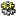
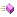

<properties date="2016-06-24"
/>

NetServer Services API Changes from 7.0.4003.1200 to 7.1.4507.700
 SuperOffice.Services DLL
SuperOffice.CRM.Services
AppointmentAgent
CanAssignToProjectMember(System.Int32, System.Int32)

CreateDefaultAppointmentEntityFromProjectSuggestion(System.Int32, System.Int32, System.Boolean, System.Int32)

AppointmentEntity
IsMileStone

EntityElement
System.Runtime.Serialization.DataContractAttribute

System.Xml.Serialization.XmlRootAttribute

StrippedValue

------------------------------------------------------------------------

 SOCore DLL
System.Diagnostics.DebuggableAttribute

SuperOffice.Configuration
ConfigFile
GetEffectiveConfig()

SaveEffectiveConfig(System.String)

Client
ApplicationInstance

ApplicationName

ApplicationTitle

ExportPageSize

HelpFilesBaseUrl

Instance

Name

Downloads

Security
ActiveDirectoryCredentialPlugin

Services
RemoveInvalidXMLText

SoFormsAuthentication

SuperOffice.CRM
FunctionRightStrings
AdminSale

AdminWorkflow

INextMilestonePlugin

NextDateInfo

NextMilestonePluginAttribute

TimeZoneData
.ctor(System.Int32, System.String, System.String, System.String)

.ctor(System.Int32, System.String, System.String, System.String, System.Int32)

IsoNumber

UserPreferenceStrings
.ctor()

AddRemoveSelection

AppointmentDialog

Associates
AssocHomeCountry

AssocSubListWeb

DontAskAgainDeleteDialog

DontAskAgainEmailInvitationDialog

DontAskAgainRelationDialog

DontAskAgainUdefPage1

ResourceSubListWeb

Section

AssocHomeCountry

AssocSubListWeb

DontAskAgainDeleteDialog

DontAskAgainEmailInvitationDialog

DontAskAgainRelationDialog

DontAskAgainUdefPage1

ResourceSubListWeb

Section

Cripple
Application

Appointment

Contact

Diary

Document

Email

Person

Project

Relation

Reporter

Sale

Section

Selection

Travel

Application

Appointment

Contact

Diary

Document

Email

Person

Project

Relation

Reporter

Sale

Section

Selection

Travel

DbOptimizations

Defaults
DefaultAppntRememberVisibleFor

DefaultAppointmentAppointLength

DefaultAppointmentAppointTaskId

DefaultAppointmentAppointText

DefaultAppointmentPhoneLength

DefaultAppointmentPhoneTaskId

DefaultAppointmentPhoneText

DefaultAppointmentToDoLength

DefaultAppointmentToDoTaskId

DefaultAppointmentToDoText

DefaultAppointmentVisibleFor

DefaultBusiness

DefaultCategory

DefaultDecimalPlacesInAmount

DefaultDocRememberVisibleFor

DefaultDocumentType

DefaultDocumentVisibleFor

DefaultFaxType

DefaultProjectType

DefaultSaleProb

DefaultSaleRememberVisibleFor

DefaultSaleType

DefaultSaleVisibleFor

DefaultSelectionCategory

DefaultSelectionVisibleFor

Section

DefaultAppntRememberVisibleFor

DefaultAppointmentAppointLength

DefaultAppointmentAppointTaskId

DefaultAppointmentAppointText

DefaultAppointmentPhoneLength

DefaultAppointmentPhoneTaskId

DefaultAppointmentPhoneText

DefaultAppointmentToDoLength

DefaultAppointmentToDoTaskId

DefaultAppointmentToDoText

DefaultAppointmentVisibleFor

DefaultBusiness

DefaultCategory

DefaultDecimalPlacesInAmount

DefaultDocRememberVisibleFor

DefaultDocumentType

DefaultDocumentVisibleFor

DefaultFaxType

DefaultProjectStatus

DefaultProjectType

DefaultSaleProb

DefaultSaleRememberVisibleFor

DefaultSaleType

DefaultSaleVisibleFor

DefaultSelectionCategory

DefaultSelectionVisibleFor

Section

DiaryView
AllDayEndTime

AllDayStartTime

DefaultAlarmTime

DiaryStartTime

DiaryViewAssociates

DiaryViewNumAssociates

DiaryViewShowUserGroup

DiaryViewSubList

ExtendFindAvailable

LunchEndTime

LunchStartTime

SecretaryMode

Section

SilentAfter

AllDayEndTime

AllDayStartTime

DefaultAlarmTime

DiaryStartTime

DiaryViewAssociates

DiaryViewNumAssociates

DiaryViewShowUserGroup

DiaryViewSubList

ExtendFindAvailable

LunchEndTime

LunchStartTime

SecretaryMode

Section

SilentAfter

DocPluginNames
Section

Section

DocTemplateTypeMap
Section

Section

DocumentDialog

DuplicateSystem
Section

Section

FieldLabels
LastLanguage

Section

ShowCustomFieldLabels

LastLanguage

Section

ShowCustomFieldLabels

FieldReplication
Section

udcontactlarge

udcontactsmall

udpersonlarge

udpersonsmall

udprojectlarge

udprojectsmall

udsalelarge

udsalesmall

Section

udcontactlarge

udcontactsmall

udpersonlarge

udpersonsmall

udprojectlarge

udprojectsmall

udsalelarge

udsalesmall

Filter
All

Associate

DaysAfter

DaysBefore

Group

NumAssociates

NumGroups

Section

All

Associate

DaysAfter

DaysBefore

Group

NumAssociates

NumGroups

Section

FindContact

FindDocument

FindProject

FindResultDialog
DisplayInMain

Section

DisplayInMain

FindSelection

Freetext
AutoEnableTravel

Enabled

MaxSuggestWords

MultiWordFTHitLimit

MultiWordFTOperator

Section

SingleWordFTHitLimit

SingleWordFTOperator

AutoEnableTravel

Enabled

MaxSuggestWords

MultiWordFTHitLimit

MultiWordFTOperator

Section

SingleWordFTHitLimit

SingleWordFTOperator

Functions
AcademicTitle

BlankApptClick

CapitalFirstLetterCompanyName

CapitalFirstLetterPersonName

DisableContactDogEar

DisableDelKey

DisableDuplicateCheckContact

DisableDuplicateCheckProject

DisableDuplicateCheckSelection

DisableSoundExCheckContact

DisableSoundExCheckProject

DisableSoundExCheckSelection

DisplayDateFormatInLists

EditIfVisible

FilterBookingSlaves

ForceConfirmation

GetAdvanceDays

HomeContact

IdAllocationBatchSize

InternetUseIntegratedBrowser

PastDateAlert

PeriodicCheckInterval

RemoveInvitationDuplicates

Section

ShowAllPhoneNumbers

ShowInviteDlgFromView

ShowProgressInfo

ShowTipNumber

ShowTipsAtStart

ThreeStateStatusCheckbox

UseCaseOnTemplateVariables

UseMiddleName

AcademicTitle

BackgroundDocumentCheckTimer

BlankApptClick

CapitalFirstLetterCompanyName

CapitalFirstLetterPersonName

DisableContactDogEar

DisableDelKey

DisableDuplicateCheckContact

DisableDuplicateCheckProject

DisableDuplicateCheckSelection

DisableSoundExCheckContact

DisableSoundExCheckProject

DisableSoundExCheckSelection

DisplayDateFormatInLists

EditIfVisible

EnableBackgroundDocumentCheck

FilterBookingSlaves

ForceConfirmation

GetAdvanceDays

GetRecordCounts

HomeContact

IdAllocationBatchSize

InternetUseIntegratedBrowser

PastDateAlert

PeriodicCheckInterval

RemoveInvitationDuplicates

Section

ShowAllPhoneNumbers

ShowDocs

ShowFollowUps

ShowInviteDlgFromView

ShowProgressInfo

ShowRetiredPersons

ShowSales

ShowTipNumber

ShowTipsAtStart

ShowToDo

ThreeStateStatusCheckbox

UseCaseOnTemplateVariables

UseMiddleName

Mail
AddressSeparator

ArchiveAppointments

ArchiveDocuments

ArchiveForwards

ArchiveReplies

ArchiveSentMsg

ArchiveSentMsgFromMailClient

ArchiveToAssocs

AttachiCal

BookingAssociatesSubList

CheckForDuplicates

CloseAfterArchive

CreateExtUserSubject

DefaultDocSender

DefaultFaxSender

DefaultIncomingEmailTypeID

DefaultMailSender

DefaultOutgoingEmailTypeID

DeleteAfterArchive

EnableMailSync

FirstMailSync

ForceConfirmationEmailInvit

HidePreview

ImapServerName

ImapServerPort

Inbox

IsEmailInstalled

IsFaxInstalled

LargeAttachmentWarningTreshold

MailGatewayDisplayName

MailGatewayMailAddress

MailSmtpAuthorize

MailSyncTimer

MarkAsReadInPreview

MoveDeletedToDeletedItems

NameDeleted

NameDrafts

NameInbox

NameSent

NotifyAssociateByMail

NotifyExtPersonByMail

NotifyOnlineUsers

RemoveAfterArchive

SaveLogonInfo

SaveSentInSentItems

Section

SendFaxPrefix

SendFaxProtocol

ShowAllTemplates

ShowInlineImages

SmtpServerName

SmtpServerPass

SmtpServerPort

SmtpServerUser

SoAppointmentArchivedExecuteCommand

SoDocumentArchivedExecuteCommand

Timeout

UseMapiReaderAnyway

UseSoMailBody

UseSoProtocolIntegration

WarnAboutLargeAttachments

AddressSeparator

ArchiveAppointments

ArchiveDocuments

ArchiveForwards

ArchiveReplies

ArchiveSentMsg

ArchiveToAssocs

AttachiCal

BookingAssociatesSubList

CloseAfterArchive

CreateExtUserSubject

DefaultDocSender

DefaultFaxSender

DefaultMailSender

DeleteAfterArchive

EnableMailSync

FirstMailSync

ForceConfirmationEmailInvit

HidePreview

ImapServerName

ImapServerPort

Inbox

IsEmailInstalled

IsFaxInstalled

MailGatewayDisplayName

MailGatewayMailAddress

MailSmtpAuthorize

MailSyncTimer

MarkAsReadInPreview

MoveDeletedToDeletedItems

NameDeleted

NameDrafts

NameInbox

NameSent

NotifyAssociateByMail

NotifyExtPersonByMail

NotifyOnlineUsers

RemoveAfterArchive

SaveLogonInfo

SaveSentInSentItems

Section

SendFaxPrefix

SendFaxProtocol

ShowInlineImages

SmtpServerName

SmtpServerPass

SmtpServerPort

SmtpServerUser

Timeout

UseMapiReaderAnyway

UseSoMailBody

MDOList
associate

business

category

comptr

contint

credited

currency

doctmpl

EnableLongValues

extapp

LowerLimit

LowerLimitassociate

LowerLimitbusiness

LowerLimitcategory

LowerLimitcomptr

LowerLimitcontint

LowerLimitcredited

LowerLimitcurrency

LowerLimitdoctmpl

LowerLimitextapp

LowerLimitmrmrs

LowerLimitpersint

LowerLimitperspos

LowerLimitpmembtype

LowerLimitpriority

LowerLimitprob

LowerLimitprojstatus

LowerLimitprojtype

LowerLimitreason

LowerLimitrelationdefinition

LowerLimitsearchcat

LowerLimitsource

LowerLimittask

mrmrs

persint

perspos

pmembtype

priority

prob

projstatus

projtype

reason

relationdefinition

searchcat

Section

source

task

Udef0

Udef1

Udef2

Udef3

associate

business

category

comptr

contint

credited

currency

doctmpl

extapp

LowerLimit

LowerLimitassociate

LowerLimitbusiness

LowerLimitcategory

LowerLimitcomptr

LowerLimitcontint

LowerLimitcredited

LowerLimitcurrency

LowerLimitdoctmpl

LowerLimitextapp

LowerLimitmrmrs

LowerLimitpersint

LowerLimitperspos

LowerLimitpmembtype

LowerLimitpriority

LowerLimitprob

LowerLimitprojstatus

LowerLimitprojtype

LowerLimitreason

LowerLimitrelationdefinition

LowerLimitsearchcat

LowerLimitsource

LowerLimittask

mrmrs

persint

perspos

pmembtype

priority

prob

projstatus

projtype

reason

relationdefinition

searchcat

Section

source

task

Udef0

Udef1

Udef2

Udef3

MiniPanel
LockMiniPanel

Section

LockMiniPanel

Section

NetServices
ELearningUrl

EnableNetServicesOnCentral

EnableNetServicesOnTravel

LastPage

NewsURL

NextCheck

PageURL

Section

SeenTeaserDlg

ShowOnStartup

StatusCheckTimeout

StatusURL

TeaserURL

UserPassportId

ELearningUrl

EnableNetServicesOnCentral

EnableNetServicesOnTravel

LastPage

NewsURL

NextCheck

PageURL

Section

SeenTeaserDlg

ShowOnStartup

StatusCheckTimeout

StatusURL

TeaserURL

UserPassportId

Numbering
DefaultAllocate

DefaultAllowBlank

DefaultReadOnly

DefaultSatPrefix

DefaultTravelPrefix

DefaultUnique

NumberEachTemplate

Section

DefaultAllocate

DefaultAllowBlank

DefaultReadOnly

DefaultSatPrefix

DefaultTravelPrefix

DefaultUnique

NumberEachTemplate

Section

Phone
DdeData

DdeItem

DdeService

DdeTopic

DdeType

DialType

EnablePersonalScripts

EnableScripting

FormatNumber

LocalAreaCode

LongDistancePrefix

Postfix

Prefix

ProgDir

ProgFile

ProgParam

ReporterDocumentDlgExpanded

ReporterDocumentDlgOpenDoc

ReporterLastUsedReport

Section

DdeData

DdeItem

DdeService

DdeTopic

DdeType

DialType

EnablePersonalScripts

EnableScripting

FormatNumber

LocalAreaCode

LongDistancePrefix

Postfix

Prefix

ProgDir

ProgFile

ProgParam

ReporterDocumentDlgExpanded

ReporterDocumentDlgOpenDoc

ReporterLastUsedReport

Section

Project

QuickLaunchBar
QuickLaunchButtons

Section

QuickLaunchButtons

Section

RequiredDynamicLoad
Section

Section

Sale
ConfirmCreateSuggAppointment

EnableSaleStakeholders

Section

SkipCompletedSales

ConfirmCreateSuggAppointment

Section

SkipCompletedSales

Selection
LastUsedSelectionTargetTableId

LastUsedSelectionType

LastUsedSelectionUnionType

Section

SkipCompletedSelections

LastUsedSelectionTargetTableId

LastUsedSelectionType

LastUsedSelectionUnionType

Section

SkipCompletedSelections

SentryAddonNames
Section

Section

Sorting
Section

SortingAssociates

SortingLists

SortingPersons

Section

SortingAssociates

SortingLists

SortingPersons

SuperMode
Section

TaskBarConfiguration

TaskBarMode

TopArchivePerson

TopContactView

TopDiaryView

TopEmailView

TopPanel

TopProjArchive

TopProjectView

TopReporterView

TopSelectionView

Section

TaskBarConfiguration

TaskBarMode

TopArchivePerson

TopContactView

TopDiaryView

TopEmailView

TopPanel

TopProjArchive

TopProjectView

TopReporterView

TopSelectionView

System
AllowCentralLogin

AllowForcedLogin

BaseCurrencyId

CurrentUdefVersioncontact

CurrentUdefVersionperson

CurrentUdefVersionproject

CurrentUdefVersionsale

DefaultDocPlugin

EnableCurrency

NotesIniPath

NotesSODbName

OurCurrencyId

OwnCountry

PasswordPolicy

PreferDocLanguage

PreferredNotesDocServer

PreferredNotesMailServer

ReplicateSelection

Section

UpdateStatusMonitorsRealTime

AllowCentralLogin

AllowForcedLogin

BaseCurrencyId

CurrentUdefVersioncontact

CurrentUdefVersionperson

CurrentUdefVersionproject

CurrentUdefVersionsale

DefaultDocPlugin

EnableCurrency

MailMergeMoreTimeNeeded

NotesIniPath

NotesSODbName

OurCurrencyId

OwnCountry

PreferDocLanguage

PreferredNotesDocServer

PreferredNotesMailServer

ReplicateSelection

Section

UpdateStatusMonitorsRealTime

ToolTips
Section

TooltipOnBApp

TooltipOnBEmail

TooltipOnBNote

TooltipOnBPhone

TooltipOnBSale

TooltipOnBTask

TooltipOnBWrite

TooltipOnLContact

TooltipOnLDiary

TooltipOnLEmail

TooltipOnLProject

TooltipOnLReporter

TooltipOnLSelection

TooltipsReadFactor

Section

TooltipOnBApp

TooltipOnBEmail

TooltipOnBNote

TooltipOnBPhone

TooltipOnBSale

TooltipOnBTask

TooltipOnBWrite

TooltipOnLContact

TooltipOnLDiary

TooltipOnLEmail

TooltipOnLProject

TooltipOnLReporter

TooltipOnLSelection

TooltipsReadFactor

Travel
AdvancedTravelMenu

EnableStats

EnableTravel

FlushAfterReadAll

GWSilent

OfferBlockCentralLogin

RemoteTravelClient

RemoteTravelServer

Section

TravelAsMenu

AdvancedTravelMenu

EnableStats

EnableTravel

FlushAfterReadAll

GWSilent

OfferBlockCentralLogin

RemoteTravelClient

RemoteTravelServer

Section

TravelAsMenu

Visual
ActiveSound

AnimatePanels

FilterCompletedFromTodo

FilterShowRedLimit

FilterShowYellowLimit

FrameType

HistorySize

JpegQuality

MonitorLight

Section

ShowNotepad

SundayFirstDay

Tooltips

ActiveSound

AnimatePanels

CalendarPos

FilterCompletedFromTodo

FilterShowRedLimit

FilterShowYellowLimit

FrameType

HistorySize

JpegQuality

MonitorLight

Section

ShowNotepad

SundayFirstDay

Tooltips

WebServer
Location

Name

Section

Location

Name

Section

Wizard
MailMergeWizardStartPageEx

Section

MailMergeWizardStartPageEx

Section

SuperOffice.CRM.ArchiveLists
ArchiveActivityLinksRow
System.Data.IDataRecord

ArchiveActivityRow
System.Data.IDataRecord

ArchiveColumnInfo
System.Runtime.Serialization.DataContractAttribute

ArchiveCriteriaRow
System.Data.IDataRecord

ArchiveFindAppointmentRow
System.Data.IDataRecord

ArchiveFindContactRow
System.Data.IDataRecord

ArchiveFindDocumentRow
System.Data.IDataRecord

ArchiveFindSaleRow
System.Data.IDataRecord

ArchiveFreetextCountRow
System.Data.IDataRecord

ArchiveInvitationRow
System.Data.IDataRecord

ArchiveProjectRow
System.Data.IDataRecord

ArchiveRestrictionInfo
System.Runtime.Serialization.DataContractAttribute

ArchiveRow
System.Reflection.DefaultMemberAttribute

System.Data.IDataRecord

FieldCount

Item

Item

GetBoolean(System.Int32)

GetByte(System.Int32)

GetBytes(System.Int32, System.Int64, System.Byte\[\], System.Int32, System.Int32)

GetChar(System.Int32)

GetChars(System.Int32, System.Int64, System.Char\[\], System.Int32, System.Int32)

GetData(System.Int32)

GetDataTypeName(System.Int32)

GetDateTime(System.Int32)

GetDecimal(System.Int32)

GetDouble(System.Int32)

GetFieldType(System.Int32)

GetFloat(System.Int32)

GetGuid(System.Int32)

GetInt16(System.Int32)

GetInt32(System.Int32)

GetInt64(System.Int32)

GetName(System.Int32)

GetOrdinal(System.String)

GetString(System.Int32)

GetValue(System.Int32)

GetValues(System.Object\[\])

IsDBNull(System.Int32)

ArchiveSelectionRow
System.Data.IDataRecord

Constants
IconHints
Associate\_Current\_Group

Associate\_Group

Milestone

Resource\_Group

Sale\_IsStakeholderSale

Options
DisableTrimming

RestrictionTypes
PositiveString

StringOrPK

SuperOffice.CRM.Globalization
CultureDataFormatter
ParseInlineMultiLanguageString(System.String, System.String, System.Int32)

SuperOffice.CRM.Services
SoPrincipalCarrier
EjUserStatus

SuperOffice.Data
CsAuthenticationType

EjUserStatus

GuideStepConstants

InboxStatus

MessagingStatus

ProjectStatusConstants

SaleStageConstants
IsDeleted

ShipmentAddrStatus

ShipmentLinkAction

ShipmentLinkTaskFlags

ShipmentListStatus

TicketOrigin

SuperOffice.DCF.Configuration
ConfigurationAttributes
ControlElements
Config
MDO
AutoCallback

CurrentName

CustomIconPath

Fetcher

GlobalSort

SetCurrent

UseHeadingName

SuperOffice.Exceptions
ExceptionHelper
FindExceptionOfType&lt;(System.Exception) T&gt;(System.Exception)

SoDbAccessException

SuperOffice.Globalization
RC
SA\_ERR\_ACCESS\_DENIED

SA\_ERR\_BAD\_REQUEST

SA\_ERR\_ERRORDIALOG\_TITLE

SA\_ERR\_FORBIDDEN

SA\_ERR\_GO\_HOME

SA\_ERR\_PAGE\_NOT\_FOUND

SA\_ERR\_SERVER\_ERROR

SR\_ACTIVITY\_CREATE\_DAYS\_AFTER\_TODAY

SR\_ADD\_AS\_STAKEHOLDER

SR\_ADDED\_PARTICIPANTS

SR\_ADDED\_REP\_FOLLOWUP

SR\_ADMIN\_DELETE\_CONTACT\_DESCRIPTION

SR\_ADMIN\_DELETE\_CONTACT\_TITLE

SR\_ADMIN\_DELETE\_TEMPLATE\_WARNING\_1

SR\_ADMIN\_DELETE\_TEMPLATE\_WARNING\_2

SR\_ADMIN\_DELETE\_USER

SR\_ADMIN\_DELETE\_USER\_BOTH

SR\_ADMIN\_DELETE\_USER\_BOTH\_TOOLTIP

SR\_ADMIN\_DELETE\_USER\_TOOLTIP

SR\_ADMIN\_MENUITEM

SR\_ADMIN\_PROJECT\_GUIDE\_TAB\_HEADER

SR\_ADMIN\_PROJECT\_TYPE\_LABEL

SR\_ADMIN\_REMOVE\_LICENSES

SR\_ADMIN\_REMOVE\_LICENSES\_TOOLTIP

SR\_ADMIN\_RETIRE\_ASSOC\_TOOLTIP

SR\_ADMIN\_ROLE\_ANONYMOUS\_TOOLTIP

SR\_ADMIN\_ROLE\_RELATION\_DEPARTMENT\_TOOLTIP

SR\_ADMIN\_ROLE\_RELATION\_EXTERNAL\_TOOLTIP

SR\_ADMIN\_ROLE\_RELATION\_GROUPS\_TOOLTIP

SR\_ADMIN\_ROLE\_RELATION\_MY\_OWN\_TOOLTIP

SR\_ADMIN\_ROLE\_RELATION\_OTHER\_TOOLTIP

SR\_ADMIN\_ROLE\_SAME\_ROLE

SR\_ADMIN\_ROLE\_TABLE\_STAKEHOLDER

SR\_ADMIN\_SALES\_CAPTION

SR\_ADMIN\_SALES\_MANAGEMENT\_CAPTION

SR\_ADMIN\_STATUS\_POWEREDBY

SR\_ADMIN\_SYSTEM\_COMPANIES\_DELETE\_TOOLTIP

SR\_ADMIN\_USER\_NAME\_ALREADY\_EXIST

SR\_ADMIN\_USER\_NAME\_CANT\_BE\_EMPTY

SR\_ADMIN\_USERS\_CANNOT\_REMOVE\_OWNER\_CONTACT

SR\_ADMIN\_WORKFLOW\_CAPTION

SR\_ADMIN\_WORKFLOW\_MANAGEMENT\_CAPTION

SR\_ADMIN\_WORKFLOW\_MILESTONE\_FOLLOWUP

SR\_ARCHIVE\_ACTIVITY\_ARCHIVENAME

SR\_ARCHIVE\_ACTIVITY\_COMPLETEDDATE

SR\_ARCHIVE\_ACTIVITY\_ENDDATE

SR\_ARCHIVE\_ACTIVITY\_ID

SR\_ARCHIVE\_ACTIVITY\_PERSON

SR\_ARCHIVE\_ACTIVITY\_PROJECT

SR\_ARCHIVE\_ACTIVITY\_RESPONSIBLE

SR\_ARCHIVE\_ACTIVITY\_STARTDATE

SR\_ARCHIVE\_ACTIVITY\_TYPE

SR\_ARCHIVE\_AMIINVITED

SR\_ARCHIVE\_AMIINVITED\_TOOLTIP

SR\_ARCHIVE\_CREATED\_ONLY

SR\_ARCHIVE\_CREATED\_ONLY\_TOOLTIP

SR\_ARCHIVE\_DEFAULT\_MAXROWCOUNT\_REASON

SR\_ARCHIVE\_DESCRIPTION\_EMAIL

SR\_ARCHIVE\_DESCRIPTION\_URL

SR\_ARCHIVE\_ENDDATE

SR\_ARCHIVE\_ENDDATE\_TOOLTIP

SR\_ARCHIVE\_HAS\_GUIDE

SR\_ARCHIVE\_HAS\_GUIDE\_TOOLTIP

SR\_ARCHIVE\_HAS\_STAKEHOLDERS

SR\_ARCHIVE\_HAS\_STAKEHOLDERS\_TOOLTIP

SR\_ARCHIVE\_MAXROWCOUNT\_FREETEXT\_MULTIPLEWORDS

SR\_ARCHIVE\_MAXROWCOUNT\_FREETEXT\_SINGLEWORD

SR\_ARCHIVE\_MAXROWCOUNT\_REACHED

SR\_ARCHIVE\_MILESTONE

SR\_ARCHIVE\_MILESTONE\_TOOLTIP

SR\_ARCHIVE\_MILESTONES\_ONLY

SR\_ARCHIVE\_MILESTONES\_ONLY\_TOOLTIP

SR\_ARCHIVE\_NEXTMILESTONE

SR\_ARCHIVE\_NEXTMILESTONE\_TOOLTIP

SR\_ARCHIVE\_PERSON\_ARCHIVENAME

SR\_ARCHIVE\_PERSON\_DIRECTPHONE

SR\_ARCHIVE\_PERSON\_DIRECTPHONE\_1

SR\_ARCHIVE\_PERSON\_EMAILADDRESS

SR\_ARCHIVE\_PERSON\_FIRSTNAME

SR\_ARCHIVE\_PERSON\_HASINFO

SR\_ARCHIVE\_PERSON\_HASINTERESTS

SR\_ARCHIVE\_PERSON\_ISONLINE

SR\_ARCHIVE\_PERSON\_JOBTITLE

SR\_ARCHIVE\_PERSON\_LASTNAME

SR\_ARCHIVE\_PERSON\_MIDDLENAME

SR\_ARCHIVE\_PERSON\_MOBILEPHONE

SR\_ARCHIVE\_PERSON\_MRMSS

SR\_ARCHIVE\_PERSON\_RANK

SR\_ARCHIVE\_PROJECT\_ARCHIVENAME

SR\_ARCHIVE\_PROJECT\_ASSOCIATEID

SR\_ARCHIVE\_PROJECT\_NAME

SR\_ARCHIVE\_PROJECT\_NUMBER

SR\_ARCHIVE\_PROJECT\_OURMEMBERS

SR\_ARCHIVE\_PROJECT\_STATUS

SR\_ARCHIVE\_PROJECT\_TYPE

SR\_ARCHIVE\_PROJECT\_URL

SR\_ARCHIVE\_PROJECTMEMBER\_ARCHIVENAME

SR\_ARCHIVE\_PROJECTMEMBER\_COMPANY

SR\_ARCHIVE\_PROJECTMEMBER\_EMAILADDRESS

SR\_ARCHIVE\_PROJECTMEMBER\_FULLNAME

SR\_ARCHIVE\_PROJECTMEMBER\_FUNCTION

SR\_ARCHIVE\_PROJECTMEMBER\_HASINFO

SR\_ARCHIVE\_PROJECTMEMBER\_PHONE

SR\_ARCHIVE\_REACHEDLIMIT

SR\_ARCHIVE\_REACHEDLIMIT\_TOOLTIP

SR\_ARCHIVE\_SHOW\_DETAILS

SR\_ARCHIVE\_SUGGESTEDITEM\_TOOLTIP

SR\_ARCHIVE\_SUGGESTEDITEM\_TOOLTIP\_TOOLTIP

SR\_ARCHIVES\_TEST1

SR\_ARCHIVES\_TEST2

SR\_ASSIGN\_FOLLOW\_UP\_TO\_PROJECT\_MEMBERS

SR\_ASSIGN\_FOLLOWUP\_TO\_PROJECT\_MEMBER

SR\_ASSIGN\_TO\_PROJECT\_MEMBER

SR\_BTN\_ADD\_STAKEHOLDER\_CONTACT\_TOOLTIP

SR\_BTN\_ADD\_STAKEHOLDER\_PERSON\_TOOLTIP

SR\_BUTT\_CANCEL\_TOOLTIP

SR\_BUTT\_SKIP

SR\_BUTT\_SKIP\_TOOLTIP

SR\_BUY\_NEW\_LICENSES

SR\_CHANGED\_REP\_FOLLOWUP

SR\_CLICK\_TO\_SELECT

SR\_COMMENT

SR\_COMMON\_ADD\_TO\_PROJECT

SR\_COMMON\_ADD\_TO\_SALE

SR\_COMMON\_ADD\_TO\_SELECTION

SR\_CONTACTSELECTIONARCHIVE\_CONTACTPOSTALADDRESS

SR\_CONTACTSELECTIONARCHIVE\_CONTACTPOSTALADDRESS\_TOOLTIP

SR\_CONTACTSELECTIONARCHIVE\_CONTACTSTREETADDRESS

SR\_CONTACTSELECTIONARCHIVE\_CONTACTSTREETADDRESS\_TOOLTIP

SR\_CRED\_CHOOSEOTHER

SR\_CREDGROUPERR

SR\_CREDUSERERR

SR\_CRITERIONTYPE\_TICKET

SR\_DESELECT\_ROWS

SR\_DOCPLUGIN\_ADO\_CONNECTION\_STRING\_MISSING

SR\_DOCPLUGIN\_CANNOT\_COPY\_FILES

SR\_DOCPLUGIN\_CANNOT\_CREATE\_PATH

SR\_DOCPLUGIN\_CANNOT\_FIND\_ARCHIVEPATH

SR\_DOCPLUGIN\_CANNOT\_FIND\_CREATED\_DATE\_FOR\_ID

SR\_DOCPLUGIN\_CANNOT\_FIND\_DATABASE\_VARIANT

SR\_DOCPLUGIN\_CANNOT\_FIND\_DOC\_IN\_DATABASE

SR\_DOCPLUGIN\_CANNOT\_FIND\_FILE

SR\_DOCPLUGIN\_CANNOT\_FIND\_FILENAME\_FOR\_ID

SR\_DOCPLUGIN\_CANNOT\_FIND\_REFERENCE\_FOR\_ID

SR\_DOCPLUGIN\_CANNOT\_FIND\_SOURCE\_FOLDER

SR\_DOCPLUGIN\_CANNOT\_FIND\_SUBJECT\_FOR\_ID

SR\_DOCPLUGIN\_CANNOT\_FIND\_TEMP\_PATH

SR\_DOCPLUGIN\_CANNOT\_FIND\_TRAVEL\_START\_DATE

SR\_DOCPLUGIN\_CANNOT\_FIND\_USERID

SR\_DOCPLUGIN\_CANNOT\_FIND\_USERNAME

SR\_DOCPLUGIN\_CANNOT\_GET\_COPY

SR\_DOCPLUGIN\_CANNOT\_MAKE\_TARGET\_FOLDER

SR\_DOCPLUGIN\_CANNOT\_OPEN\_FILE

SR\_DOCPLUGIN\_CANNOT\_OPEN\_FILE\_FOR\_CHANGE

SR\_DOCPLUGIN\_CANNOT\_PRINT\_FILE

SR\_DOCPLUGIN\_CANNOT\_RENAME\_FILE

SR\_DOCPLUGIN\_CANNOT\_SAVE\_UNIQUE\_FILENAME

SR\_DOCPLUGIN\_CHECK\_IN\_FILE

SR\_DOCPLUGIN\_CHECK\_OUT\_FILE

SR\_DOCPLUGIN\_CREATE\_ERROR

SR\_DOCPLUGIN\_DELETE\_FILE\_ERROR

SR\_DOCPLUGIN\_NEW\_VERSION

SR\_DOCPLUGIN\_NO\_APPLICATION\_FOR\_EXTENSION

SR\_DOCUMENT\_NO\_FORWARD

SR\_DOCUMENT\_NO\_REPLY

SR\_DUPLICATE\_CONTACT

SR\_DUPLICATE\_CONTACT\_DEPARTMENT

SR\_DUPLICATE\_CONTACT\_DEPARTMENT\_TOOLTIP

SR\_DUPLICATE\_CONTACT\_TOOLTIP

SR\_DUPLICATE\_PROJECT

SR\_DUPLICATE\_PROJECT\_TOOLTIP

SR\_DUPLICATE\_SELECTION

SR\_DUPLICATE\_SELECTION\_TOOLTIP

SR\_DUPLICATE\_SOUNDEX\_CONTACT

SR\_DUPLICATE\_SOUNDEX\_CONTACT\_TOOLTIP

SR\_DUPLICATE\_SOUNDEX\_PROJECT

SR\_DUPLICATE\_SOUNDEX\_PROJECT\_TOOLTIP

SR\_DUPLICATE\_SOUNDEX\_SELECTION

SR\_DUPLICATE\_SOUNDEX\_SELECTION\_TOOLTIP

SR\_FIND\_ISEXACTLY

SR\_FIND\_SALESTAKEHOLDERS\_IN\_DB

SR\_FIND\_TICKETS\_IN\_DB

SR\_FLD\_DESCRIPTION

SR\_FLD\_INSTALLQUESTION

SR\_FLD\_MAIL\_LINK\_DESCRIPTION

SR\_FLD\_NO\_PUBLIC\_COMPUTER

SR\_FLD\_NO\_PUBLIC\_COMPUTER\_DESCRIPTION

SR\_FLD\_TITLE

SR\_FLD\_WEB\_EXTENSION\_DESCRIPTION

SR\_FLD\_YES\_DOWNLOAD

SR\_FLD\_YES\_INSTALLED\_WEB\_EXTENSION

SR\_LIC\_COMPANYNAME\_CHANGED

SR\_LOGIN\_CANT\_FIND\_ADMIN\_CLIENT

SR\_LOGIN\_OPEN\_FOLDER

SR\_MAIL\_FOLDER\_DRAFTS

SR\_MAIL\_FOLDER\_INBOX

SR\_MAIL\_FOLDER\_SENT

SR\_MAIL\_FOLDER\_TRASH

SR\_MAIL\_UPDATING\_FOLDER

SR\_MAILMERGE\_NO\_CLIENT

SR\_MAIN\_EJOURNAL\_NAVIGATOR

SR\_MB\_NOVALIDSALE\_TOOLTIP

SR\_MENU\_LIST\_ADD\_TO\_STAKEHOLDER

SR\_MENU\_LIST\_OPENCOMPANY

SR\_MENU\_LIST\_OPENPERSON

SR\_MENU\_LIST\_OPENPROJECT

SR\_MENU\_LIST\_OPENSALE

SR\_MENU\_LIST\_REMOVE

SR\_NON\_EXISTING\_DATA\_RIGHT

SR\_NONPOLICY\_PASSWORD

SR\_NONPOLICY\_PASSWORD\_LC

SR\_NONPOLICY\_PASSWORD\_NUM

SR\_NONPOLICY\_PASSWORD\_SPEC

SR\_NONPOLICY\_PASSWORD\_TOTAL

SR\_NONPOLICY\_PASSWORD\_UC

SR\_NONPOLICY\_REQS

SR\_NOTARGETSALE\_TOOLTIP

SR\_NUMBER\_AND\_DATE\_FORMAT

SR\_OPEN\_ADMIN\_CLIENT

SR\_PD\_TABNOS

SR\_PREFERENCE\_ALLDATABASES

SR\_PROCESSING\_REQUEST

SR\_PROJECT\_ENDDATE

SR\_PROJECT\_GUIDE\_FOR

SR\_PROJECT\_GUIDE\_MOVE\_TO\_THIS\_STATUS

SR\_PROJECT\_GUIDE\_TABHEADER

SR\_PROJECT\_NEXTMILESTONE

SR\_PROJECT\_TYPE\_EDIT\_STAGES

SR\_PROJECT\_TYPE\_EDIT\_STAGES\_TOOLTIP

SR\_PROJECT\_TYPE\_ENABLE\_GUIDE

SR\_PROJECT\_TYPE\_ENABLE\_GUIDE\_TOOLTIP

SR\_PROJECT\_TYPE\_NO\_STAGE

SR\_PROJECT\_TYPE\_NO\_STAGES

SR\_PROJECT\_TYPE\_NOT\_GUIDED

SR\_PROJECT\_WANNA\_ADVANCE\_PROJECT

SR\_PROJECTGUIDE\_ADVANCE\_STAGE\_CAPTION

SR\_PROJECTGUIDE\_ADVANCE\_STATUS\_CAPTION

SR\_PROJECTTYPE\_AUTOADVANCE

SR\_PROJECTTYPE\_CHANGED\_WARNING

SR\_PROJECTTYPE\_DISABLE\_GUIDED

SR\_PROJECTTYPE\_ESTIMATED\_TIME

SR\_PROJECTTYPE\_GUIDED

SR\_PROJECTTYPE\_STAGES\_USED

SR\_PURPOSE\_OF\_THIS\_SUGGESTED\_DOCUMENT

SR\_PURPOSE\_OF\_THIS\_SUGGESTED\_FOLLOWUP

SR\_REGISTEREDASSOC

SR\_REGISTEREDASSOC\_TOOLTIP

SR\_REGISTEREDDATE

SR\_REGISTEREDDATE\_TOOLTIP

SR\_REMOVED\_PARTICIPANTS

SR\_SALE\_NO\_STAKEHOLDER\_SUPPORT

SR\_SALETYPE\_HAS\_STAKEHOLDERS

SR\_SAVE\_CHANGES\_QUESTION\_DESCRIPTION\_GENERIC

SR\_SEARCH\_FINDHYPERACTION\_TOOLTIP

SR\_SEARCH\_FIRSTNAME\_X

SR\_SEARCH\_FIX\_CRITERIA

SR\_SEARCH\_FIX\_CRITERIA\_TOOLTIP

SR\_SEARCH\_LOADING\_CRITERIA

SR\_SEARCH\_LOADING\_CRITERIA\_TOOLTIP

SR\_SEARCH\_NORESULT\_SELECTED\_TOOLTIP

SR\_SELECT\_ROWS

SR\_SELECTION\_CANNOT\_ADDMEMBERS\_TOSELECTION

SR\_SELECTION\_CANNOT\_REMOVEMEMBERS\_FROMSELECTION

SR\_SELECTION\_INSUFFICIENT\_RIGHTS

SR\_SELECTION\_TASK\_ADD\_AS\_PROJECTMEMBER

SR\_SELECTION\_TASK\_ADD\_AS\_STAKEHOLDER

SR\_SERVER\_NOT\_RESPONDING

SR\_SETUP\_ACTIVESATELLITES

SR\_SETUP\_CHECK\_DATABASE\_UPDATE

SR\_SETUP\_CHOOSE\_LOCATION\_INFO\_71

SR\_SETUP\_ERROR\_NEW\_DB\_71

SR\_SETUP\_ERROR\_NEW\_UPGRADE\_DB\_71

SR\_SETUP\_ERROR\_NO\_NET\_3\_5\_71

SR\_SETUP\_ERROR\_OLD\_DB\_VERSION\_71

SR\_SETUP\_ERROR\_OLD\_UPGRADE\_DB\_VERSION\_71

SR\_SETUP\_ERROR\_READ\_FILE\_71

SR\_SETUP\_ERROR\_UPDATE\_DB\_71

SR\_SETUP\_ERROR\_UPGRADE\_DB\_71

SR\_SETUP\_ERROR\_UPGRADE\_DB\_PRODUCT\_VERSION\_71

SR\_SETUP\_ERROR\_UPGRADE\_UPGRADE\_DB\_PRODUCT\_VERSION\_71

SR\_SETUP\_ERROR\_WRITE\_FOLDER\_71

SR\_SETUP\_IS\_ACTIVESATELLITE

SR\_SETUP\_NO\_UPDATE\_OF\_SATELLITE

SR\_SETUP\_USE\_EXISTING\_DATABASE\_71

SR\_SETUP\_USE\_EXISTING\_UPGRADE\_DATABASE\_71

SR\_SETUP\_VERSION\_SEVEN\_ONE

SR\_SHOW\_ALL\_STATUSES

SR\_SINGULAR\_SALESTAKEHOLDER

SR\_SKIP\_COMPLETED\_PROJECTS

SR\_STAGES\_IN\_THIS\_PROJECT\_TYPE

SR\_STAKEHOLDER

SR\_STAKEHOLDER\_DISABLE\_FIELD\_MESSAGE

SR\_STAKEHOLDER\_ID

SR\_STAKEHOLDER\_ID\_TOOLTIP

SR\_STAKEHOLDER\_IS\_STAKEHOLDER\_SALE

SR\_STAKEHOLDERS

SR\_STAKEHOLDERS\_ADD

SR\_STAKEHOLDERS\_COMMENT

SR\_STAKEHOLDERS\_COMMENTS

SR\_STAKEHOLDERS\_EDIT

SR\_STAKEHOLDERS\_INCLUDE

SR\_STAKEHOLDERS\_INVALID\_ROLE

SR\_STAKEHOLDERS\_ROLE

SR\_STAKEHOLDERS\_ROLE\_COMMENT

SR\_STAKEHOLDERS\_ROLE\_COMMENT\_TEXT

SR\_STAKEHOLDERS\_SELECT\_ALL

SR\_STAKEHOLDERS\_STAKEHOLDER\_SALE

SR\_STAKEHOLDERS\_UNIQUE\_ROLE

SR\_SUGGESTED\_STATUS\_ACTIVITIES

SR\_SUGGESTED\_STATUS\_DOCUMENTS

SR\_TAKEAWAYLICENSESFROMUSERS\_AVAILABLE

SR\_TAKEAWAYLICENSESFROMUSERS\_DESCRIPTION

SR\_TAKEAWAYLICENSESFROMUSERS\_LICENSE

SR\_TAKEAWAYLICENSESFROMUSERS\_TITLE

SR\_TOGGLE\_STATUS

SR\_TRAYAPP\_NEW\_VERSION

SR\_TRAYAPP\_NEWDOWNLOAD\_AVAILABLE

SR\_TRAYAPP\_NEWDOWNLOAD\_AVAILABLE\_POPUP

SR\_TRAYAPP\_NEWDOWNLOAD\_REQUIRED

SR\_TRAYAPP\_NEWDOWNLOAD\_REQUIRED\_POPUP

SR\_TRAYAPP\_NEWDOWNLOAD\_REQUIRED\_WARNING

SR\_TRAYAPP\_YOUR\_VERSION

SR\_UNABLE\_GET\_EMAIL

SR\_UNABLE\_GET\_EMAIL\_ENVELOPE

SR\_VFC\_ANY

SuperOffice.IO

SuperOffice.License
SoLicenseNames
AdAuth

Solo

SuperOffice.Security.Principal
SoPrincipal
EjUserStatus

SuperOffice.Threading
ThreadManager
SingleThreadMode

BeginIgnoreSentry()

IgnoreSentry()

StartNew(System.Action)

IgnoreSentryModifier

SuperOffice.Util
DateUtility
CalculateEndDate(System.Int32, SuperOffice.Data.DurationUnit)

TimeConverter
System.Runtime.CompilerServices.ExtensionAttribute

IsEdgeTime(System.DateTime)

SnapToEdge(System.DateTime)

XmlUtil
GetValidXmlString(System.String)
