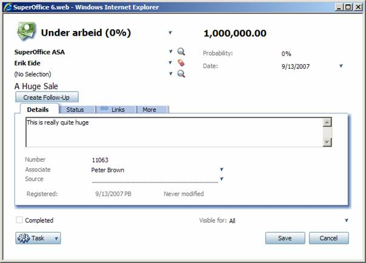
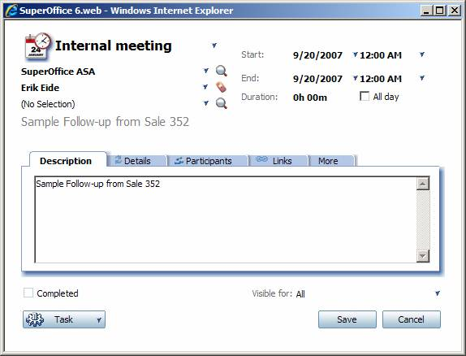
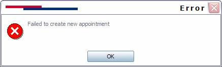
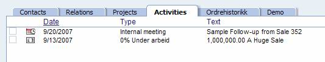

Taking a look at how to call server-side methods both asynchronously and synchronously from client-side javascript inside CRM web

When doing development in a web environment, the whole point is doing operations on the webserver without having to post the whole page and get back the whole page from the webserver again. The key is to use javascript for calling business logic on server-side objects asynchronously using remote XML, or AJAX.

CRM web uses both asynchronous and synchronous server-side method calls from the client using javascript. Like with all other objects and controls, you are also able to create your own objects that are to be called using the AJAX methodology. Exactly that will be the topic for this article.

CRM web has a javascript object call AjaxMethodDispatcher that handles all AJAX method calls from the client.

There are two functions in this object that are of interest:

* CallSync
* CallASync

## Synchronous Calls

To call a server-side method synchronously, meaning that you want your client-side javascript to wait until the server-side method returns, you want to use CallSync method of the AjaxMethodDispatcher object. This actually circumvents the purpose or definition of AJAX, really, since the first “A†in AJAX stands for Asynchronous. But the ability to call server-side methods from the client synchronously without having to do a page postback is still very useful. And, more importantly, it will improve the end-user experience by providing a more responsive webpage.

The signature for the CallSync javascript function:

```javascript
_this.CallSync=function(ajaxMethod, fnOnTimeout)
```

An example call using CallSync:

```javascript
AjaxMethodDispatcher.CallSync("SuperOffice.CRM.Web.AjaxMethods.DiaryUpdate.ChangeAppointmentToTask", "",appId,"OnlyThis");
```

The _ajaxMethod_ argument is the fully qualified path to the method name in the assembly you want to call, like e.g. `SuperOffice.CRM.Web.AjaxMethods.DiaryUpdate.ChangeAppointmentToTask` from the sample call above.

The _fnOnTimeOut_ argument is the name of a javascript function to be called if the call times out.

You can add as many arguments as the signature expects, and these are passed to the server-side method. You have to make sure you specify all arguments needed by the server-side method, and that you provide the correct data types for these arguments

## Asynchronous Calls

To call asynchronously means  your client-side javascript will continue execution and not wait for the server-side method to finish. This is the way to do actual AJAX-calls, meaning that the end-user gains back control over the browser even though the server is performing operations, and will return with any result values whenever it finishes, without the user having to wait for a page to refresh.

The signature for the CallASync javascript function is:

```javascript
CallASync=function(fnCallback, fnError, fnOnTimeout, socontext, ajaxMethod)
```

The _fnCallback_ argument is the client side javascript method that is called once the ajaxMethod on the server completes, and will be passed the results if there are any, as well as the socontext argument.

Like the CallSync method, the ajaxMethod argument is the name of the method you want to call.

The fnError argument is the name of the javascript function you want to call if an error occurs.

The fnOnTimeOut argument is the name of a javascript function to call if the call times out.

The socontext argument is a value, if any, that will be passed on to the function defined in fnCallback.

## Server-side Ajax Method

As with the CallSync function, you can add as many arguments as your server-side method requires after the ones from the signature.

You can call any server-side class method using the AjaxMethodDispatcher. The only requirement is that the method return must be of type string.

In this article, we will add functionality for creating a follow-up appointment for a sale. Here is the code from the class we will register as an AjaxMethod called CreateFollowUp that creates a followup based on a sale.

```csharp
public class AjaxDemo
{
    public string CreateFollowUp()
    {
        SaleEntity sale = AgentFactory.GetSaleAgent().GetSaleEntity(SuperStateManager.GetCurrentId("sale"));


        if (sale != null)
        {
            IAppointmentAgent agent = new AppointmentAgent();
            AppointmentEntity app = agent.CreateDefaultAppointmentEntityByType(SuperOffice.Data.TaskType.Appointment);
            app.Contact = sale.Contact;
            app.Person = sale.Person;
            app.Associate = sale.Associate;
            app.Description = "Sample Follow-up from Sale "+ sale.SaleId;
            app.StartDate = DateTime.Today.AddDays(7);
            app.EndDate = app.StartDate;
            app = agent.SaveAppointmentEntity(app);

            return app.AppointmentId.ToString();
        }
        else
            return String.Empty;
    }
}
```

After you have registered the class in CRM web, you will have access to all CRM web classes, like SuperStateManager etc. So, as you can see from the code, we use the SuperStateManager to get the current sale id. If there is a current sale, the method will create a new appointment for the contact, person and associate from the sale, with a start date one week from today.

The new appointment is saved using the NetServer Appointment service agent.

The id of the new appointment is finally returned from the method in a string.

## Register AjaxMethod

Like with all objects and control you want to add to CRM web, you will have to register classes that are to be used by the AjaxMethodDispatcher in the SoObjectMapping.config file.

The object type is _AjaxMethod_ and the MappingName, AssemblyName and ObjectName properties refer to the name you want to reference the object in CRM web, the name of the assembly (DLL), and the fully qualified name of the class, respectively.

You also need to set the xusing\_ajaxnet property to true.

<object type="AjaxMethod" mappingname="AjaxDemo" assemblyname="CustomizingSIXwebPart6" objectname="CustomizingSIXwebPart6.AjaxDemo" xusing\_ajaxnet="true"></object>

Alternatively, you can use implicit object mapping by decorating the Ajax class with the SoWebObject attribute, and inheriting the IWebObject interface. Read more about [Implicit Object Mapping](../Page%20Configuration/System%20Configuration%20Files/SoObjectMapping.config.md) in the Page Configuration section.

## Using Ajax Method

When the configuration is done and the class is ready, use the AjaxMethodDispatcher from anywhere in CRM web to invoke the method.

Please make sure the ClientConfigurationProvider/ CacheConfigurations key in web.config is set to false for any configuration file changes to take effect immediately. If you do not have that set to true, you must restart IIS (do an iisreset) for your changes to take effect and be observed.

Since we wanted to create a follow-up appointment for a sale, we'll add a new button to the Sale page that calls our new server-side method from javascript.

Here is the declaration of the button in SoSalePage.config:

``` xml
<control id="DevNetDemoButton" type="SoButton">
    <caption>Create Follow-Up</caption>
    <config>
        <onclick>javascript:var appId = AjaxMethodDispatcher.CallSync('CustomizingSIXwebPart6.AjaxDemo.CreateFollowUp'); if (appId > 0) { Dialog.open('appointment','appointment[dialog=stop]?appointment_id='+ appId,''); } else { Dialog.Information('Error', 'Failed to create new appointment', 'error'); }</onclick>
        <width>100</width>
    </config>
</control>
```

The button is of type SoButton, the caption can be set to whatever you want, and you can set a whole range of properties in the config section. We are only using the onclick and width properties in this example.

Here you can see the new button added to the Sale page;



The javascript inside the onclick property is what performs the magic here; it uses the CallSync javascript function of the AjaxMethodDispatcher object to call the CreateFollowUp method of our server-side class. Note that you actually need to supply the fully qualified name. You can not use the MappingName as supplied in SoObjectMapping directly.

The javascript stores the value returned from the CallSync method in a local variable. Depending on that value, either the appointment dialog will be opened with the new appointment, or it the method fails for some reason, an error message will be displayed in a CRM web message box.

Here are both results as displayed by the Display javascript object;





And finally, here's the appointment shown in the activity archive of the contact card;



## Conclusion

In this article we have gone through how you can call your own server-side classes from javascript using the AjaxMethodDispatcher javascript object.

The use of the display javascript object was there mainly to show you more of the javascript objects that are available to you in CRM web.

Take a look inside the Scripts folder of your CRM web installation, it's a huge library there ready for you to use and also extend to your own purpose!

If you take a look at e.g. Scripts/Dialog.js, you will find there are a whole set of ways to display message boxes with various sets of buttons etc.
