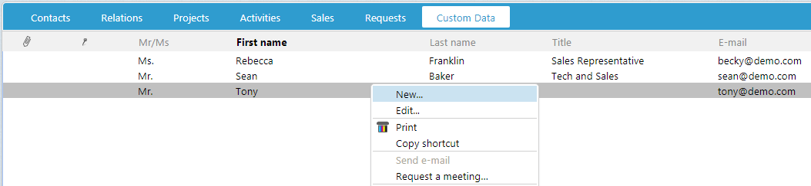

# Add Archive Row Context Menu

This article discusses how to add a context menu to row elements in an archive control.



First, let's review. What is an archive row? An archive row is a combined set of fields from one or more tables that represent a known entity. Whether it is a document, sale or person, a row is a single line in an archive control that represents that entity.

The context menu shown when a user right-clicks a row is defined as a ```<menu>``` element in the SoMenuConfiguration.config file. A context menu element must contain the ```context``` attribute value __“archivelist”__.

The ```subcontext``` attribute is the name of an entity provided by the archive provider.

For example, the DiaryActivity archive provider supplies the __document__, __appointment__ and __todo__ entities, while the Person archive provider supplies the __person__ and __retiredPerson__ entities.

With this format, regardless which archive provider an archive control uses, each row entity will have the same menu item.

``` xml

<!-- 
context = “archivelist” to mark this menu as an archivecontrol rows context menu 

subcontext = “entityname” of the entity defined in the archive provider
-->

<menu context="archivelist" subcontext="person" id="0" position="belowcursor" group="archive" displayaccesskeys="false">
  <menuitems>
    <menuitem id="arelnew" type="normal">
      <caption>[SR_MENU_LIST_NEW]</caption>
<url>javascript:Dialog.open('Person','person[dialog=stop].main[new=true]?current_id=0','ContactPersonArchiveArchiveControl.RefreshList();');</url>
      <icon></icon>
      <sentry-rights>
        <sentry-right tableright="HasInsert" type="disable">relation</sentry-right>
      </sentry-rights>
    </menuitem>
    <!— Remaining default context menu items removed for brevity-->
  </menuitems>
</menu>

```
