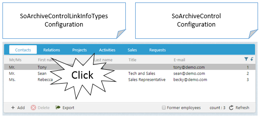

# How to Add Row Click Actions

This article discusses how to add an action when a user single or double clicks an archive row.



All archive row click actions are defined in the SoArchiveControlLinkInfoTypes.config file. Similar to context-menus, click events are entity specific.

First, let's review. What is an archive row? An archive row is a combined set of fields from one or more tables that represent a known entity. Whether it is a document, sale or person, a row is a single line in an archive control that represents that entity.

Different rows clicked, potentially different entities, cause different reactions by the application. For example, when an appointment entity row is double-clicked, the appointment dialog is shown. When a person entity row is double-clicked, the person dialog is shown.

When a new entity is introduced via a custom archive provider, or a custom behavior is desired, changes must be made to the SoArchiveControlLinkInfoTypes.config file.

Each ```linkinfo``` element in the code below handles the click events for the person entity.

The __type__ correspondes to the entity, and the __subtype__ correspondes to the click type.

The __baseurl__ element defines the javascript method for the corresponding click event.

``` xml

<linkinfos>
  <linkinfo type="person" subtype="click">
    <baseurl>javascript:PageUpdate('soprotocol:?person_id={person_id}','');</baseurl>
    <target></target>
  </linkinfo>
    <linkinfo type="person" subtype="dblclick">
    <baseurl>javascript:Dialog.open('Person','person[dialog=stop].main?person_id={person_id}','RefreshContactAndPersonCurrent()');</baseurl>
    <target></target>
  </linkinfo>

```

## Link Hint Prefix

It's common for integrations to perform different actions for a given entity. In fact, SuperOffice does this in many places.

The way to differenciate actions for the same entity in different SoArchiveControls is to use a ```<linkhint-prefix>```.

A linkhint prefix specifies a name followed by a colon.

``` xml

<control id="ContactPersonArchive" type="SoArchiveControl">
...
  <config>
    <providername>person</providername>
...
    <linkhint-prefix>personarchive:</linkhint-prefix>
...
  </config>
</control>

```

A linkhint prefix is then used in the ```<linkinfo>``` element, prefixing the type with the given linkhint-prefix name.

Below are just a few real examples where a ```<linkhint-prefix>``` is used to create different actions for the same entity type.

``` xml

<linkinfos>
  <!-- *********************************************
  create archive separation using a linkhint prefix  
  ***********************************************-->

  <linkinfo type="personarchive:person" subtype="click">
    <baseurl>javascript:PageUpdate('soprotocol:personarchive[refresh=false]?person_id={person_id}','');</baseurl>
    <target></target>
  </linkinfo>
  <linkinfo type="personarchive:person" subtype="dblclick">
    <baseurl>javascript:Dialog.open('Person','person[dialog=stop].main?person_id={person_id}','RefreshContactAndPersonCurrent()');</baseurl>
    <target></target>
  </linkinfo>

    <linkinfo type="find:person" subtype="click">
    <baseurl>javascript:FindOnSingleClick('contact.main.personarchive?person_id={person_id}',true,'person','person[dialog=stop]?person_id={person_id}','{ArchiveControlId}');</baseurl>
    <target></target>
  </linkinfo>
  <linkinfo type="find:person" subtype="dblclick">
    <baseurl>javascript:FindOnDblClick('contact.person.main.personarchive?person_id={person_id}');</baseurl>
    <target></target>
  </linkinfo>

  <linkinfo type="drilldown:person" subtype="dblclick">
    <baseurl>javascript:SuperOffice.Dashboard.NavigateToDrilldownEntity('contact', {contact_id});</baseurl>
    <target></target>
  </linkinfo>
</linkinfos>

```

## Override LinkInfo Settings

An SoArchiveControl config setting can override a __double-click__ event defined in SoArchiveControlLinkInfoTypes.config.

The override must be defined in the ```<dblclick-action>``` element in the SoArchiveControl's ```<config>``` element.

There is __no__ override capability for the single-click event. Single click actions generally only update the current id of the corresponding entity.

``` xml

<control id="ContactPersonArchive" type="SoArchiveControl">
  ...
  <config>
    <providername>person</providername>
   ...
    <dblclick-action>javascript:Dialog.open('Person','person[dialog=stop].main[mode=edit;new=true]?person_id=0','ContactPersonArchiveArchiveControl.RefreshList()');</dblclick-action>
  </config>
</control>

```