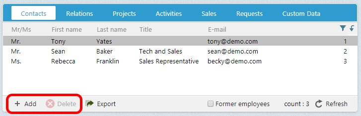

# How to Add an Archive Action Button

This article discusses how to add an action button to the toolbar of an archive control.



To add an action button on the archive control bar, add a toolbar element in the SoArchiveControl ```<config>``` element.

Toolbar button elements have a number of attributes that control their behavior, such as the icon displayed and whether the control is disabled or not.

The following example is an exerpt of the ConactPersonArchive control. It demonstrates both the add and delete buttons, and is a good example that demonstrates the two different ways to specify the onclick action.

``` xml

<control id="ContactPersonArchive" type="SoArchiveControl">
...
  <config>
    <providername>person</providername>
...
    <toolbar>
      <button caption="[SR_MB_ADD]"
        icon="images/toolicons/Mini_Add_Passive.gif"
        iconselected="images/toolicons/Mini_Add_Passivegif"
        iconhover="images/toolicons/Mini_Add_Hover.gif"
        icondisabled="images/toolicons/Mini_Add_Disabledgif"
        onclick="javascript:Dialog.open('Person','person[dialog=stop].main[mode=edit;new=true]person_id=0''ContactPersonArchiveArchiveControl.RefreshList()';"
        dataright="create"
        datasourcename="ContactEntityDataHandlerContactPersonEntity"
        xtablerightname="person" />

      <button caption="[SR_MB_DELETE]"
        icon="images/toolicons/Mini_Delete_Passive.gif"
        iconselected="images/toolicons/Mini_Delete_Passive.gif"
        iconhover="images/toolicons/Mini_Delete_Hover.gif"
        icondisabled="images/toolicons/Mini_Delete_Disabled.gif"
        disabled="true"
        dataright="delete"
        onrowselect="DisableOnEmpty"
        linkhint="nav=deletePerson"/>
    </toolbar>
<!— Remaining config items removed for brevity-->
...
  </config>
</control>

```
The Add button explicitly defines a javascript routine that will open the Person dialog. The idea that the person_id set to 0 indicates the person dialog will create a new person. 

The delete button is more discrete and uses the ```linkhint``` attribute to specify which action to perform. The linkhint value of "nav=deletePerson" means execute the javascript code defined in the SoArchiveControlLinkInfoTypes.config where the ```<linkinfo>``` element with a ```type``` value equal to _deletePerson_ and ```subtype``` value equal to _click_.

``` xml

<linkinfo type="deletePerson" subtype="click">
  <baseurl>javascript:ArchiveDelete.DeleteRows({ArchiveControlId}, {ArchiveSelectedRowElements}, '{ArchiveControlId}.RefreshList();');</baseurl>
  <target></target>
</linkinfo>

```
