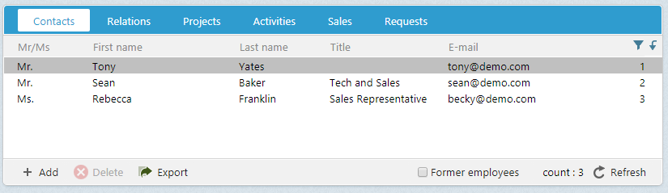
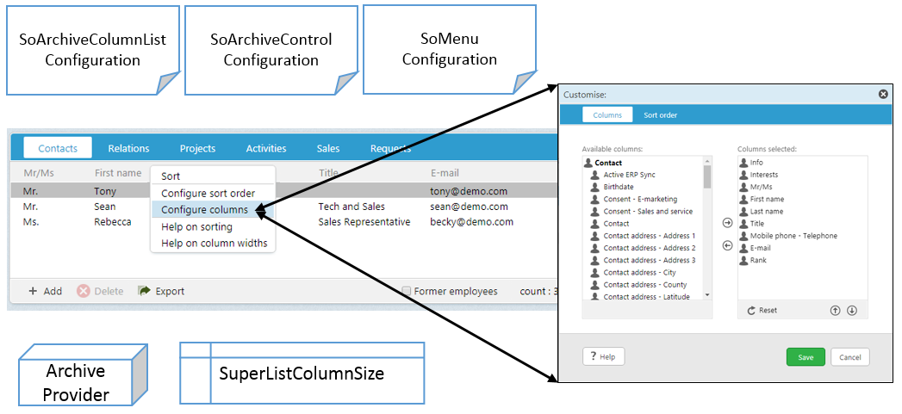
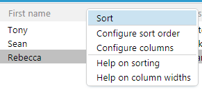
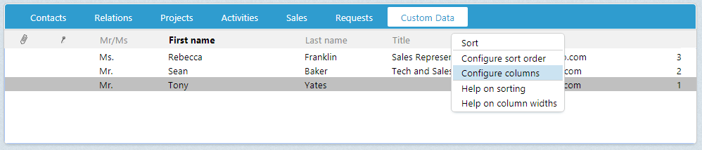

# How to Add an Archive Control



Archive Controls are comprised of the following components:

1. Configuration
1. Data Source
1. Displayed Columns
1. Header Context Menu
1. Row Context Menu
1. Toolbar Action Buttons

This article discusses adding a new archive control with a header context menu and the requirements associated with that task.

How to add a row context menu is discussed in the [Adding a Context Menu](Add%20Archive%20Row%20Context%20Menu.md) page.

How to add row single-click and double-click actions is discussed in the [Adding an Action Button](Add%20an%20Archive%20Action%20Button.md) page.

How to add a toolbar action button is discussed in the [Adding an Action Button](Add%20an%20Archive%20Action%20Button.md) page.

## Configuration

Archive controls are created within a control element of type SoArchiveControl. The id attribute is used to uniquely identifies this particular archive from all others in SuperOffice. A common naming practice adds the Archive suffix to the id for easily identifying the control through the system.

In the following example, a control element declares an archive control with id __CustomDataArchive__.

``` xml

<control id="CustomDataArchive" type="SoArchiveControl">
...
</control>

```

## Data Source

A child config element defines the characteristics of the archive control. The __providername__ element defines the archive control data source and the restrictions element controls the criteria passes to the datasource to restrict the results.

This example declared the person archive provider as the datasource. The criteria used to restrict the number of person rows shown is the contactId, which is one of the available columns in the person archive provider.

The current element is set to anchor the current person entity. This means that when a person row is selected in the archive control, this will set the selected person as the current person in the current system.

``` xml

<control id="CustomDataArchive" type="SoArchiveControl">
  <config>
      <providername>person</providername>
      <restrictions>
        <restriction name="contactId" operator="=" binding="current">contact</restriction>
      </restrictions>
      <current>person</current>
  </config>
</control>

```

## Displayed Columns

All archive providers implement the same interfaces to ensure they have a uniform behavior. Each one defines a set of available columns to display data in an archive control, but how and which columns displayed are managed by a number of mechanisms.



Once an SoArchiveControl is defined in a page, the controls' id attribute is used as a gui-identifier, called a guiname. Together, the guiname and provider name defined a unique archive element in the __SoArchiveColumnList.config__ file.

The combination of providername and guiname must be unique as duplicates will create odd user-experience behaviors in SuperOffice.

_Note casing is lower case_.

### Example Section in SoArchiveColumnList.config

``` xml

<archive providername="person" guiname="customdataarchive">
  <columns>
    <column name="hasInfoText" default="true" mandatory="false" ignore="false" />
    <column name="hasInterests" default="true" mandatory="false" ignore="false" />
    <column name="mrMrs" default="true" mandatory="false" ignore="false" />
    <column name="firstName" default="true" mandatory="false" ignore="false" />
    <column name="middleName" default="false" mandatory="false" ignore="false" />
    <column name="lastName" default="true" mandatory="false" ignore="false" />
    <column name="title" default="true" mandatory="false" ignore="false" />
    <column name="email/emailAddress" default="true" mandatory="false" ignore="false" />
    ...
  </columns>
</archive>

```

### Configure Columns

To enable the ability to use the Customize dialog to configure displayed column and positioning, the page hosting the archive control must declare the __ArchiveColumnConfigDataHandler__ at the top of the page.

```xml
<page id="ContactPage">
  <data>
    <datahandlers>
      <datahandler id="ContactEntityDataHandler" type="ContactEntityDataHandler" />
      <datahandler id="PersonEntityDataHandler" type="PersonEntityDataHandler" />
      <datahandler id="ArchiveColumnConfigDataHandler" type="ArchiveColumnConfigDataHandler">
        <config>
          <archivecolumninfos>
            <!--guiname maps to definition in SoArchiveColumnList.config-->
            <archivecolumninfo guiname="CustomDataArchive" providername="person"/>
          </archivecolumninfos>
        </config>
      </datahandler>
    </datahandlers>
  </data>
  <panels>
  ...
  </panels>
</page>

```

With a datahandler configured, add the __archivecolumninfo-datasourcename__ element to the SoArchiveControl config section. This provides the personalized functionality where different users can configure different columns without affecting each others view of the same data source.

The first time an archive control is viewed in SuperOffice, it creates a record in the database table SuperListColumnSize. Future changes by users in the Customize dialog are persisted for each user in the database table SuperListColumnSize.

``` xml

<control id="CustomDataArchive" type="SoArchiveControl">
  <config>
      <providername>person</providername>
      <restrictions>
        <restriction name="contactId" operator="=" binding="current">contact</restriction>
      </restrictions>
      <current>person</current>
      <archivecolumninfo-datasourcename>ArchiveColumnConfigDataHandler.CustomDataArchive</archivecolumninfo-datasourcename>
  </config>
</control>

```

_Note during development that any changes to configuration or data source will not be seen in the UI until the record in SuperListColumnSize is deleted._

#### Add Menu Element to SoMenuConfiguration.config



 To show the header context menu when a header item is right-clicked, i.e. the “configure colums” menu, you must add a ```<menu>``` element between the ```<control>``` and ```<config>``` elements in the SoArchiveControl.

``` xml

<menu>
  <context>archive</context>
  <subcontext>customdata</subcontext>
  <id binding="none">0</id>
  <position>belowcursor</position>
  <click>right</click>
</menu>

```

The context and subcontext attributes must match a menu element defined in the SoMenuConfiguration.config file. These are the identifiers that distinquish this menu item from all others.

An important convention to note about the following markup. Rendered archive control names are the result of combining the id value suffixed with _ArchiveControl_. The result, with the archive control __id__ _CustomDataArchive_, becomes __CustomDataArchiveArchiveControl__. Therefore, when referencing the archive control in JavaScript (as seen below), use the full term CustomDataArchiveArchiveControl.

 ``` xml

   <menu context="archive" subcontext="customdata" id="0" position="below" group="mainmenu" displayaccesskeys="false">
    <menuitems>
      <menuitem id="archivesort" type="normal" >
        <caption>[SR_MENU_SORT]</caption>
        <url>Javascript:CustomDataArchiveArchiveControl.OrgOrderBy();</url>
      </menuitem>
      <menuitem id="" type="divider"/>
      <menuitem id="archivesortconfig" type="normal">
        <caption>[SR_MENU_SORT_CONFIG]</caption>
        <url>Javascript:Dialog.open("archiveconfiguration", "archiveconfiguration[dialog=stop].sortorder?provider_name=person&amp;gui_name=CustomDataArchive","CustomDataArchiveArchiveControl.Refresh();");</url>
      </menuitem>
      <menuitem id="archivecolumnconfig" type="normal">
        <caption>[SR_MENU_COLUMNS_CONFIG]</caption>
        <url>Javascript:Dialog.open("archiveconfiguration", "archiveconfiguration[dialog=stop].columns?provider_name=person&amp;gui_name=CustomDataArchive","CustomDataArchiveArchiveControl.Refresh();");</url>
      </menuitem>
      <menuitem id="" type="divider"/>
      <menuitem id="archivesorthelp" type="normal">
        <caption>[SR_MENU_LIST_HELP_SORT]</caption>
        <url>javascript:Dialog.ShowHelpFromIndex('archive.sort');</url>
      </menuitem>
      <menuitem id="archivecolumnresize" type="normal">
        <caption>[SR_MENU_LIST_HELP_RESIZE]</caption>
        <url>javascript:Dialog.ShowHelpFromIndex('archive.resize');</url>
      </menuitem>
    </menuitems>
  </menu>

 ```

### Contact Page Example with SoArchiveControl

```xml
<page id="ContactPage">
  <data>
    <datahandlers>
      <datahandler id="ContactEntityDataHandler" type="ContactEntityDataHandler" />
      <datahandler id="PersonEntityDataHandler" type="PersonEntityDataHandler" />
      <datahandler id="ArchiveColumnConfigDataHandler" type="ArchiveColumnConfigDataHandler">
        <config>
          <archivecolumninfos>
            <!--guiname maps to definition in SoArchiveColumnList.config-->
            <archivecolumninfo guiname="CustomDataArchive" providername="person"/>
          </archivecolumninfos>
        </config>
      </datahandler>
    </datahandlers>
  </data>
  <panels>
    <panel id="Contact" type="SplitterPanel" soprotocol="Contact" paneltype="Main">
    <!-- skipping other elements for brevity -->
      <card id="ContactArchives" placeholderid="bottom" type="SoTabbedCard" cardtype="ArchiveCard" layout-position="south">
      <views>
      <!-- *************************************************************
        Assuming a custom archive section (dicussed in Displayed Columns above)
        added to SoArchiveColumnList.config file... 
        
        Add this view under others in ContactArchives in SoContactPanel.config
        ****************************************************************-->
        <view id="CustomDataArchiveView" type="SoView" soprotocol="customdataarchive"  rendermode="display">
          <caption binding="resources">Custom Data</caption>
          <controlgroups>
            <controlgroup id="customdatagroup" type="SoControlGroup" position="absolute" left="0px" right="0px" top="0px" bottom="0px">
              <controls>
                <control id="CustomDataArchive" type="SoArchiveControl" width="100%" top="0px" left="0px" height="100%" position="absolute">
                <!-- define header context menu -->
                  <menu>
                    <context>archive</context>
                    <subcontext>customdata</subcontext>
                    <id binding="none">0</id>
                    <position>belowcursor</position>
                    <click>right</click>
                  </menu>
                  <config>
                    <providername>person</providername>
                    <restrictions>
                      <restriction name="contactId" operator="=" binding="current">contact</restriction>
                    </restrictions>
                    <current>person</current>
                    <archivecolumninfo-datasourcename>ArchiveColumnConfigDataHandler.CustomDataArchive</archivecolumninfo-datasourcename>
                    <showheader>true</showheader>
                  </config>
                </control>
              </controls>
            </controlgroup>
          </controlgroups>
          <triggers>
            <trigger type="current">contact</trigger>
            <trigger type="current">person</trigger>
          </triggers>
        </view>
      </views>
    </panel>
  </panels>
</page>

```

## Result

