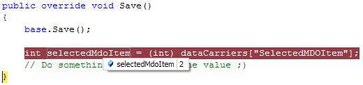

<properties date="2016-06-24"
SortOrder="12"
/>

Ok, so now we are able to show our own MDO control, and it works like expected. But to have any use of such a control, you would want to grab the selected value of the control at some point and use it in some way.

This can be accomplished by adding your own data handler, a topic discussed in the previous article. To recap; add a new class that inherits SuperOffice.CRM.Web.Data.SaleDataHandler (when working with Sales), add a data carrier from the overridden Initialize method, declare the data handler in the SoObjectMapping file, and finally add the new data handler to the page;

```
public class AnotherSaleDataHandler : SuperOffice.CRM.Web.Data.SaleDataHandler
{
    public override void Initialize(System.Xml.XmlNode config, string id)
    {
        _dataCarriers.Add("SelectedMDOItem", null);
        base.Initialize(config, id);
    }
}
```

&lt;object type="IDataHandler" mappingname="DevNetSaleDataHandler" assemblyname="CustomizingSIXwebPart4" objectname="CustomizingSIXwebPart4.AnotherSaleDataHandler"&gt;&lt;/object&gt;

&lt;datahandler id="EntityDataHandler" type="DevNetSaleDataHandler"&gt;

Now your page uses the new data handler, you can update the data carrier with the value of the selected item from your MDO control. Do this by overriding the UpdateDataSource method from the user control where you have your MDO control;

```
public override void UpdateDataSource()
{
    base.DataSource = mdoTest.SelectedId;
    base.UpdateDataSource();
}
```

Then you can add some logic to the Save method of your data handler;

```
public override void Save()
{
    base.Save();
  
    int selectedMdoItem = (int)_dataCarriers["SelectedMDOItem"];
    // Do something useful with the value ;)
}
```

When running the application, you will see that the value of selected MDO item is passed from your user control to your data handler;


