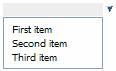
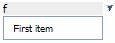

<properties date="2016-06-24"
SortOrder="11"
/>

Now we are ready to add the user control to a page. As mentioned in previous articles, you will need to define the user control in the SoObjectMapping.config file;

&lt;object type="UserControl" mappingname="DevNetTestMDO" assemblyname="CustomizingSIXwebPart4" objectname="~/DevNet/testMDO.ascx"&gt;&lt;/object&gt;

Then add the control to a page;

&lt;control id="DevNetMDOControl" type="DevNetTestMDO" width="100%" top="0px" left="0px" height="100%" position="absolute" &gt;

&lt;/control&gt;

Now you should be able to see the contents of your own MDO control;

Searching works;

