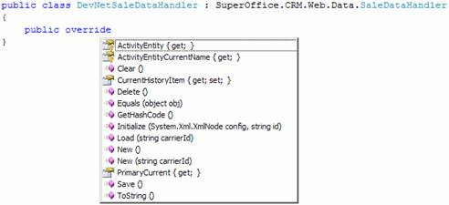

<properties date="2016-06-24"
SortOrder="12"
/>

The first thing you need to do is to create a new class that inherits SuperOffice.CRM.Web.Data.SaleDataHandler. If you take a look at the public methods you can override, you will see that there are methods for all the basic operations available to a CRM.web page; New, Load, Save, Delete, etc.

For this exercise we will be using the Initialize and Save methods.
