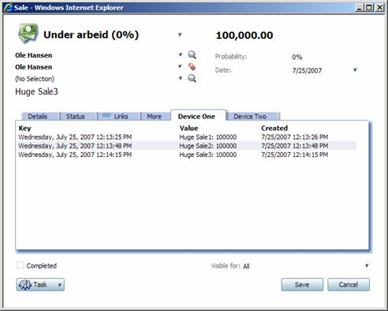

<properties date="2016-06-24"
SortOrder="18"
/>

The final goal of this exercise was to add new Foreign Keys to the current Sale. To add functionality to what happens when pressing the Save button in the Sale page, we need to override the Save method in the data handler;

```
public override void Save()
{
    // Save the sale
    base.Save();
  
    SaleEntity saleEntity = (SaleEntity)_dataCarriers["SaleEntity"];
    if (saleEntity.SaleId > 0)
    {
        // Save foreign keys
        DevNetForeignKey devNetFkOne = (DevNetForeignKey)_dataCarriers["ForeignKeyDeviceOne"];
        DevNetForeignKey devNetFkTwo = (DevNetForeignKey)_dataCarriers["ForeignKeyDeviceTwo"];
  
        SaveForeignKey(devNetFkOne, saleEntity);
        SaveForeignKey(devNetFkTwo, saleEntity);
    }
}
```

In the Save method, we let the Sale page do its thing first by calling the base Save method. The data handler will implicitly contain a data carrier holding whatever entity you are working on – in this case a SaleEntity. If you were creating a new sale, the SaleEntity would have a value for SaleId after the base Save had completed.

The next thing we do is to use the two data carriers that we added to create two new Foreign Keys to the Sale.

The Foreign Keys will simply contain a key consisting of the current date and time, and the value will be the title and amount of the sale (see the DevNetForeignKey class in the project). So basically, it would be a log of changes made to the title and amount of a Sale.

The actual saving of the Foreign Keys is done in the SaveForeignKey method of the data handler, which uses the Services layer to add a new Foreign Key.

Here is the result of what we have gone through in this article;


