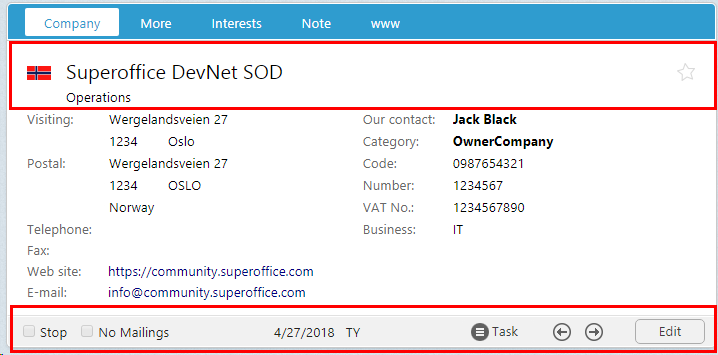

# SuperOffice CRM Web Configuration

SuperOffice CRM is a standard ASP.NET web application. In this section we will be examining the contents of the CRM.web installation, highlighting how it is structured, as well as providing guidance how to build customizations and integrations.

## Application Structure

The following table describes all application folders likely to be affected by creating and deploying customizations. Most integrations are only concerned with the App_Data, Bin and JavaScripts folders, but sometimes so are Themes and Images.

|Folder| Description|
|------|-------------|
|App_Data|Contains all SuperOffice Markup Language (SOML) configuration files that constitute the entire application structure.  Change configuration files to suit your needs, i.e. add your own or edit existing pages. |
|App_Themes| Contains all stylesheets used by the application. The use of themes also lets you change all of the design elements, like fonts, colors, etc. in the entire application to e.g. fit your own corporate design. |
|Bin| Contains all application-dependent assemblies, from archive providers to web controls, as well as NetServer Service assemblies. |
|Images| Contains all images used by SuperOffice CRM Web. Custom images should be placed in a subfolder inside.|
|Javascripts| Contains all JavaScript (.js) files used by the application. Custom scripts should be placed in subfolders.|

Nearly all customizations involve changing at least one of the configuration files so that's the best place to continue this discussion.

## Configuration Files

Some of the overall design goals of the SuperOffice web client are: create an application that is easy to extend, easy to transform and easy to validate. It must also be easy to read and easy to configure.

SuperOffice has achieved these goals with an XML format called SuperOffice Markup Language (SOML). SOML conforms to a well-defined schema that defines the entire web applications structure. 

SOML content is stored in files with a .config extension and referred to as configuration files. SOML is also found in files with a [.merge](web-client-deploy-merge-files) extension, usually associated with third-party customizations or integrations.

Configuration files make up both the infrastructure components and User-Interface (UI) components of the application. Infrastructure components are a collection of files that represent the system itself and are referred to as system files.

### System Configuration Files

System file **SoApplicationConfiguration.config**, contains all of the page and dialog declarations, essentially cataloging all of the files that represent UI components. System file **SoObjectMapping.config** maps all element types used in page configurations to actual user and web controls defined in assemblies. Both of these system files contain more than what's described here, but this explaination is useful in that it describes how the contents of system files are different that dedicated page configuration files.

Other files considered to be system files include:

- SoAdminApplicationConfiguration.config
- SoFilterList.config
- SoObjectMapping.config
- SoArchiveColumnList.config
- SoArchiveControlLinkInfoTypes.config
- SoArchiveCriteriaList.config
- SoMenuConfiguration.config

### User Inferface Files

What's shown in a brower window is generally associated with being a UI configuration component.

For example, the following SOML represents a dialog page called _SoPlainCardDialog.config_. It contains a root element **page** and contains two child elements, **title** and **panels**. The **panels** element is a container for one or more **panel** elements. In this case it only contains one **panel** of type **SoDialogPanel**.

The panel element contains a **cards** child element and this represents a contains for one or more **card** elements. In this case, only one **card** element of type **SoDialogSimpleCard** is declared.

The **card** element contains a **views** element, which is a container for one or more **view** elements. In this case, only on **view** element of type **SoDialogSimpleView** is declared.

The **view** element contains a **controlgroups** element, which is a container for one or more **controlgroup** element. In this case, only one **controlgroup** of type **SoControlGroup** is declared.

The controlgroup element contains a **controls** element, which is a container for one or more **control" elements. In this case, only one control of type **SoLabel** is declared.

Beginning to see a pattern yet?

```xml
<!-- SoPlainCardDialog.config -->
<page id="PlainCardDialog">
  <title>Plain Dialog</title>
  <panels>
    <panel id="MainPanel" type="SoDialogPanel" soprotocol="main">
      <cards>
        <card id="MainCard" type="SoDialogSimpleCard" placeholderid="MainDialogCard"
              cardtype="MainCard" position="absolute" top="10px">
          <views>
            <view id="MainView" type="SoDialogSimpleView" soprotocol="view1">
              <controlgroups>
                <controlgroup id="MainHeaderGroup" type="SoControlGroup"
                              left="50px" top="50px" position="absolute">
                  <controls>
                    <control id="DialogHeader" type="SoLabel" width="100%">
                      <caption>Plain Dialog Label</caption>
                    </control>
                  </controls>
                </controlgroup>
              </controlgroups>
             </view>
          </views>
          <config>
            <customcssclass>mycardtop</customcssclass>
          </config>
        </card>
      </cards>
    </panel>
  </panels>
</page>
```

All elements have child **config** elements for additional functionality, but only certain controls use them. Here the [card](https://community.superoffice.com/documentation/SDK/SO.Web.Application/html/M_SuperOffice_DCF_Web_UI_Controls_CardBase_InitializeViews.htm) uses a **config** element to define a css style that should override the default. It's up to the control implementation to define what child elements are available in the config element, and then process each accordingly. See the online article [Customizing CRM Web, Part II: User Controls](https://community.superoffice.com/en/content/content/webclient/Customizing-SIXweb-part-II-User-Controls/) for more information.

The naming convension for all configuration files follow start with the prefix "So". The text that follows the prefix represents the contents of the file. With regard to UI configuration files, the root name generally pertains to the entity shown in the UI; such as Person. The filename suffix is the first SOML element in the file.

For example, consider the company card, the name of the configuration file that describles all the elements that make up the company card resides in a file called _SoContactPage.config_.

It follows the convension:

```text
So[Entity][Element]
```

Inspecting the contents of the SoContactPage.config, the SOML is:

```xml
<page id="ContactPage">
  <data>
    <datahandlers>
      ...
    </datahandlers>
  </data>
  <panels>
    <panel reference="Menu" />
    <panel reference="ButtonBar" />
    <!--panel reference="Navigation" /-->
    <panel reference="Navigator" />
    <panel layout-position="center" reference="Contact" />
  </panels>
</page>


```

For easier discoverability and file maintainablility, a page structure is optionally be broken down into logical fragments and saved in multiple files.

## Page Fragments

As seen in the company page, **panel** elements use a _reference_ attribute to indicate the panel contents reside in a file that follows the standard naming convention. With that knowledge, the following files must also exist and contain their respective parts; which they do:

- SoMenuPanelPanel.config
- SoButtonBarPanel.config
- SoNavigatorPanel.config
- SoContactPanel.config

Each one of these files exist under the root or a subfolder in _App\_Data\WebClient\Web_.

Expanding on a slimmed down copy of _SoContactPanel.config_ reveals the following structure. As expected, the root element is panel followed by a card collection, which contain views and so on.

The file declares even more element fragments that reference other files. The first example is a **view** with _id_ value MainView. The _reference_ attribute is _MainView_, which means that the content of this view must be in a file named SoMainViewView.config. _SoMainViewView.config does exist and contains the content that declares the top left view of the company card.

```xml
<panel id="Contact" type="SplitterPanel" soprotocol="Contact" paneltype="Main">
  <cards>
    <card id="ContactMainCard" type="SoTabbedCard" placeholderid="leftpanel" cardtype="MainCard" layout-position="center">
      <views>
        <view id="MainView" reference="MainView" current="contact" rendermode="display"></view>
        <view id="more" type="SoView" soprotocol="udef" current="contact" rendermode="display" minwidth="##MAINCARD.MINWIDTH##">
          ...
          <controlgroups>
            <controlgroup id="MoreMainHeaderGroup" referenceWithIdUpdate="MainHeaderGroup"/>
            <controlgroup id="MoreButtonBar" referenceWithIdUpdate="ContactButtonBar"/>
          </controlgroups>
          ...
        </view>
        <view id="interests" type="SoView" soprotocol="interest" current="contact" rendermode="display" minwidth="##MAINCARD.MINWIDTH##">
          <caption binding="resources">[SR_PL_INTERESTS_1]</caption>
          <controlgroups>
            <controlgroup id="InterestMainHeaderGroup" referenceWithIdUpdate="MainHeaderGroup"/>
            <controlgroup id="InterestButtonBar" referenceWithIdUpdate="ContactButtonBar"/>
          </controlgroups>
        </view>
      </views>
      ...
    </card>
    <!-- prefkey="MiniPanel": Need to explicitly mark the minipanel card, because settings are stored differently in database -->
    <card id="ContactMiniCard" reference="MiniCard"></card>
    ...
  </cards>
...
</panel>
```

Looking further down in the file, there are more fragments declared using both **reference** and **referenceWithIdUpdate** attribute.

The difference between the two is that _reference_ is used when the element id is unique and the contents of the element reside in file that follows the naming convention _So[id][Element].config_.

The attribute _referenceWithIdUpdate_, is used when more than one element of the same type wants to reference the same content. To avoid creating duplicate content in files _SoMoreMainHeaderGroupControlGroup.config_ and _SoInterestMainHeaderGroupControlGroup.config_, using _referenceWithIdUpdate_ means reference this file instead of using my id as the link.

Using the following image to illustrate the point, no matter what tab is selected in the main card, the contents of the MainHeaderGroup _controlgroup_ is shown. The same goes for the ContactButtonBar _controlgroup_ the same buttons are shown in all views.



Therefore, the best way to avoid creating two files with the same content named:

- SoMoreMainHeaderGroupControlGroup.config
- SoInterestMainHeaderGroupControlGroup.config

Is to use _referenceWithIdUpdate_ and reference one file named:

- _SoMainHeaderGroupControlGroup.config_

## Conclusion

This page introduced web application folders used when building customizations or integration with SuperOffice CRM Web. It also introduced configuration files, briefly describing system configuration files and, in more detail, UI page configuration files.

1. autolist
