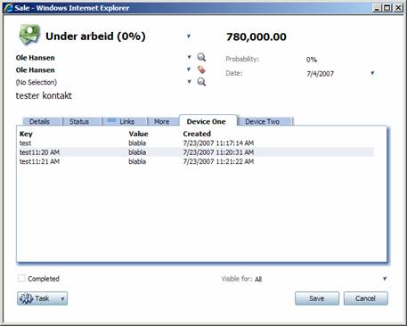

<properties date="2016-06-24"
SortOrder="14"
/>

Now let's move back to the user control and add some logic to it. First, add a DataGrid control to the user control, and name it dgFkList. This will be the control that holds the list of foreign keys that we will be retrieving.

```xml
<asp:DataGrid ID="dgFkList" AutoGenerateColumns="false" runat="server">
    <Columns>
        <asp:BoundColumn DataField="key" HeaderText="Key" />
        <asp:BoundColumn DataField="value" HeaderText="Value" />
        <asp:BoundColumn DataField="createddate" HeaderText="Created" />
    </Columns>
</asp:DataGrid>
```

As you may have noticed in the previous section, we added one element in the config section of the control;

```xml
<config>
    <ForeignKeyDeviceId>DeviceOne</ForeignKeyDeviceId>
</config>
```

Every element you add to the config section of a control is available to you in the overridden Initialize method of a UserControlBase object. It will be passed in as the config argument to the method, which is of type System.Xml.XmlNode.

What we want to do here is simply to read out the value of the key from the page configuration file and store it in a class variable;

```csharp
public override void Initialize(System.Xml.XmlNode config, string id)
{
    base.Initialize(config, id);

    System.Xml.XmlNode node = config.SelectSingleNode("ForeignKeyDeviceId");

    if (node != null && !String.IsNullOrEmpty(node.InnerText))
    {
        _fkDeviceId = node.InnerText;
    }
    else
    {
        throw new SystemException("Missing Foreign Key Device Id");
    }
}
```

The Initialize method is fired before Page\_Load, which is the next event we will be looking at next. What we want to do here is to get the current Sale ID and populate the DataGrid. The SuperStateManager is a static object in CRM.web that keeps track of all the currents in the system, like current contact, current person, current sale, etc.

Here it is:

```csharp
protected void Page_Load(object sender, EventArgs e)
{
    // Get current sale ID
    _saleId = SuperOffice.CRM.Web.SuperStateManager.GetCurrent("sale").Id;

    if (_saleId > 0)
    {
        // Get all foreign keys for current sale
        GetList();
    }
}
```

So the GetCurrent method of the SuperStateManager takes in a string saying what entity you want to get information from. The method returns a HistoryItem, which is transparent to what entity is actually returned, and has properties like Id and Name.

The sale id returned is stored in a class variable for later use. The sale id will be zero when opening the dialog for a new sale.

Finally, we populate the DataGrid when opening an existing sale from the GetList method;

```csharp
private void GetList()
{
    IForeignSystemAgent agent = new ForeignSystemAgent();
    ForeignKey[] fks = agent.GetDeviceKeysOnDeviceIdentifierTableRecordId("DevNet", "Demo", _fkDeviceId, "sale", _saleId);

    dgFkList.DataSource = fks;
    dgFkList.DataBind();
}
```

The GetDeviceKeysOnDeviceIdentifierTableRecordId method is new in NetServer 3, and will let you retrieve all Foreign Keys for an entity using the entity id along with the Foreign Application and Device names and ids.

You will have to create Foreign Key records for a sale to actually get anything showing up in the list. This is actually an exercise for the next article, but to give you a head start, here are some lines of code that will insert records in the tables needed for something to show up in the control;

```csharp
ForeignSystemAgent agent = new ForeignSystemAgent();

ForeignKey key = new ForeignKey();
key.Key = "testKey1";
key.Value = "testValue123";
key.RecordId = _saleId;
key.TableName = "sale";

agent.SaveForeignKey(key, "DevNet", "Demo", _fkDeviceId);
```

Here is finally a screenshot of the sale page with a list of foreign keys showing in one of the tabbed views that we just added;


