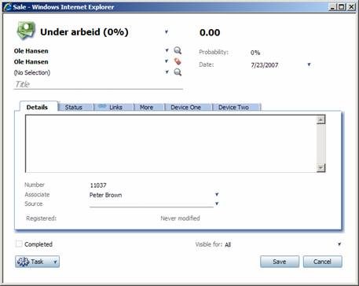

<properties date="2016-06-24"
SortOrder="13"
/>

After you have declared your user control in SoObjectMapping.config, you are ready to use it in a new or existing page.

We will be adding two new views to the Sales dialog, so let’s open the SoSalePage.config file. As you may remember from the last article, there is a pattern in how every page is built. You will need a page, one or more panels, one or more views, one or more controlgroups and one or more controls.

We want to place two new views after the existing ones, so let’s go to the last view, and just copy that whole definition and paste it once. We have to change the id of the view, as the id needs to be unique from within the page. Think of the ids as variable names. The soprotocol also needs to be unique, and this needs to be unique system wide. With that in mind, it is always a good idea to name the soprotocols for your own views, controls, etc with a specific prefix, so that they do not interfere with existing CRM.web soprotocols.

After you have added one view, you can just copy and paste that one, and simply replace the ids, soprotocol and finally the config setting for the user control.

The final configuration of the two new views will look something like this:

&lt;!-- DevNet Device One --&gt;

&lt;view id="DevNetDeviceOneView" type="SoDialogView" soprotocol="devnetdeviceone" &gt;

    &lt;caption&gt;Device One&lt;/caption&gt;
    &lt;tooltip&gt;&lt;/tooltip&gt;
    &lt;controlgroups&gt;
        &lt;controlgroup id="DevNetDeviceOneControlGroup" type="SoControlGroup" position="absolute" top="0px" bottom="0px" left="0px" right="0px" &gt;
            &lt;controls&gt;
                &lt;control id="DevNetDeviceOne" type="DevNetSaleForeignKeys" width="100%" top="0px" left="0px" height="100%" position="absolute" &gt;

[                    &lt;]()config&gt;

                        &lt;ForeignKeyDeviceId&gt;DeviceOne&lt;/ForeignKeyDeviceId&gt;
                    &lt;/config&gt;
                &lt;/control&gt;
            &lt;/controls&gt;
        &lt;/controlgroup&gt;
    &lt;/controlgroups&gt;

&lt;/view&gt;

  

&lt;!-- DevNet Device Two --&gt;

&lt;view id="DevNetDeviceTwoView" type="SoDialogView" soprotocol="devnetdevicetwo" &gt;

    &lt;caption&gt;Device Two&lt;/caption&gt;
    &lt;tooltip&gt;&lt;/tooltip&gt;
    &lt;controlgroups&gt;
        &lt;controlgroup id="DevNetDeviceTwoControlGroup" type="SoControlGroup" position="absolute" top="0px" bottom="0px" left="0px" right="0px" &gt;
            &lt;controls&gt;
                &lt;control id="DevNetDeviceTwo" type="DevNetSaleForeignKeys" width="100%" top="0px" left="0px" height="100%" position="absolute" &gt;
                    &lt;config&gt;
                        &lt;ForeignKeyDeviceId&gt;DeviceTwo&lt;/ForeignKeyDeviceId&gt;
                    &lt;/config&gt;
                &lt;/control&gt;
            &lt;/controls&gt;
        &lt;/controlgroup&gt;
    &lt;/controlgroups&gt;

&lt;/view&gt;

The next thing you need to do is to add references to the new views in the &lt;config&gt; section of the &lt;card&gt;where you defined the views. The config section of a card has a section defining which views will be placed in separate tabs in a tab control; &lt;tabbedviews&gt;. Similarly, there is also a &lt;headerviews&gt; and a &lt;footerviews&gt; config section.

Here is the definition of the tabs in the sale page after we have added the two new views;

&lt;tabbedviews top="150px" bottom="60px"&gt;

    &lt;viewref&gt;SaleDetailsView&lt;/viewref&gt;
    &lt;viewref&gt;SaleStatusView&lt;/viewref&gt;
    &lt;viewref&gt;LinksArchive&lt;/viewref&gt;
    &lt;viewref&gt;SaleMoreView&lt;/viewref&gt;
    &lt;viewref&gt;WWWDialog&lt;/viewref&gt;
    &lt;viewref&gt;DevNetDeviceOneView&lt;/viewref&gt;
    &lt;viewref&gt;DevNetDeviceTwoView&lt;/viewref&gt;

&lt;/tabbedviews&gt;

If you do not add references to your views in &lt;headerviews&gt;, &lt;tabbedviews&gt; or &lt;footerviews&gt;, they will simply not appear on the page.

Now you should be able to see two new tabs on the tab control of the sale page;

  
