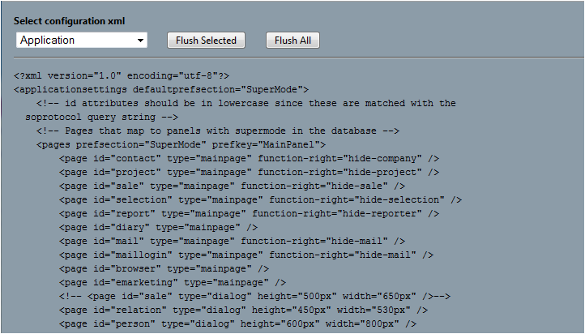

<properties date="2016-06-24"
/>

Diagnostics viewer.

```
   Diagnostics.aspx
```



This web-page (included in all Sales & Marketing installations) can be used to check whether your config file modifications are being picked up.
