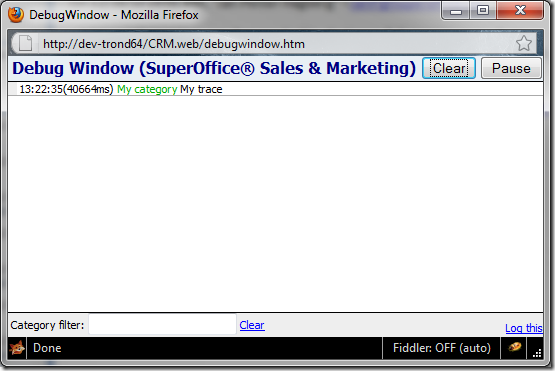
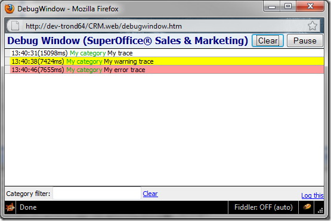

<properties date="2016-06-24"
/>

How do we debug the web client? For starters, all the web browsers have developer tools either built in, or available as a plugin.

* Firefox: Download the Firebug Plugin
* IE8+: Built in (F12)
* Chrome: Built in (Ctrl-Shift-J)
* Safari: Built in (Ctrl-Alt-I)

With these tools you are able to get an overview of the current HTML, styles and able to execute javascript code.

**So far, so good. But I would like something functioning closer to my codebase…**

Early on, we developed a “Debug Window� to catch our own trace messages from the application:

<table>
<colgroup>
<col width="100%" />
</colgroup>
<tbody>
<tr class="odd">
<td><pre class="code"><code>    debug.trace(&quot;My trace&quot;, &quot;My category&quot;);</code></pre></td>
</tr>
</tbody>
</table>

This javascript code above will produce the following output:

**Cool! But how can I open the debug window?**

There are several ways to open the debug window. Type the following into the address bar of your favorite browser:

<table>
<colgroup>
<col width="100%" />
</colgroup>
<tbody>
<tr class="odd">
<td><pre class="code"><code>    javascript:debug.openWindow();</code></pre></td>
</tr>
</tbody>
</table>

The debug window is now active for the current page, and will receive all trace from the code. If you want to use this for dialogs, a new debug window must be opened for each dialog.

Go ahead and enter the following lines into the address bar (one at the time):

<table>
<colgroup>
<col width="100%" />
</colgroup>
<tbody>
<tr class="odd">
<td><pre class="code"><code>    javascript:debug.trace(&quot;My trace&quot;, &quot;My category&quot;);
    javascript:debug.warning(&quot;My warning trace&quot;, &quot;My category&quot;);
    javascript:debug.error(&quot;My error trace&quot;, &quot;My category&quot;);</code></pre></td>
</tr>
</tbody>
</table>

You should see something like this in your debug window:

The output is quite straightforward:

* Time of trace
* (xxxms) Time in milliseconds since the last trace was written
* Category in green (Clickable, allows filtering on a specific category)
* Trace text

When you open the debug window you will notice a lot of traces going on when navigation the application. We utilize the trace output a lot. Take a look into the combined script file to check it out.

Note: The debug window will survive a refresh of the page it’s connected to.

**There must be a simpler way to open the debug window?**

Sure is. You could add a new item to the main menu, or you could modify some script code to open it automatically, maybe even by pressing a key combination.

*Not a good idea you say? You’re right, if we can do this without touching the codebase, we’ll go for it.*

**The simpler and better way; socustom.js.**

Note: This will only work in S&M 7.Web

During the load of a new page the application will be looking for a javascript file named socustom.js in the root folder. Any scripts inside this file will be executed for the main page and any dialogs opened.

**Let’s say we want to the debug window when we press Ctrl-F9 inside the web application.**

1. Create a new file **socustom.js**, and place it in the root folder.
2. Add the following javascript code to the file

<table>
<colgroup>
<col width="100%" />
</colgroup>
<tbody>
<tr class="odd">
<td><pre class="code"><code>    $j(document).ready(function() {
        KeyPressHandler.AddKeyPressListenerByKeyCode(
          120, //F9
            ModifyKey.CTRL, 
         &#39;debug.openWindow();&#39;);     
    });</code></pre></td>
</tr>
</tbody>
</table>

* Open the application or hit F5
* Press Ctrl-F9

There you are. The preferred way to open the debug window. And no debug code you will have to remember to remove before shipping to the customer!

Trond Nilsen
