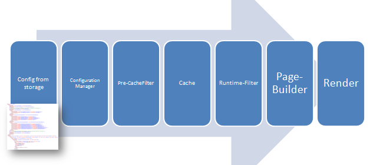

<properties date="2016-06-24"
/>



When a callback request is made to the server the request is in the form of the soprotocol.

The SoProtocolModule parses the soprotocol and updates the SuperState and Current reflecting the changes made from the last request.

These changes are used by the ContextFilter to modify the configuration.

Parts of the configuration that isn’t affected by the changes in SuperState/Current are removed.

When the PageBuilder receives the configuration it has no knowledge of what to render and what to not render. The PageBuilder only builds what the configuration tells it to build.

Fragments
=========

Configuration files can be split into smaller fragments. This enables reuse of configuration. There is a strict naming convention for this to work.

Fragments must be named correctly:

Syntax: `So[Reference_Name][Type].config`
e.g.: `SoContactCommonHeaderControlGroup.config`

Fragment filename: SoNavigatorPanel.config

```
  <panels>
    <panel reference="Menu" />
    <panel reference="ButtonBar" />
    <panel reference="Navigator" />
    <panel reference="Contact" />
  </panels>
```

You can have several paths. Must start with CustomPath. You should turn off the cache during development - or you won't see changes to the config file appear in the GUI.

Fragments are Page configuration specific.

SoMainHeaderGroupControlGroup.config

```
  <controlgroups>
     <controlgroup id="MoreMainHeaderGroup" 
        referenceWithIdUpdate="MainHeaderGroup"/>
```

All id attributes are prefixed with ref. id

```
<controlgroups>
  <controlgroup id="MoreMainHeaderGroup_OrgId" 
     type=“ControlGroup" />
```

Data Driven
===========

Config for WWWpanels and external applications are generated using templates. These reside in the Service layer.

Filters
=======

Adds and removes fragments of the configuration. Main purpose is to reduce client output, enforce rules(rights) based on client state/user. MergeFilter executes before cache, all others filters after cache. The filters resides in the client - not in the web-services.

Filter filename: `SoFilterList.config`

```
<filters>
  <filter phase="precache" name="MergeFilter"></filter>
  <filter phase="post" name="ContextFilter"></filter>
  <filter phase="post" name="DataFilter"></filter>
  <filter phase="post" name="FunctionalRightsFilter"></filter>
  <filter phase="post" name="SessionStateFilter"></filter>
  <filter phase="post" name="UserPreferenceFilter"></filter>
  <filter phase="post" name="LocalizationFilter"></filter>
  <filter phase="post" name="SentryFilter"></filter>
</filters>
```

Configuration Cache
===================

Caches exist in the database and the web-client application. Fragments and data driven config are cached in the database. The post MergeFilter is run on the client. Use the magic `?Flush` command to clear the cache both on client and server.
