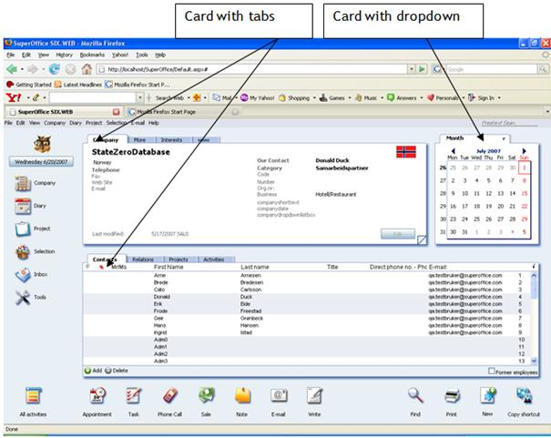

<properties date="2016-06-24"
SortOrder="11"
/>

Cards
=====

The card section contains one or more views. The views can be displayed one by one or all at once, this is decided by the implementation of the card. In CRM.web, the card will display a tab control or a dropdown control telling the user which view is active and what other views are available.

You can use SO-Protocol strings in the URL to force a switch to a particular view:

[http://localhost/SuperOfficeWeb/default.aspx?contact.interest](#)

This link opens the contact page displaying the interest tab.

[http://localhost/SuperOfficeWeb/default.aspx?contact.interest.minimonth](#)

This link opens the contact page displaying the interest tab in the main card and displaying the month calendar in the minicard.

[http://localhost/SuperOfficeWeb/default.aspx?contact.interest.minimonth.activityarchive](#)

This link opens the contact page displaying the interest tab in the main card and displaying the activity tab in the archive card and displaying the month calendar from the minicard.

These links show us a direct way to open a page with wanted tabs. The SoProtocol name is declared on the view using tag in the config file. Otherwise we can log to the contact page and then by clicking or by selecting the wanted views we can get the same result.

