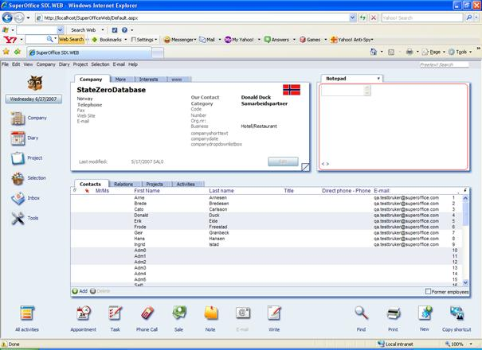

<properties date="2016-06-24"
SortOrder="14"
/>

PlaceHolder
===========

The PlaceHolder control is used to reserve space for controls added by code.

**An important point to remember!**       

The PlaceHolder control does not produce any visible output (it only acts as a container for other controls on the Web page).

CRM.web uses many ASP placeholders in their UserControls.

The below code segment shows the MiniNotepadView.ascx file which shows the NotePad MiniCard on the left hand side

```
<%@ control language="C#" autoeventwireup="true" inherits="WebParts_MiniCards_MiniNotepadView, SoSixWeb" %>
<%@ Register TagPrefix="so2" Namespace="SuperOffice.CRM.Web.UI.Controls" Assembly="SuperOffice.CRMWeb" %>
<asp:PlaceHolder ID="notepadPlaceholder" runat="server" />
<div runat="server" id="buttonwrapper" style="position:absolute;bottom:0px;">
<asp:HyperLink ID="prev" runat="server">&lt;</asp:HyperLink>
<asp:PlaceHolder ID="infoPlaceholder" runat="server" />
 
<asp:HyperLink ID="next" runat="server">&gt;</asp:HyperLink>
</div>
```

 

Two PlaceHolders are used in the above code and their ids are "notepadPlaceholder”  and "infoPlaceholder”.



Controls are dynamically added to the above two placeholders in coding of MiniNotepadView.ascx.cs file.
