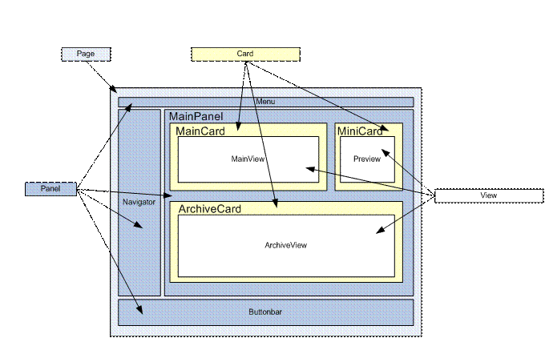

<properties date="2016-06-24"
SortOrder="9"
/>

UserControls: cards, panels
===========================

A Page consists of many panels. Panel consists of one or more views and view consists of one or more controlgroups. Within a controlgroup it has its own controls. Structure of the page is shown in the diagram given below. 

The XML fragment below shows the elements of the SoContactPanel.config file.

```
<?xml version="1.0" encoding="utf-8"?>
<!-- panel -->
<panel id="Contact" type="SplitterPanel" soprotocol="Contact" paneltype="Main" placeholderid="MainPlaceHolder">
  <caption>[SR_COMMON_CONTACT]: [current:contact_name]</caption>
  <cards>
     <!-- card-->
    <card id="ContactMainCard" type="SoTabbedCard" placeholderid="leftpanel" cardtype="MainCard">
      <views>
        <!-- Some other code-->
        <!-- view-->       
        <view id="more" type="SoView" soprotocol="udef" current="contact">
          <caption>[SR_MORE_CONTACT]</caption>
          <tooltip>More...</tooltip>
          <controlgroups>
             <!--controlgroup-->      
            <controlgroup id="moreHeadergroup" type="SoControlGroup" position="absolute" top="5px" left="5px" right="20px">
              <!--controls-->
              <controls>
                <!--control-->
                <control id="ContactMoreHeaderControl" type="ContactHeader">
                  <datasource>ContactEntityDataHandler.ContactEntity</datasource>
                  <config>
                  </config>
                </control>
              </controls>
            </controlgroup>
            <!--Some other code-->
          </controlgroups>
          <!-- Some other code-->
        </view>
        <!-- Some other code-->
      </views>
      <!-- Some other code-->
    </card>
    <!-- Some other cord-->
  </cards>
  <!-- Some other code-->
</panel>
 
```

1. autolist
