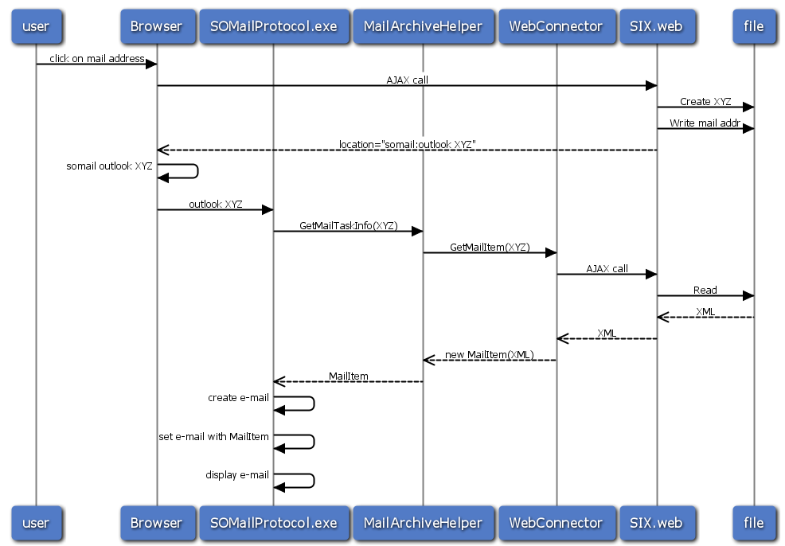

<properties date="2016-06-24"
/>

Mail Protocol Helper

The MailProtocol is installed to handle the somail:xxx links that the SIX.web server generates.

Normally SIX.web will handle a click on an e-mail link by opening a web-based mail editor. When the tray-app and local mail client extensions are installed, then SIX.web will generate a link using the custom SOMAIL protocol.



First SIX.web writes the mail address and info to a temp file.

Then SIX.web generates a redirect to a somail: link with the name of the temp file.

The browser launches the locally installed somail protocol handler - which is usually the `SuperOffice.Mail.ProtocolHandler.exe`

The protocol handler calls either SOCRM.exe or the SIX.web web service depending on the local settings.

The protocol handler requests the temp file from the SIX.web server.

The protocol parses the temp file contents returned from the server, and performs the appropriate actions. e.g: opening a new mail window with the recipient e-mail address already filled in.

Example
-------

Your mail protocol handler needs to do the following to turn the mysterious id "mailtask" into useful XML:

```
   XmlDocument task = new XmlDocument()
   task.LoadXml(mailArchiveHelper.GetMailTaskInfo(id));
```

mailArchiveHelper will call the web service on SIX.web with the "mailtask" id. If connected to the SIX.win client - then the GetMailTaskInfo call will do nothing. The six.web service will return an XML document that looks like this:

```
  <superoffice>
   <mails>
    <mail action="new">
      <to>
        <address>myaddress@somewhere.no
        <name>My Name
      </to>
   </mails>
  </superoffice>
```

Your custom mail protocol handler needs to extract the mail address from this XML document and do the right thing. i.e. in this case create a new mail message, and set the recipient address and name.
