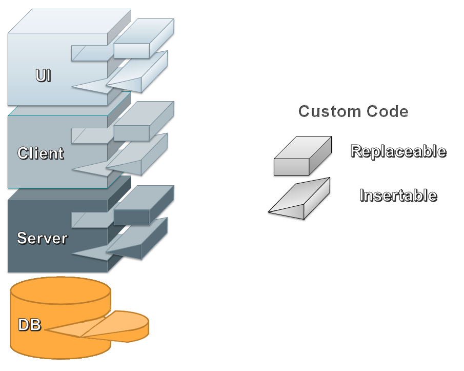
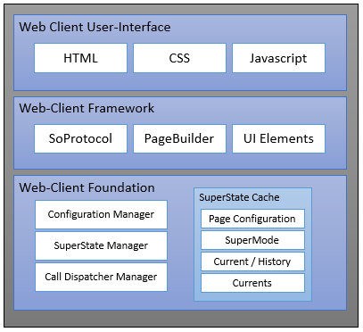
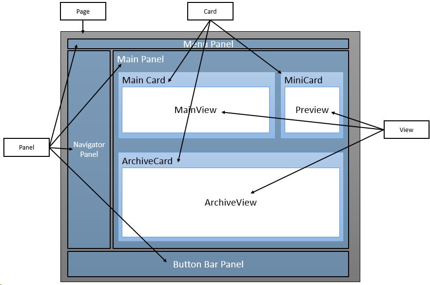
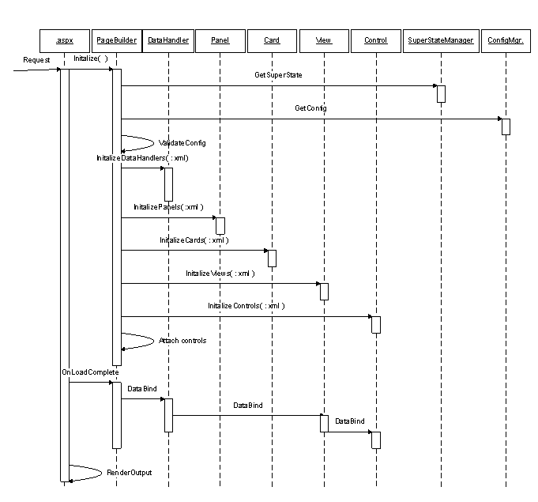

# Web Client Architecture

First conceived and built on ASP.NET technology in 2005, the CRM Web Framework used cutting-edge Web 2.0 techniques, and was delivered as one the first enterprise CRM single-page applications (SPA) on the market. It continues to evolve, using the latests web development technologies, and remains the finest CRM platform available.

SuperOffice CRM Web is an application, from the ground up, built for extensibility. Nearly every feature, from user-interface (UI) to the database, is customizable.



Like similar platforms, SuperOffice Web is comprised of several components that render a page in a browser. Its strength is its flexibility. The clients entire application structure is declared in XML configuration files.

The XML markup used is SuperOffice specific and is called SuperOffice Markup Language (SOML).

## Requirements

The overall requirements are simple:

- Be human-readable
- Be easy to customize and extend
- Be easy to validate
- Be easy to parse and transform as necessary

### Easy to Read and Extend

From the beginning requirements stated that SOML must be intuitively structured and easy to extend. The representation must be orthogonal, so as to easily introduce new elements without having to change the overall structure of the document. Additionaly, the SOML must be factored into logical isolated units, which enables reuse of existing objects when implemented new objects.

Early validation improves productivity, and therefore SuperOffice uses a fixed SOML structure suitable for schema validation.

Some errors cannot be caught with schema validation alone. These types of validations includes checking references between objects, and on the implementation level provides a validation delegation framework; which ensures that the SOML is completely validated during initialization.

### Easy to Transform and Customize

When accessed for the first time, the __Configuration Manager__ loads and parses a base set of system configuration files that declare every page and dialog, type of control, interactive action and menu that appear throughout the application.



The Configuration Manager builds a large object graph that represents a complete page structure. The completed structure is then passed through a series of filters that perform specific tasks, such as enable or disable a feature, replace resource text with internationalized values, and more; all based on the context of the current user.

## Configuration Files

All configuration definitions are SOML configuration files that represent system pages; defining all dependencies, and UI pages; defining all user-interface (UI) elements.

System configuration files, which define all pages, dialogs and dependent files, are covered in more detail in the article [Customizing CRM Web, part I: Page Configuration](https://community.superoffice.com/en/content/content/webclient/Customizing-SIXweb-part-I-Page-Configuration/).

Each request to default.aspx page invokes the PageBuilder framework and uses [SuperState](../../Developer's%20Guide/Super%20State/Super%20State.md) to determine which panels, cards, views and controls are shown.

Below is a diagram that shows the components in a typical CRM web page.



A web page contains one or more panels, such as the navigator panel on the left, button bar on the bottom and the main panel in the center.

A Panel contains one or more cards, where each card contains one or more views, which in turn contain one or more control groups that host UI controls.

At the core of a UI page, its' definition declares the root page element, which contains a data element and a panels element.

```xml
<!-- Example Client Page -->
<page id="SoExamplePage">
    <data></data>
    <panels></panels>
</page>

```

The data element contains all datahandler elements used for databinding and persisting data changes. The example below references the ContactEntityDataHandler, used to retrieve and persist all company-related data.

```xml

<data>
    <datahandlers>
        <datahandler id="ContactEntityDataHandler" type="ContactEntityDataHandler"/>
        ...
    </datahandlers>
</data>
```

The panels element contains a set of panels that represent layout areas on a page. The master page, for example, uses four panels: Menu, Navigator, ButtonBar and one that represents an entity page. Below is an excerpt from the SoContactPage.config file.

```xml
<!-- Snippet from the Contact Page -->
<page id="ContactPage">
    <data></data>
    <panels>
        <panel reference="Menu" />
        <panel reference="Navigator" />
        <panel reference="ButtonBar" />
        <panel reference="Contact" />
    </panels>
</page>

```

An element with the `reference` attribute is a common convention for splitting up the SOML up into smaller, more managable files. The convention means all referenced elements are in another file called the same as the declared id, prefixed with _So_ and suffixed with the name of the element, i.e. __SoMenuPanel.config__.

When viewing the SoMenuPanel.config file, the contents begin with the base element, followed by valid child elements.

```xml

<!-- Snippet from the SoMenuPanel.config file -->
<panel id="Menu">
...
</panel>

```

Panels have child elements called cards, which have child elements called views, which have child elements called controls, and so on. Page configurations are detailed in the [Web Client Page Configuration](../../Developer's%20Guide/PageBuilder%20config%20files/PageBuilder%20config%20files.md) section.

## Filters

A filters task is to modify and adjust the configuration, based on settings, state and other factors. For instance all state concerning the configuration is handled by a filter (Context filter).

A filter list is used to determine whoch filters to use and in which order.

```xml

<!-- See the file SoFilterList.config -->
<filters>
    <filter phase="pre" name="ContextFilter"></filter>
    <filter phase="post" name="ResourceFilter"></filter>
    ...
</filters>


```

PageBuilder calls the ConfigurationManager, which inturn invokes the FilterEngine. FilterEngine gets the filter list from the configuration manager and begins to invoke each one.


The following is an illustration of the growth and shrinking of a processed page.


One such filter is the MergeFilter, which discovers files with a _.merge_ extension and containing fragments of SOML and to add, remove or replace portions of the graph.

Merge files are a means used by both SuperOffice and third-parties to customize existing functionality, and are discussed at length in the article: [Deploying Merge Files](https://community.superoffice.com/en/content/content/webclient/customization-and-deployment/).

## PageBuilder

After completing the filter process, PageBuilder uses the final SOML structure of a page to; as the name applies, build the page. It uses implementations of a Panel, Card, View, Control and Datahander to setup the different panels, card, views and controls in the right combination. 99% of the visible UI are the controls.

In addition to build the page it also makes sure the datahandlers populate, collect form data and perform page saves.



More details about PageBuilder are in the [Web Client Page Builder](../../Developer's%20Guide/PageBuilder%20config%20files/PageBuilder%20config%20files.md)  section.

## Single-Page Application Callbacks

One of the biggest challenges with the page framework was to recreate the dynamic and responsiveness of the windows client. The web-client client must be able to seamlessly reflect changes in not just the UI but in the current and supermode(SuperState) cache as well.

Using a combination of configuration and SuperState, the web client is able to prevent full page postbacks, causing flickering, lost focus and position, by using the server-side callback mechanism in ASP.NET.

SoProtocol has everything needed to perform the necessary calculations that determine what, and what not, to update in the UI. Callback requests arrive as [soprotocol](../../Developer's%20Guide/SoProtocol/SoProtocol.md), containing querystring key/value parameters. A module called SoProtocolModule parses soprotocol strings and updates current SuperState changes with the parameters in the last request.

SoProtocol value changes are used by the ContextFilter to modify the configuration. Parts of the configuration that are not affected by the changes in SuperState/Current are removed. This means that almost all unnecessary parsing and rendering is eliminated.

PageBuilder has no knowledge of what and what not to render, it only builds what the ConfigurationManager tells it to build. 

Once PageBuilder has created and initialized all its objects the Callbackhandler loops through the cards that made it through the filters and sends a request back to the client to renders the html.

On the client side a function receives the html and puts it back where it belongs. This means that with only one request to the server we can update all the cards on a panel, or even none, if the request didn’t result in any changes in SuperState.

## In Summary

SuperOffice CRM Web delivers a comprehensible and highly extensible platform that enables virtually unlimited integration capabilities.