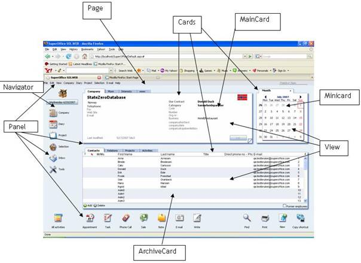

<properties date="2016-06-24"
SortOrder="9"
/>

**An important point to remember!**       

PageBuilder main functionality is rendering the page with the UI States and current changes in the page.

1. autolist

Below is a diagram that shows the components that exists in a typical CRM.web webpage. The web page consists of one or more panels. A Panel should consist of at least one card. Each card has its own set of views. The diagram below shows the page structure of CRM.web webpage. I.e. Contact page.

 The PageBuilder generates a page based on the information passed by the SuperState. The SuperState determines which configuration to fetch based on the SoProtocol and passes it to the PageBuilder.

The controls consider the UI status and the current values when rendering a page. Once the page shows in the browser, it brings all elements in the page in to one level. SIX&gt;web connects the SuperState, User Controls, SoProtocols, DataHandlers and the XML configuration files to render the page.
