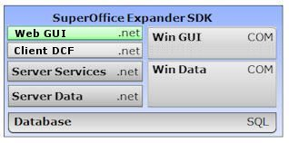

<properties date="2016-06-24"
SortOrder="1"
/>

 
Expander SDK: Web GUI .net API
==============================

Documentation for CRM.web 8.0 SR5
(Jun 2017)

The SuperOffice Sales & Marketing web-client can be customized in many different ways. The web-client is built using a reusable set of components documented here. The web-client can be extended with new components and configured to use custom components. The [SuperOffice Web Client Nuget package](https://www.nuget.org/packages/SuperOffice.Crm.Web/) adds the needed assemblies to extend the web client. This will also install [the SuperOffice web services package](https://www.nuget.org/packages/SuperOffice.NetServer.Services/) and [the SuperOffice Core package](https://www.nuget.org/packages/SuperOffice.NetServer.Core/).

The web-client is built using the NetServer Services API layer, which enables the web-server to be run on a separate server from the business logic implemented in the web-services.

The web-client also uses the Dynamic Client Foundation (DCF) on top of the web services to handle globalization and to define the page builder infrastructure.

The major components in the Web GUI are:

* The [page builder framework](Introduction/PageBuilder%20Framework/PageBuilder%20Framework.md) used in CRM.web. This means the config files for the framework and the many components and interfaces that the PageBuilder uses.
* The [page, panel, card and archive components](Developer's%20Guide/PageBuilder%20config%20files/PageBuilder%20config%20files.md) used to render the pages.
* The [AJAX libraries](Developer's%20Guide/Customizing%20CRM.web/Custom%20Ajax%20Methods/Custom%20Ajax%20Methods.md) that integrate the web front end with the web server.
